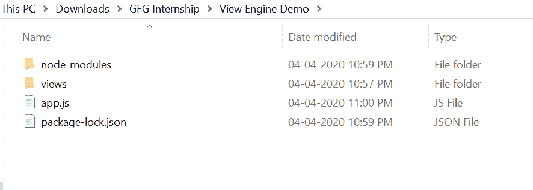
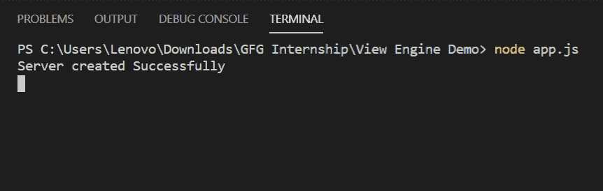
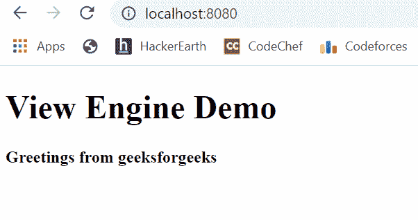

# 如何在 Node.js 中设置视图引擎？

> 原文:[https://www . geesforgeks . org/how-setup-view-engine-in-node-js/](https://www.geeksforgeeks.org/how-to-setup-view-engine-in-node-js/)

视图引擎对于呈现网页很有用。市场上有许多视图引擎，如小胡子、车把、EJS 等，但其中最受欢迎的是 EJS，它只是嵌入式 JavaScript 的代表。这是一种简单的模板语言/引擎，允许用户用普通的 javascript 生成 HTML。

**ejs 模块安装:**

1.  您可以访问链接[安装 ejs 模块](https://www.npmjs.com/package/ejs)。您可以使用以下命令安装此软件包。

    ```
    npm install ejs
    ```

2.  安装 multer 后，您可以使用命令在命令提示符下检查您的 ejs 版本。

    ```
    npm version ejs
    ```

3.  之后，您可以创建一个文件夹并添加一个文件，例如 app.js。

    ```
    node app.js
    ```

4.  To setup view engine, you need the write this middleware in your index.js as follow:

    ```
    app.set('views', path.join(__dirname, 'views'))
    app.set('view engine', 'ejs')
    ```

    其中 path 是全局对象，__dirname 保存当前目录地址。视图是保存我们所有网页的文件夹。

5.  现在创建一个像 Demo.ejs 这样的 EJS 文件，并将这个文件放在 views 文件夹中。

**文件名称:演示。ejs**

```
<!DOCTYPE html>
<html>
<head>
    <title>View Engine Demo</title>
</head>
<body>

  <!- For printing variable these
      tags are used: <%= %>  -->
  <h1> <%= title %> </h1>

  <!- For business logic these
      tags are used: <% %> -->
  <% if(true){ %>
      <h4>Greetings from geeksforgeeks</h4> 
  <% } %>
</body>
</html>
```

**文件名:app.js**

```
const express = require('express')
const path = require('path')
const app = express()

// View Engine Setup
app.set('views', path.join(__dirname, 'views'))
app.set('view engine', 'ejs')

app.get('/', function(req, res){

    // Rendering our web page i.e. Demo.ejs
    // and passing title variable through it
    res.render('Demo', {
        title: 'View Engine Demo'
    })
})

app.listen(8080, function(error){
    if(error) throw error
    console.log("Server created Successfully")
})
```

**运行程序的步骤:**

1.  项目结构会是这样的:
    
2.  确保你有“查看引擎”，就像我使用“ejs”一样，并使用以下命令安装 express:

    ```
    npm install ejs
    npm install express
    ```

3.  Run app.js file using below command:

    ```
    node app.js
    ```

    

4.  打开浏览器，输入该网址:

    ```
    http://localhost:8080/
    ```

5.  然后你会看到如下所示的 Demo.ejs 页面:
    

这就是如何在节点 js 中设置视图引擎。还有许多其他的引擎存在，如车把，小胡子等。