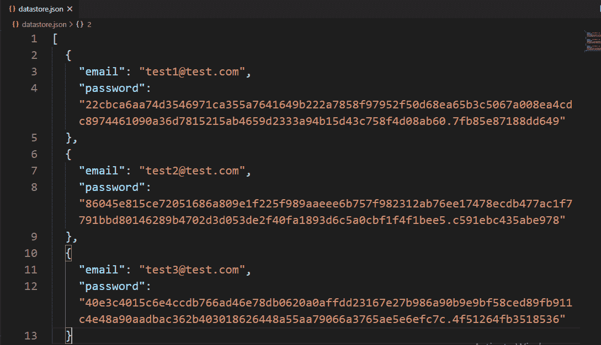
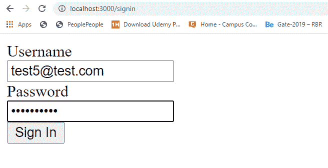
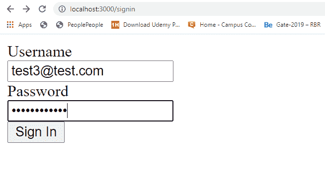
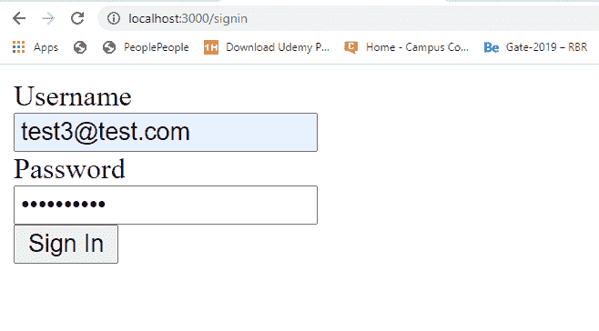
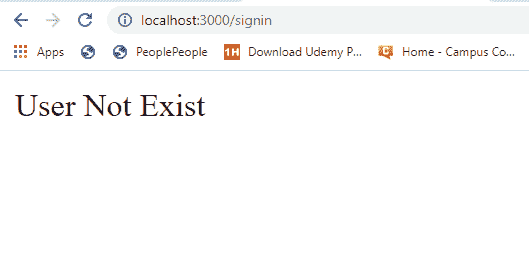
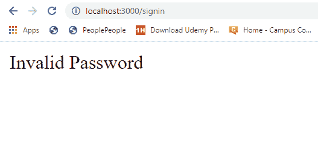
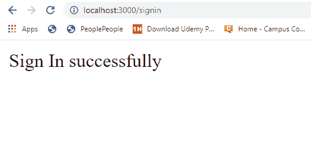

# 当数据库中存储的密码以 Node.js 的形式进行哈希运算时，如何使用原始密码登录？

> 原文:[https://www . geesforgeks . org/如何使用原始密码登录-当密码存储在数据库中-被散列-节点中-表单-js/](https://www.geeksforgeeks.org/how-to-sign-in-with-raw-password-when-password-store-in-the-database-are-hashed-form-in-node-js/)

出于安全考虑，数据库中存储的密码始终是**(哈希+salt)** 形式。当用户在任何网站上注册时，都会以原始形式给出密码。但是将原始密码直接存储在数据库中并不是一个好的做法。使用一些服务器端逻辑，我们首先转换(散列+盐)形式的原始密码，然后将其存储在数据库中。这就产生了一个新的挑战，如何比较用户在登录时给出的原始密码，并根据密码的正确与否授予用户访问权限。

**以如下形式存储在数据库中的密码:**

```js
Hashed(password, salt) 
```

**例:**

> 22 cbca 6aa 74d 354971 ca 355 a 7641649 b 222 a 7858 f 972 f 50d 68 ea 65 B3 c 5067 a 008 ea 4 CDC 897446190 a 36d 7815215
> ab 4659d 2333 a 94 b 15d 43 c 758 f 4d 08 ab 60.7 FB 85 e 87188 DD 649

**设置使用原始密码登录逻辑的步骤:**

*   借助用户登录时给出的唯一用户名或电子邮件搜索数据库。
*   找到唯一的记录，如果没有找到，返回“用户不存在”。
*   在“**”处拆分加密密码。**'分别查找哈希密码和盐。
*   使用 salt 对用户提供的原始密码进行哈希处理，以使用 node . js“scrypt”方法登录。
*   将获得的散列值与通过拆分数据库密码获得的散列值进行比较。
*   如果两个散列值相等，则在用户中签名，并授予访问权限。
*   如果两者哈希不相等，则拒绝访问，并显示消息“密码无效”。

**注意:**为了说明逻辑，这里我们取一个本地或者定制的数据库。同样的逻辑也可以用 MongoDB、MySql 等常规数据库来实现。

**示例:**此示例说明了当数据库中存储的密码为(哈希+盐)形式时，如何使用原始密码登录。

## java 描述语言

```js
const util = require('util')
const crypto = require('crypto')
const express = require('express')
const bodyParser = require('body-parser')
const repo = require('./repository')

const app = express()
const scrypt = util.promisify(crypto.scrypt)
const port = process.env.PORT || 3000

// The body-parser middleware to parse form data
app.use(bodyParser.urlencoded({ extended: true }))

// Get route to display HTML form to sign in
app.get('/signin', (req, res) => {
    res.send(`
    <div>
      <form method='POST'>
        <div>
          <div>
            <label id='email'>Username</label>
          </div>
          <input type='text' name='email'
            placeholder='Email' for='email'>
        </div>
        <div>
          <div>
            <label id='password'>Password</label>
          </div>
          <input type='password' name='password'
          placeholder='Password' for='password'>
        </div>
        <div>
          <button>Sign In</button>
        </div>
      </form>
    </div>
  `)
})

// Post route to handle form submission logic and
app.post('/signin', async (req, res) => {

    // Email and password submitted by the user
    const { email, password } = req.body

    // Find record by given unique username or email
    const user = await repo.findBy({ email })
    console.log(user)

    // If record not found by given username
    if (!user) {
        return res.send('User Not Exist')
    }

    // Hashed and salt of database password
    const [hashed, salt] = user.password.split('.')

    // Hashing raw password submitted by the user
    // to sign in third argument is the key length
    // that must be same when hashing the password
    // to store it into the database when user sign up
    const hashedBuff = await scrypt(password, salt, 64)
    console.log(hashed)
    console.log(hashedBuff.toString('hex'))

    // Compare saved hashed of database and
    // obtained hashed
    const isValid = hashed === hashedBuff.toString('hex')

    if (isValid) {
        return res.send('Sign In successfully')
    }
    return res.send('Invalid Password')
})

// Server setup
app.listen(port, () => {
    console.log(`Server start on port ${port}`)
})
```

**Filename: repository.js** 这个文件包含所有与创建本地数据库以及如何与之交互相关的逻辑。

## java 描述语言

```js
// Importing node.js file system, util,
// crypto module
const fs = require('fs')
const util = require('util')
const crypto = require('crypto')

// Convert callback based scrypt method
// to promise based method
const scrypt = util.promisify(crypto.scrypt)

class Repository {

    constructor(filename) {

        // The filename where datas are
        // going to store
        if (!filename) {
            throw new Error(
'Filename is required to create a datastore!')
        }

        this.filename = filename

        try {
            fs.accessSync(this.filename)
        } catch (err) {

            // If file not exist it is created
            // with empty array
            fs.writeFileSync(this.filename, '[]')
        }
    }

    async findBy(attrs) {

        // Read all file contents of the datastore
        const jsonRecords = await
            fs.promises.readFile(this.filename, {
            encoding: 'utf8'
        })

        // Parsing json records in javascript
        // object type records
        const records = JSON.parse(jsonRecords)

        // Iterating through each record
        for (let record of records) {
            let found = true

            // Iterate through each given
            // propert for each record
            for (let key in attrs) {

                // If any given property not matches
                // with record record is discarded
                if (record[key] !== attrs[key]) {
                    found = false
                }
            }
            // If 'found' remains true after iterating
            // through each given property that
            // means record found
            if (found) {
                return record
            }
        }
    }
}

// The 'datastore.json' file created at runtime
// if it not exist, here we try to fetch
// information from database using some properties
// that means database(datastore.json) already
// exist and there are also records in it.
module.exports = new Repository('datastore.json')
```

使用以下命令运行 **index.js** 文件:

```js
node index.js
```

**文件名:package.json**


package.json 文件

**数据库:**



数据库ˌ资料库

**输出:**

在这里，我们使用用户名和密码的不同组合分别提交三个表单，并分别获得如图所示的输出。



使用无效的用户名登录



使用有效的用户名登录，但密码无效



使用有效的用户名和密码登录

**重定向页面:**T2】



使用无效用户名登录时的响应



使用有效用户名但无效密码登录时的响应



使用有效的用户名和密码登录时的响应