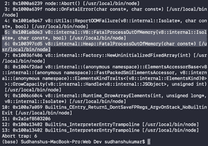
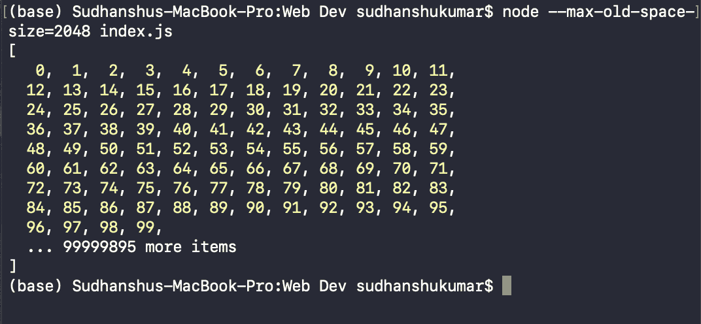
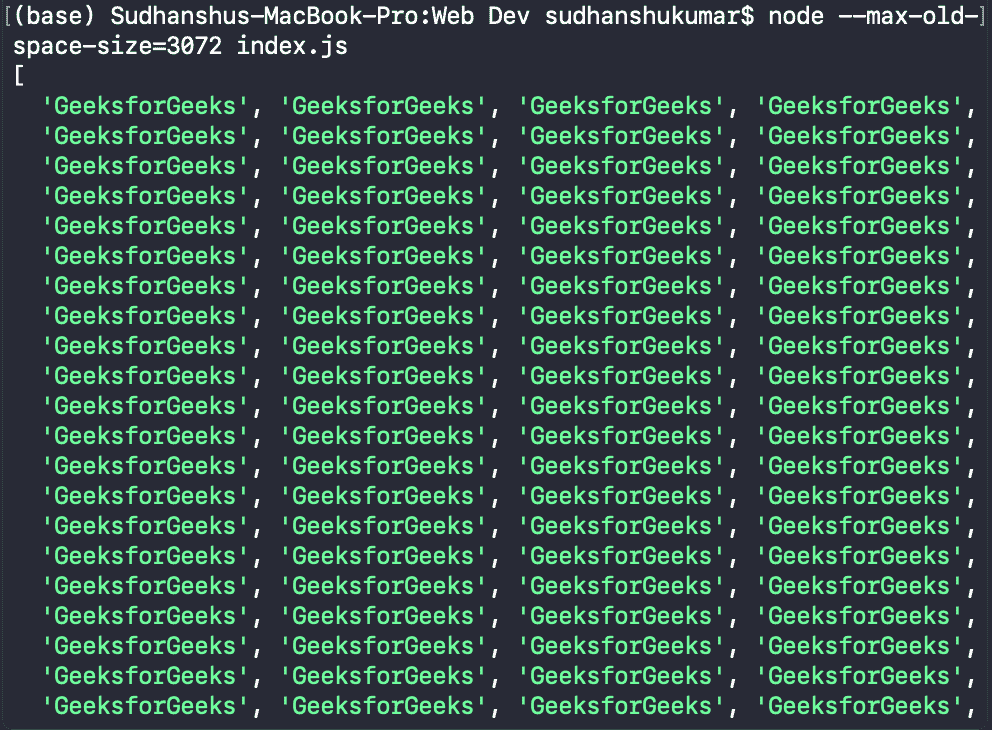

# 如何解决 Node.js 中的“进程内存不足异常”？

> 原文:[https://www . geesforgeks . org/如何解决进程内存不足-节点异常-js/](https://www.geeksforgeeks.org/how-to-solve-process-out-of-memory-exception-in-node-js/)

在这篇文章中，我们将学习如何解决[节点](https://www.geeksforgeeks.org/nodejs-tutorials/)中的**处理器内存**异常。*进程内存不足异常*是当您的**节点. js** 程序内存不足时发生的异常。当我们的程序在执行时超过了分配给程序的默认内存时，就会发生这种情况。

这个异常可以通过使用以下命令将分配给我们程序的默认内存增加到所需的内存来解决。

**语法:**

```js
node --max-old-space-size=<SPACE_REQD> index.js
```

**参数:**

*   **SPACE_REQD:** 传递增加的内存空间(兆字节)。

**示例:**首先，让我们重新创建这个异常，然后我们将了解这个异常背后的原因。

## index.js

```js
let items = [];

for (let i = 0; i < 99999995; i++) {
    items.push(i);
}

console.log(items);
```

使用以下命令运行 *index.js* 文件。

```js
node index.js
```

**输出:**我们会得到一个**致命错误**表示**致命错误**，如下图所示。



**注意:**分配给 node.js 程序的默认内存是 **32 位**系统上的 **512MB** 和 **64 位**系统上的 **1024MB** (以上程序运行在 64 位系统上)。

**示例 1:** 在下面的示例中，我们将内存空间要求提高到了 **2048MB** 或 **2GB** 。使用以下命令运行 JS 文件(在我的例子中是 *index.js* )。

**语法:**

```js
node --max-old-space-size=2048 index.js
```

现在我们可以看到，我们的程序正在完美运行，没有任何异常。如果使用标准的“**节点 index.js** ”命令运行下面的代码，它会抛出相同的异常:**宿命论处理器内存**，因为我们的程序超出了分配给它的默认内存空间。

所以我们使用**–最大旧空间大小**命令来增加分配的内存空间，这样我们的程序就不会耗尽内存。

## index.js

```js
let items = [];

for (let i = 0; i < 99999995; i++) {
    items.push(i);
}

console.log(items);
```

**输出:**



**示例 2:** 在下面的示例中，我们将内存空间要求提高到了 **3072MB** 或 **3GB** 。使用以下命令运行 JS 文件(在我的例子中是 *index.js* )。

**语法:**

```js
node --max-old-space-size=3072 index.js
```

如果使用标准的“**节点 index.js** ”命令运行下面的代码，它会抛出相同的异常:**宿命论处理器内存**，因为我们的程序超出了分配给它的默认内存空间。

所以我们使用**–最大旧空间大小**命令来增加分配的内存空间，这样我们的程序就不会耗尽内存。

## index.js

```js
let items = [];

for (let i = 0; i < 90000000; i++) {
    items.push("GeeksforGeeks");
}

console.log(items);
```

**输出:**

