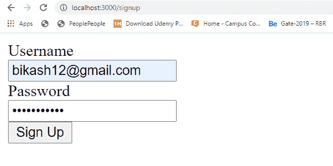
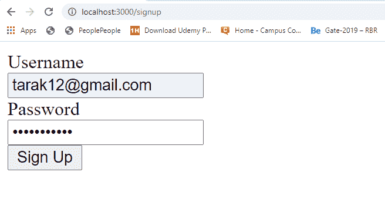
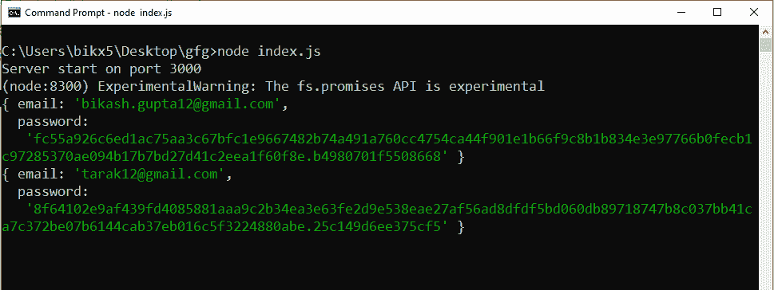
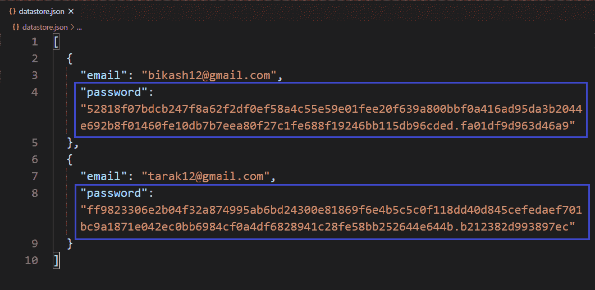

# 如何在 Node.js 中安全地将密码存储在自己的本地/自定义数据库中？

> 原文:[https://www . geesforgeks . org/如何存储密码-安全地存储在您的本地-自定义-节点中的数据库-js/](https://www.geeksforgeeks.org/how-to-store-password-securely-in-your-local-custom-database-in-node-js/)

自定义数据库表示文件系统中的本地数据库。有两种类型的数据库“SQL”和“NoSQL”。在 SQL 数据库中，数据以表的方式存储，而在 Nosql 数据库中，数据以某种特定的方式独立存储，以独立标识每条记录。我们还可以用 Nosql 方式在本地创建自己的数据库或数据存储。

创建本地数据库并向其中添加记录需要一些步骤。这些步骤如下:

*   使用以下命令在项目目录的根目录下创建 package.json 文件:

    ```js
    npm init -y
    ```

*   使用以下命令

    ```js
    npm install express body-parser
    ```

    安装 express 和 body-parser 包
*   创建一个显示表单的 GET 路径(将信息提交给数据库的 HTML 表单)。
*   创建后续的帖子路由来处理表单提交请求。
*   将服务器设置为在特定端口(开发者端口–3000)上运行。
*   创建一个存储库文件，并添加与创建数据库相关的所有逻辑。
*   哈希和绍特原始密码。
*   将记录和加密密码一起存储到本地数据库中。

**示例:**此示例说明了如何在本地数据库中安全地存储密码(Hashed+Salt)。

**文件名:index.js**

```js
const express = require('express')
const bodyParser = require('body-parser')
const repo = require('./repository')

const app = express()

const port = process.env.PORT || 3000

// The body-parser middleware to parse form data
app.use(bodyParser.urlencoded({ extended: true }))

// Get route to display HTML form
app.get('/signup', (req, res) => {
    res.send(`
    <div>
      <form method='POST'>
        <div>
          <div>
            <label id='email'>Username</label>
          </div>
          <input type='text' name='email' 
            placeholder='Email' for='email'>
        </div>
        <div>
          <div>
            <label id='password'>Password</label>
          </div>
          <input type='password' name='password'
          placeholder='Password' for='password'>
        </div>
        <div>
          <button>Sign Up</button>
        </div>
      </form>
    </div>
  `)
})

// Post route to handle form submission logic
// and Add data to the database
app.post('/signup', async (req, res) => {
    const { email, password } = req.body

    const addedRecord = await 
        repo.create({ email, password })

    console.log(addedRecord)

    res.send("Information added to the "
            + "database successfully.")
})

// Server setup
app.listen(port, () => {
    console.log(`Server start on port ${port}`)
})
```

**文件名:repository.js** 这个文件包含了用安全密码向数据库添加新记录的所有逻辑。

```js
// Importing node.js file system, 
// util, crypto module 
const fs = require('fs')
const util = require('util')
const crypto = require('crypto')

// Convert callback based scrypt method
// to promise based method
const scrypt = util.promisify(crypto.scrypt)

class Repository {

    constructor(filename) {

        // The filename where datas are
        // going to store
        if (!filename) {
            throw new Error(
'Filename is required to create a datastore!')
        }

        this.filename = filename

        try {
            fs.accessSync(this.filename)
        } catch (err) {

            // If file not exist it is created
            // with empty array
            fs.writeFileSync(this.filename, '[]')
        }
    }

    // Method to fetch all records
    async getAllRecords() {
        return JSON.parse(
            await fs.promises.readFile(this.filename, {
                encoding: 'utf8'
            })
        )
    }

    async create(attrs) {
        const records = await this.getAllRecords()
        const { email, password } = attrs

        // SALT
        const salt = crypto.randomBytes(8).toString('hex')

        // HASHED buffer
        const hashedBuff = await scrypt(password, salt, 64)

        // HASHED and SALTED password
        const hashedSaltPassword = 
            `${hashedBuff.toString('hex')}.${salt}`

        // Create new record with hashed and 
        // salted password instead of raw password
        const record = {
            ...attrs,
            password: hashedSaltPassword
        }

        records.push(record)

        // Write all records to the database
        await fs.promises.writeFile(
            this.filename,
            JSON.stringify(records, null, 2)
        )

        return record
    }
}

module.exports = new Repository('datastore.json')
```

**文件名:Package.json 文件**


package.json

**提交回复的表格**

**注意:**这里两个响应一个接一个提交，所有响应都存储在 datastore.json 文件中。
 

**提交请求后重定向页面**


提交表单后重定向页面

使用以下命令运行 **index.js** 文件:

```js
node index.js
```

**输出:**



输出

**数据库:**



数据库ˌ资料库

**注意:**第一次运行的程序数据库(datastore.json)文件在项目目录中不存在，它在运行程序后动态创建并存储提交的响应。之后，所有提交的回复都被逐一添加到数据库中。