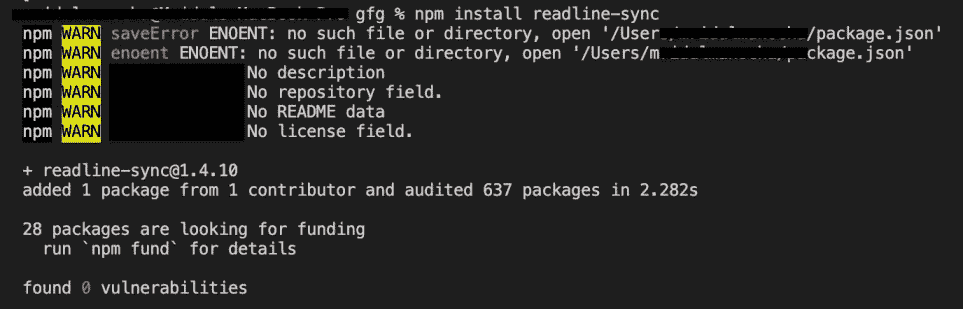
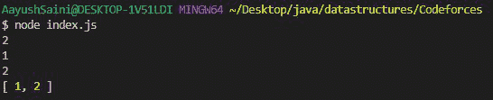
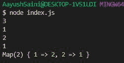

# 如何在 Node.js 中进行输入？

> 原文:[https://www.geeksforgeeks.org/how-to-take-input-in-node-js/](https://www.geeksforgeeks.org/how-to-take-input-in-node-js/)

如今，在竞争编程领域，JavaScript 的扩展，即 Node.js，在程序员中相当流行。在本文中，我们将讨论如何从用户那里获取输入。

**readline-sync:** 这是第三方模块，用于同步接收用户的输入。所以，程序的执行是一行一行的。

**安装模块:**

```js
npm install readline-sync
```



**项目结构:**


**从用户处获取输入数组**

## java 描述语言

```js
// Importing the module
const readline = require("readline-sync");

// Enter the number
let a = Number(readline.question());
let number = [];
for (let i = 0; i < a; ++i) {
  number.push(Number(readline.question()));
}
console.log(number);
```

使用以下命令运行 **index.js** 文件:

```js
node index.js
```

**输出:**这将在控制台输出。



**文件名-索引. js:** 查找数字的频率

## java 描述语言

```js
// Importing the module
const readline = require("readline-sync");

// Enter the number
let a = Number(readline.question());
let number = [];

// Creating map
let map = new Map();
for (let i = 0; i < a; ++i) {
  let number = Number(readline.question());
  if (map.has(number)) {
    map.set(number, map.get(number) + 1);
  } else {
    map.set(number, 1);
  }
}

console.log(map);
```

使用以下命令运行 **index.js** 文件:

```js
node index.js
```

**输出:**这将在控制台输出。

