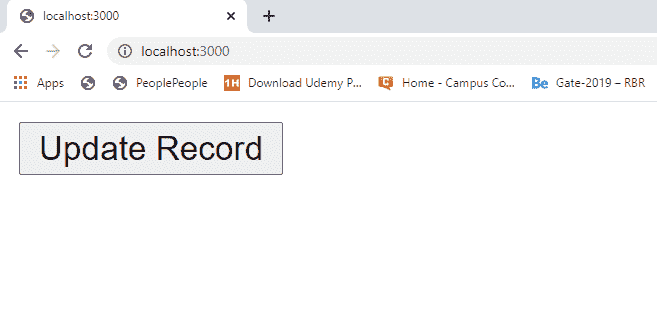
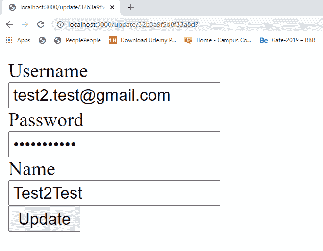
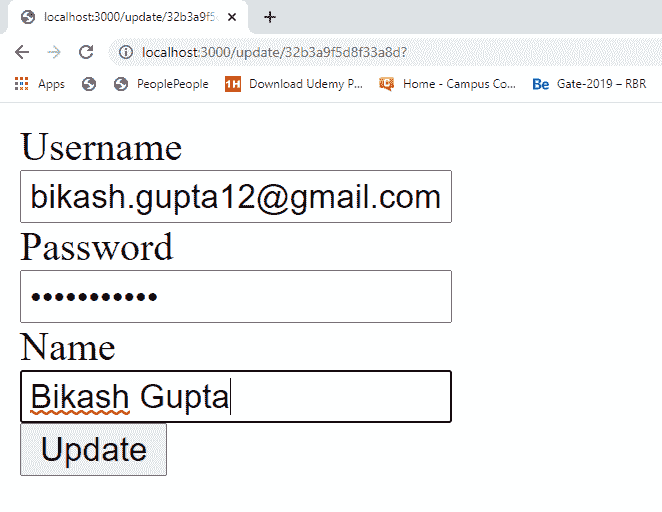
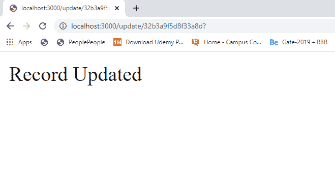
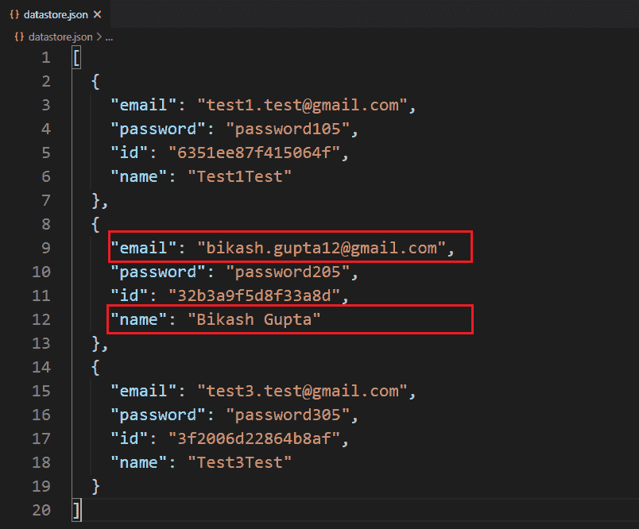

# 如何在 Node.js 中更新本地/自定义数据库中的记录？

> 原文:[https://www . geesforgeks . org/如何更新本地自定义数据库中的记录节点-js/](https://www.geeksforgeeks.org/how-to-update-a-record-in-your-local-custom-database-in-node-js/)

自定义数据库表示文件系统中的本地数据库。有两种类型的数据库“SQL”和“NoSQL”。在 SQL 数据库中，数据以表的方式存储，而在 Nosql 数据库中，数据以某种特定的方式独立存储，以独立标识每条记录。我们还可以用 Nosql 方式在本地创建自己的数据库或数据存储。

创建本地数据库以及创建、查找和更新数据库信息需要一些步骤。这些步骤如下:

1.  使用以下命令在项目目录的根目录下创建 package.json 文件:

    ```
    npm init -y
    ```

2.  使用以下命令安装 express 和 body-parser 包:

    ```
    npm install express
    npm install body-parser

    ```

3.  使用 id 为特定用户数据库创建一个 POST 路由请求。
4.  将服务器设置为在特定端口(开发者端口–3000)上运行。
5.  创建一个存储库文件，并添加与创建本地数据库相关的所有逻辑。
6.  在存储库文件中创建一个方法，使用 id 更新数据库中的记录。

**示例:**此示例说明如何更新本地自定义数据库中的记录。

**文件名:index.js**

```
const express = require('express')
const bodyParser = require('body-parser')

const repo = require('./repository')
const updateTemplet = require('./updateRecordForm')

const app = express()
const port = process.env.PORT || 3000

// The body-parser middleware to parse form data
app.use(bodyParser.urlencoded({extended : true}))

// Home page
app.get('/', (req, res) => {
  const id = '32b3a9f5d8f33a8d'
  res.send(`
    <form method='GET' action='./update/${id}'>
      <button>Update Record</button>
    </form>
  `)
})

// Get route to show update form
app.get('/update/:id', async (req, res) => {
  const id = req.params.id
  const temp = await (updateTemplet({id}))
  res.send(temp)
})

// Post route to update record
app.post('/update/:id', async (req, res) => {
  const id = req.params.id
  const record = await repo.update(id, req.body)
  console.log(`Record Updated : 
    \n${JSON.stringify(record, null, 2)}`)
  res.send('Record Updated')
})

// Server setup
app.listen(port, () => {
  console.log(`Server start on port ${port}`)
})
```

**文件名:repository.js** 该文件包含更新自定义数据库记录的所有逻辑。

```
// Importing node.js file system, crypto module 
const fs = require('fs')

class Repository {

    constructor(filename) {

        // The filename where datas are 
        // going to store
        if (!filename) {
            throw new Error('Filename is required'
                    + ' to create a datastore!')
        }

        this.filename = filename

        try {
            fs.accessSync(this.filename)
        } catch (err) {

            // If file not exist it is created
            // with empty array
            fs.writeFileSync(this.filename, '[]')
        }
    }

    // The findById method used in the example
    async findById(id) {

        // Read all filecontents of the datastore
        const jsonRecords = await 
            fs.promises.readFile(this.filename, {
            encoding: 'utf8'
        })

        // Parsing JSON records in javascript
        // object type records
        const objRecord = JSON.parse(jsonRecords)

        // Search for required record
        const requiredRecord = objRecord
            .find(record => record.id === id)
        return requiredRecord
    }

    // Update Method
    async update(id, attrs) {

        // Read all file contents of the datastore
        const jsonRecords = await 
            fs.promises.readFile(this.filename, {
            encoding: 'utf8'
        })

        // Parsing json records in javascript
        // object type records
        const records = JSON.parse(jsonRecords)

        // Find target record to update with id
        const record = records.find(
            eachRecord => eachRecord.id === id)

        // If given id not belongs to any
        // record in database
        if (!record) {
            throw new Error(`Id '${id}' not found`)
        }

        // Update record
        Object.assign(record, attrs)

        // Write all records back to the
        // custom database
        await fs.promises.writeFile(
            this.filename,
            JSON.stringify(records, null, 2)
        )
        return record
    }
}

// The 'datastore.json' file created at
// runtime if it not exist,  here we try
// to update information of database 
// that means database(datastore.json)
// already exist and there are also
// records in it.
module.exports = new Repository('datastore.json')
```

**档案名称:updateRecordForm.js**

```
const repo = require('./repository')
module.exports = async ({ id }) => {
    const record = await repo.findById(id)
    return `
    <div>
      <form method='POST'>
        <div>
          <div>
            <label id='email'>Username</label>
          </div>
          <input type='text' name='email' 
            value=${record.email} for='email'>
        </div>
        <div>
          <div>
            <label id='password'>Password</label>
          </div>
          <input type='password' name='password' 
            value=${record.password} 
          for='password'>
        </div>
        <div>
          <div>
            <label id='name'>Name</label>
          </div>
          <input type='text' name='name' 
            value=${record.name} for='name'>
        </div>
          <button>Update</button>
        </div>
      </form>
  </div>
  `
}
```

**文件名:package.json**


package.json 文件

使用以下命令运行 **index.js** 文件:

```
node index.js
```

**输出:**



点击前输出屏幕



点击后输出屏幕



更新记录



更新输出屏幕后

**数据库:**


更新前的数据库



更新后的数据库

**注意:**首次运行的程序数据库(datastore.json)文件在项目目录中不存在，它是在运行程序后动态创建的。但是在这里，我们尝试更新数据库中的一条记录，这意味着程序假设已经运行了一次，并且一些记录被添加到我们尝试更新的数据库中。