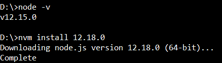
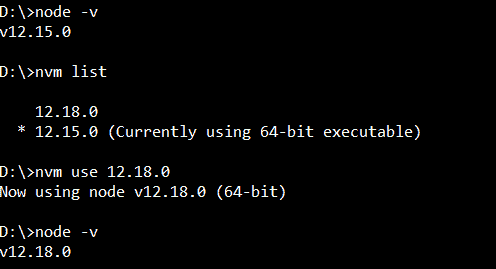
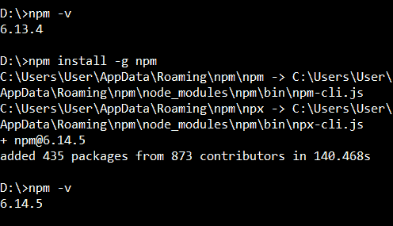
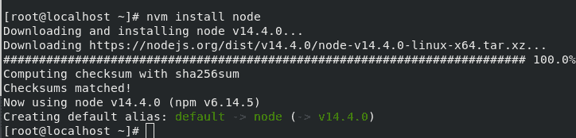
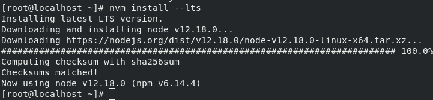
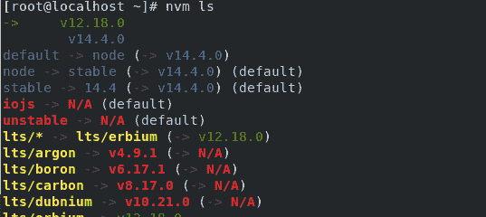
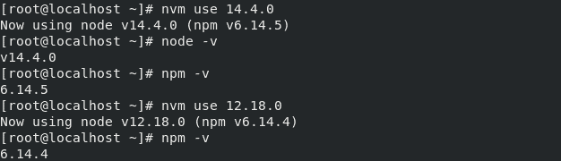
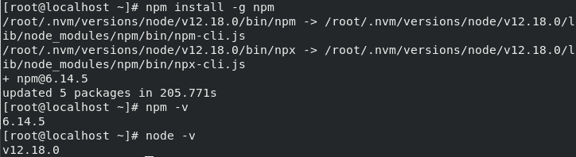

# 如何将 Node.js 和 NPM 更新到下一个版本？

> 原文:[https://www . geesforgeks . org/如何更新节点-js-和-NPM-到下一个版本/](https://www.geeksforgeeks.org/how-to-update-node-js-and-npm-to-next-version/)

Node.js 是一个跨平台的 JavaScript 环境，可以用于服务器端脚本。由于其无阻塞的工作流程，Node.js 在构建动态 web 应用程序的 web 开发人员中很受欢迎。Node Package Manager 也称为 npm，是 Node.js 的包管理器。它也是一个命令行工具，用于与 npm 在线存储库进行交互，以进行包安装、版本管理和依赖关系管理。为了使用 npm，安装 Node.js 非常重要。此外，使用 Node.js 和 npm 的更新版本可以确保更好的性能和更多的特性。
按照链接下载安装 Node.js: [下载 Node.js](https://nodejs.org/en/download/)

**将 Node.js 更新到最新稳定版本:** Node.js 可以从官方 [Node.js](https://nodejs.org/en/download/) 网站更新，也可以使用 Node Version Manager(nvm)通过命令行更新。nvm 最初是为 Linux 系统开发的，但是可以通过以下步骤为 Windows 系统单独安装 nvm:

1.  去这个[站点](https://github.com/coreybutler/nvm-windows/releases)
2.  安装并解压缩 nvm-setup.zip 文件
3.  从 cmd 型 **nvm -v 型**确保安装了 nvm。

安装 nvm 后，可以执行以下操作来将 Node.js 更新到最新版本:

```jshtml
nvm install <version>
```


使用以下命令检查系统中可用的 Node.js 版本列表:

```jshtml
nvm list 
```

要使用所需版本，请使用以下命令:

```jshtml
nvm use <version>
```



**更新 npm:** 要更新 npm，请使用以下命令:

```jshtml
npm install -g npm
```

**输出:**


下面是为 **Linux 系统**更新 Node.js 和 npm 版本的演示。
**在 Linux 中安装 nvm:**

> # curl-o-https://raw . githubusercontent . com/nvm-sh/nvm/v 0 . 34 . 0/install . sh | bash
> 或
> wget-qo-https://raw . githubusercontent . com/nvm-sh/nvm/v 0 . 34 . 0/install . sh | bash

**检查 nvm 是否安装成功**

```jshtml
Open a new terminal
nvm -v

```

**要安装最新版本的节点，请使用以下命令。**

```jshtml
# nvm install node
or
# nvm install -lts
or
# nvm install 

```




**检查系统上所有可用的节点版本:**

```jshtml
# nvm ls
```



**使用特定版本**

```jshtml
# nvm use 
```


**将 npm 更新至最新版本:**

```jshtml
# npm install -g npm 
```



HTML 是网页的基础，通过构建网站和网络应用程序用于网页开发。您可以通过以下 [HTML 教程](https://www.geeksforgeeks.org/html-tutorials/)和 [HTML 示例](https://www.geeksforgeeks.org/html-examples/)从头开始学习 HTML。

CSS 是网页的基础，通过设计网站和网络应用程序用于网页开发。你可以通过以下 [CSS 教程](https://www.geeksforgeeks.org/css-tutorials/)和 [CSS 示例](https://www.geeksforgeeks.org/css-examples/)从头开始学习 CSS。