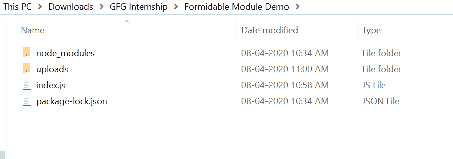
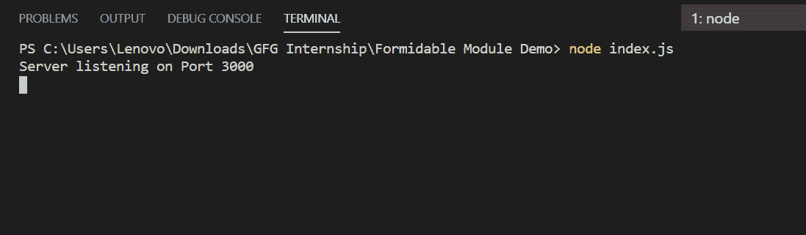
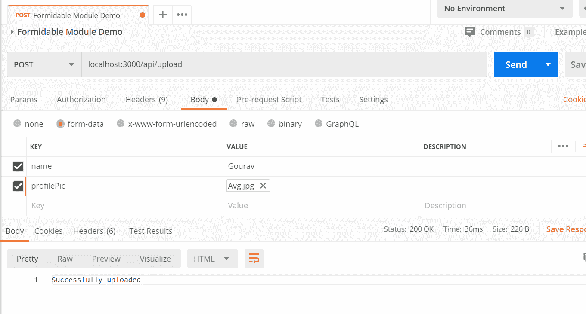

# 如何使用 Node.js 中强大的模块上传文件？

> 原文:[https://www . geesforgeks . org/如何使用强大的节点内模块上传文件-js/](https://www.geeksforgeeks.org/how-to-upload-file-using-formidable-module-in-node-js/)

强大的模块用于解析表单数据，尤其是文件上传。它易于使用并集成到您的项目中，用于处理传入的表单数据和文件上传。

**安装强大的模块:**

1.  您可以访问链接[安装强大的模块](https://www.npmjs.com/package/formidable)。您可以使用此命令安装此软件包。

    ```
    npm install formidable
    ```

2.  安装强大的模块后，您可以使用命令在命令提示符下检查您的 yargs 版本。

    ```
    npm version formidable
    ```

3.  之后，您可以创建一个文件夹并添加一个文件，例如 index.js。

    ```
    node index.js
    ```

**文件名:index.js**

```
const express = require('express');
const fs = require('fs');
const path = require('path')
const formidable = require('formidable');

const app = express();

app.post('/api/upload', (req, res, next) => {

    const form = new formidable.IncomingForm();
    form.parse(req, function(err, fields, files){

        var oldPath = files.profilePic.path;
        var newPath = path.join(__dirname, 'uploads')
                + '/'+files.profilePic.name
        var rawData = fs.readFileSync(oldPath)

        fs.writeFile(newPath, rawData, function(err){
            if(err) console.log(err)
            return res.send("Successfully uploaded")
        })
  })
});

app.listen(3000, function(err){
    if(err) console.log(err)
    console.log('Server listening on Port 3000');
});
```

**运行程序的步骤:**

1.  项目结构如下:
    注意:“上传”是上传文件的文件夹。
2.  使用以下命令确保您已经安装了快速强大的模块:

    ```
    npm install formidable
    npm install express
    ```

3.  Run index.js file using below command:

    ```
    node index.js
    ```

    

4.  现在打开 [POSTMAN](https://www.postman.com/) 运行这个 API，发送样本数据如下所示:
    在正文这里，我们已经传递了 send 两个字段，一个是 type='Text '的名称，另一个是 type='File '的 profilePic，如上所示。
5.  现在进入你的上传文件夹，你的文件上传如下所示:
    

所以这就是你如何使用强大的模块上传文件和处理传入的表单数据容易和有效。