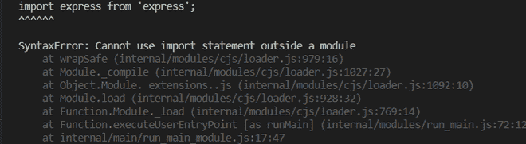
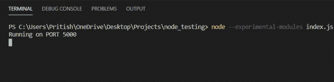
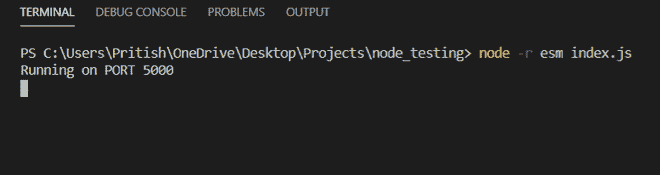
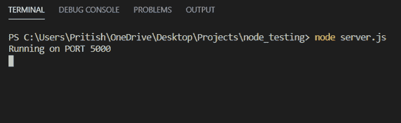
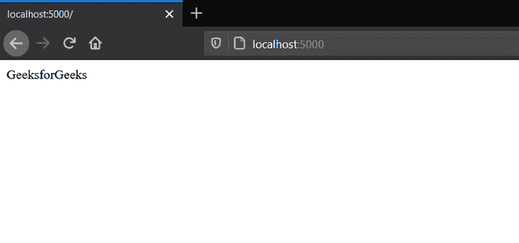

# 如何在 Node.js 中使用一个 ES6 导入？

> 原文:[https://www . geesforgeks . org/如何使用 an-es6-节点内导入-js/](https://www.geeksforgeeks.org/how-to-use-an-es6-import-in-node-js/)

**ES6 导入介绍:**

导入语句用于**导入由其他模块导出的**模块。模块是包含一段可重用代码的文件。无论是否声明，导入模块都处于严格模式。

**导入语法:**

```js
import name from 'module-name'
```

**导入可以有多种方式:**

1.  导入整个模块:

    ```js
    import * as name from 'module-name'
    ```

2.  从模块导入默认导出:

    ```js
    import name from 'module-name'
    ```

3.  从模块导入单个导出:

    ```js
    import { name } from 'module-name'
    ```

4.  从模块导入多个导出:

    ```js
    import { nameOne , nameTwo } from 'module-name'
    ```

5.  导入仅用于副作用的模块

    ```js
    import './module-name'
    ```

    Node js 不支持直接导入 ES6。如果我们尝试使用 import 直接在 node js 中导入模块，它会抛出错误。例如，如果我们试图通过从‘express’节点编写**导入 express 来导入 express 模块，js 将抛出如下错误:**

    

    节点对专家系统模块有实验支持。为了启用它们，我们需要对 package.json 文件进行一些更改。在执行这些步骤之前，请确保安装了节点。以下是实现相同目的的步骤。

    1.  In the **package.json** file add **“type” : “module”**. Adding this enables ES6 modules.

        **package.json** 文件应该是这样的:

        ## package.json

        ```js
        //package.json
        {
          "name": "index",
          "version": "1.0.0",
          "description": "",
          "main": "index.js",
          "type": "module",
          "scripts": {
            "test": "echo \"Error: no test specified\" && exit 1"
          },
          "keywords": [],
          "author": "",
          "license": "ISC"
        }
        ```

    2.  创建一个文件 index.js，并使用 ES6 import 编写程序。例如，让我们尝试在 index.js 文件中导入 express

        ## index.js 文件

        ```js
        //index.js

        import express from 'express';

        const app = express();

        app.get('/',(req,res) => {
            res.send('GeeksforGeeks');
        })

        const PORT = 5000;

        app.listen(PORT,() => {
            console.log(`Running on PORT ${PORT}`);
        })
        ```

    现在通过在终端中键入**节点-实验模块 index.js** 来运行 index.js 文件。

    

    **使用 esm 模块:**

    另一种方法是用**创建一个文件。mjs 分机**。如果我们用文件。mjs 扩展那么我们就不必在 package.json 文件中添加**“type”:“module”**。我们可以直接编写程序，在终端输入**节点-实验模块 index.mjs** 即可执行。

    当使用带有。mjs 扩展名 package.json 文件将如下所示:

    ## java 描述语言

    ```js
    // package.json when using .mjs file
    {
      "name": "index",
      "version": "1.0.0",
      "description": "",
      "main": "index.js",
      "scripts": {
        "test": "echo \"Error: no test specified\" && exit 1"
      },
      "keywords": [],
      "author": "",
      "license": "ISC"
    }
    ```

    创建一个文件 index.mjs，并使用 ES6 import 编写程序。

    ## java 描述语言

    ```js
    //index.mjs

    import express from 'express';

    const app = express();

    app.get('/',(req,res) => {
        res.send('GeeksforGeeks');
    })

    const PORT = 5000;

    app.listen(PORT,() => {
        console.log(`Running on PORT ${PORT}`);
    })
    ```

    现在在终端类型**节点–实验模块 index.mjs** 中。这将执行文件，应用程序现在将在 PORT 5000 上运行。

    **使用 esm 模块**

    装置

    ```js
    npm install esm
    ```

    现在，通过在终端中键入 **node -r esm index.js** ，尝试执行前面在 index.js 文件中编写的程序。

    

    使用 **esm 模块**的另一种方法是创建另一个文件，比如在实际应用程序之前加载 esm 的 server.js。在 server.js 文件中，编写以下代码

    ```js
    //server.js
    require = require("esm")(module);
    module.exports = require("./index.js");
    ```

    **注意:**在文件 **server.js** 中，我们导入的是存放需要执行的实际程序的 index.js 文件。

    现在在终端键入**节点 server.js** 来执行程序

    

    上述方法中 **index.js** 和 **index.mjs** 文件的输出为:

    

    本地主机:5000

    **在 nodejs 中用导入代替需求的优势:**

    *   导入有助于有选择地加载有助于节省内存的所需代码片段。
    *   在需要的情况下，加载是同步的，而导入可以是异步的，因此它的性能比需要的要好。