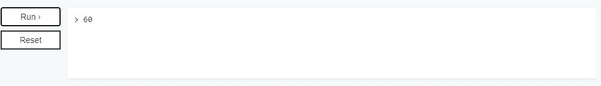

# 如何在 Node.js 中使用 Class？

> 原文:[https://www.geeksforgeeks.org/how-to-use-class-in-node-js/](https://www.geeksforgeeks.org/how-to-use-class-in-node-js/)

**简介:**在现代 JavaScript 中，有一个更高级的“类”构造，它引入了对面向对象编程有用的伟大的新特性。因为我们可以用两种方式定义函数，即函数表达式和函数声明。

类语法有两个组成部分:

1.  类表达式
2.  类声明

**语法:**

```
// Class expression
let class_name  = class {
 constructor(method1, method2) {
    this.method1 = method1;
    this.method2= method2;
  }
};

// Class declaration
class class_name {
  constructor(method1, method2) {
    this.method1 = method1;
    this.method2= method2;
  }
}

```

**例 1:类声明**

```
class Polygon {
  constructor(height, width) {
    this.area = height * width;
  }
}

console.log(new Polygon(5, 15).area);
```

**输出:**


**例 2:类表达式**

```
const Rectangle = class {
  constructor(height, width) {
    this.height = height;
    this.width = width;
  }

  area() {
    return this.height * this.width;
  }
};

console.log(new Rectangle(6, 10).area());
```

**输出:**


**类体和方法定义:**类的体在花括号{}内，这里是定义类成员如方法或构造函数的地方。构造函数方法是创建和初始化用类创建的对象的特殊方法。构造函数可以使用 super 关键字来调用超类的构造函数。