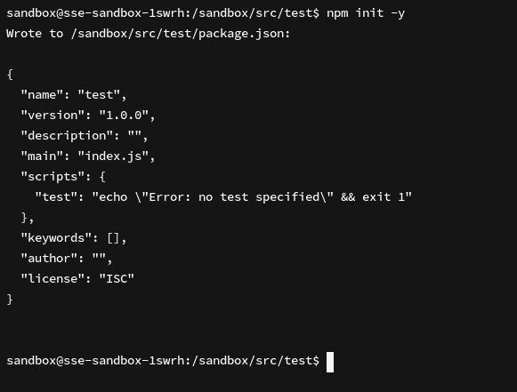
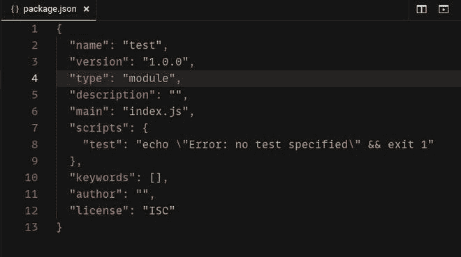
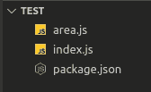
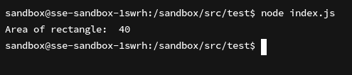

# 如何在 Node.js 中使用 EcmaScript 模块？

> 原文:[https://www . geesforgeks . org/how-用法-ecmascript-节点内模块-js/](https://www.geeksforgeeks.org/how-to-use-ecmascript-modules-in-node-js/)

**CommonJS** 模块由导出和 require()语句组成，而 **EcmaScript** 模块由导入和导出语句组成。

在这里了解更多:[node . js require 和 ES6 导入导出的区别](https://www.geeksforgeeks.org/difference-between-node-js-require-and-es6-import-and-export/)

默认情况下，Node.js 将 js 代码视为 **CommonJS** 模块，但是可以使用 **EcmaScript** 模块来代替使用**–实验模块标志。**

**遵循以下步骤:**

*   使用以下命令初始化所需文件夹中 Node.js 项目的 package.json，并根据提示输入值。

    ```js
    npm init
    ```

*   输入以下命令跳过提示:

    ```js
    npm init -y
    ```

    

*   打开新创建的 package.json 并添加以下字段。

    ```js
    "type":"module"    
    ```

    

    ### 示例:

*   **File structure:**

    

*   **例:**

    ## 区. js

    ```js
    const areaOfRectangle = (length, breadth) => {
        return length * breadth
    }

    export default areaOfRectangle
    ```

    ## 区. js

    ```js
    import areaOfRectangle from './area.js'

    console.log('Area of rectangle: ', areaOfRectangle(5, 8))
    ```

**输出:**
