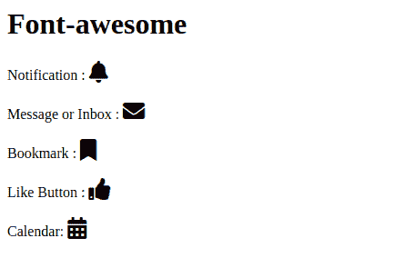

# 如何使用 Node.js-modules 中字体牛逼的图标？

> 原文:[https://www . geesforgeks . org/如何使用-font-awesome-icons-from-node-js-modules/](https://www.geeksforgeeks.org/how-to-use-font-awesome-icons-from-node-js-modules/)

Font-awesome 是一个网络图标库，它为你提供了可缩放的矢量图标，可以根据颜色、大小和其他方面进行定制。许多公司在他们的网站上集成了这个图书馆图标。它有 600 多个图标，无论分辨率屏幕大小如何，每个图标都是移动和桌面响应的。它还让我们不用 javascript 就能使用动画。

**安装库的语法:**

```
npm install font-awesome --save
```

**Approach:**

*   首先，我们需要在终端输入上面的命令来安装软件包。*   安装完成后，您可以在节点模块文件夹中找到包。*   然后需要导入 style.css 文件中的文件。*   After importing the file you can start using the font-awesome icons.

    **代码的实现:**

    在 style.css 文件中，使用以下语法导入 font-awesome。

    ```
    @import url('../node_modules/font-awesome/css/font-awesome.min.css');
    ```

    **app.component.html:**

    ```
    <h1>Font-awesome</h1>
    Notification :
    <i class='fas fa-bell' style='font-size:24px'></i>
    <br><br>
    Message or Inbox :
    <i class='fas fa-envelope' style='font-size:24px'></i>
    <br><br>
    Bookmark : 
    <i class='fas fa-bookmark' style='font-size:24px'></i>
    <br><br>
    Like Button :
    <i class='fas fa-thumbs-up' style='font-size:24px'></i>
    <br><br>
    Calendar:
    <i class='fas fa-calendar-alt' style='font-size:24px'></i>
    ```

    **输出:**

    