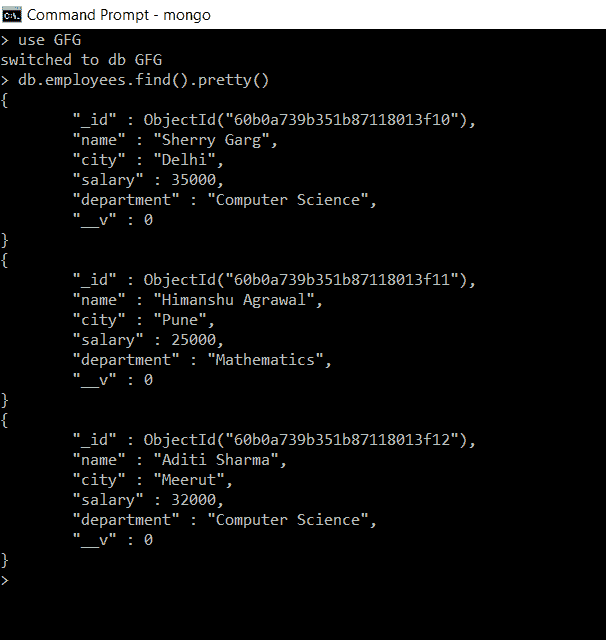
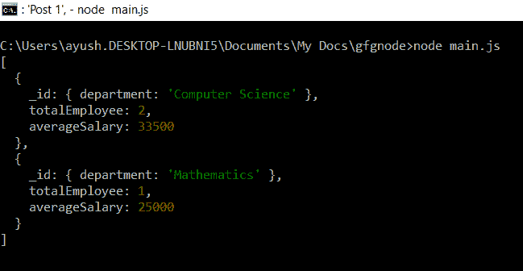

# 如何在 Node.js 中对 MongoDB 查询使用$group？

> 原文:[https://www . geesforgeks . org/a-MongoDB-query-in-node-js/](https://www.geeksforgeeks.org/how-to-use-group-for-a-mongodb-query-in-node-js/)如何使用组

**$group** 运算符是一个聚合运算符或聚合阶段，它通过某种指定的表达式对多个数据或文档进行分组，并将它们组合成一个文档。

**MongoDB 中的聚合**是将多个文档中的值组合在一起的操作，可以对组合后的数据进行多种操作，返回单个结果。而 **$group** 就是聚合执行的操作之一。

**语法:$组运算符**

```js
{
    $group:
    {
        _id: <expression>,
        <field>: { <accumulator> : <expression> }
    }
}
```

*   **_id:** 是要对文档进行分组的字段。
*   **字段:**为可选参数，是对分组数据进行一定的累加器运算后的计算字段。

**安装猫鼬:**

**第一步:**可以访问[安装猫鼬](https://www.npmjs.com/package/mongoose)链接安装猫鼬模块。您可以使用此命令安装此软件包。

```js
npm install mongoose
```

**步骤 2:** 现在，您可以使用以下命令导入文件中的猫鼬模块:

```js
const mongoose = require('mongoose');
```

**数据库:**我们已经在 GFG 的数据库中创建了一个名为*员工*的集合，如下图所示:



收集 GFG 数据库中的员工

**创建节点应用程序:**

**步骤 1:** 使用以下命令创建**包。**

```js
npm init
```

**第二步:**用以下代码创建文件 **main.js** 。

**文件名:main.js**

## java 描述语言

```js
// Requiring module
const mongoose = require('mongoose');

// Connecting to database
mongoose.connect('mongodb://localhost:27017/GFG',
    {
        useNewUrlParser: true,
        useUnifiedTopology: true,
        useFindAndModify: false
    });

// Schema of employee collection
const employeeSchema = new mongoose.Schema({
    name: String,
    city: String,
    salary: Number,
    department: String
})

// Model of employees collection
const Employee = mongoose.model(
        'employee', employeeSchema)

// Group employees by department field
// and computing total no. of employees
// and average salary in each department
Employee.aggregate([
    {
        $group:
        {
            _id: { department: "$department" },
            totalEmployee: { $sum: 1 },
            averageSalary: { $avg: "$salary" }
        }
    }
])
    .then(result => {
        console.log(result)
    })
    .catch(error => {
        console.log(error)
    })
```

使用以下命令运行 **main.js** :

```js
node main.js
```

**输出:**在控制台中，我们获得按*部门*分组的文档，以及每组中的计算字段*合计员工*和*平均工资*。



执行 main.js 后的输出

**说明:**这里我们按照部门字段对员工进行分组，计算单独的字段 *totalEmployee* 包含每个组中的员工总数， *averageSalary* 给出每个组中员工的平均工资，使用累加运算符$sum 和$avg。