# 如何使用 Node.js REPL？

> 原文:[https://www.geeksforgeeks.org/how-to-use-node-js-repl/](https://www.geeksforgeeks.org/how-to-use-node-js-repl/)

节点。Js REPL 或读-评估-打印循环是 Node.js 环境的交互式外壳，这意味着我们可以在其中编写任何有效的 Javascript 代码。这是用来测试、评估、实验或调试代码的一种更加容易和容易的方式。它基本上充当了浏览器的网络开发工具的 Javascript 控制台。

要使用 REPL，您必须为您的操作系统下载 [Node.js](https://www.geeksforgeeks.org/nodejs-tutorials/) 。检查节点是否。Js 安装正确后，可以使用以下命令:

```
node --version 
```

如果你得到了一个版本号，你就可以去别的地方了，你需要修复你的安装。因此，我们现在可以开始在您的机器中使用 node.js REPL 了。

**如何启动 REPL:** 要启动 Node.js REPL 非常简单直接，你只需要根据你的操作系统在 Terminal/CMD/PowerShell 中输入 Node 这个词。

```
node
```

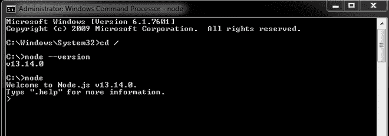

您可以在提示中使用任何有效的 Javascript 代码。我们不需要使用 console.log 来打印变量的值，在大多数情况下只需输入变量的名称就足够了。

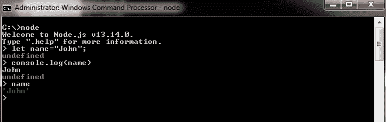

正如我们所看到的，提示输出比纯文本多一点，它是彩色的，甚至内置了自动完成功能。这使得 REPL 在项目中实际使用之前更方便快捷地测试一些想法。

**退出 REPL:** 退出回复，可以在 Windows/Linux 下按 CTRL + D，在 macOS 下按 CMD+D。或者，CTRL+C 两次也可以退出。或者，我们也可以使用以下方法退出 REPL:

```
.exit
```

**在 REPL 使用 Javascript:**我们可以在 REPL 使用任何有效的 Javascript。我们可以使用变量、字符串、连接、算术以及所有在 REPL 可行的东西。我们在 REPL 能写的东西是有限制的，比如长一点的功能性程序。这个问题将在 REPL 命令的下一部分中看到。

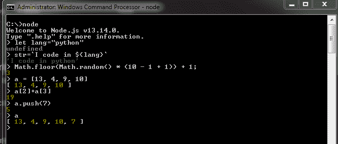

正如我们所看到的，我们在 Javascript 中使用了一些概念，比如字符串插值、算术和使用数组。任何有效和可行的 Javascript 都可以在 REPL 使用，因此 Javascript 的一些核心特性可以在其中使用。

**REPL 命令:**节点中有几个命令和参数要使用。Js REPL 壳牌。我们将在本节中探讨其中的一些。这些命令将在 REPL shell 中使用，即在将命令节点输入您的终端/CMD/PowerShell 之后。这些命令或字符保留在 REPL，因此提供了一些很好的功能并增强了可访问性。

1.  **编辑器命令:**此命令用于停止逐行求值，并在 shell 中进行类似编辑器的键入。它一点也不像一个编辑器，而是简单地编写更长更有意义的代码作为程序的一种形式。

    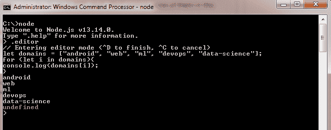

    正如我们所看到的，我们可以在 shell 中编写多行代码，这使得编写更复杂的代码在终端中有很大的自由度。写完所需的代码后，我们可以通过按 CTRL + D 来保存和评估代码，或者我们可以取消评估，从而通过按 CTRL + C 来中止该过程。

2.  **保存命令:**我们可以使用。命令将当前 REPL 会话的代码保存在一个文件中。如果您退出 REPL，这可能会非常方便，所有代码片段都将丢失，使用此命令，用户可以更容易地保留备份。

    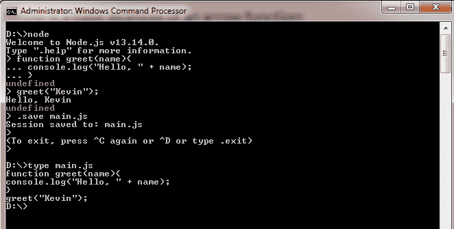

    正如我们所看到的，REPL 的代码片段被保存到一个文件中。在大多数情况下，这个文件显然是一个 Js 文件。那个。save 命令与文件名一起用于存储 REPL 的内容。

3.  **加载命令:**与相反的加载命令。save 命令将文件的变量、函数和其他范围加载到 REPL 中。这对于从文件中加载现有代码进行实验而不需要重新编写整个代码非常有用。

    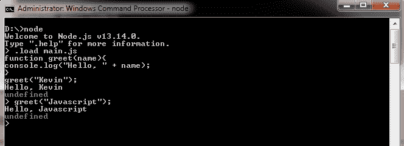

    正如我们所看到的，我们加载了上一个例子中的文件，并把它塞进了一个单独的代码块中，而不是一行行地呈现它。我们可以根据需要扩展代码，如果需要的话，可以再次将其保存到文件中。这使得实验变得更加容易和快速，避免了重复编写代码，并且从文件中加载 Js 代码也非常有用。

4.  **清除命令:**该。清除命令或。break 命令用于中断现有的循环语句或多行输入。

    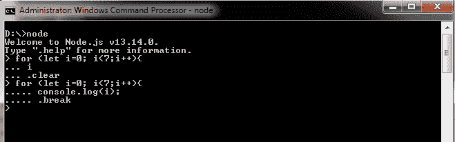

    从上面的例子中我们可以看到。清除或。break 命令会出现一个新的提示并中断当前的输入或语句。这些命令不会执行代码并返回主提示。

5.  **退出命令:**如前所述 **CTRL + D** 或 **CTRL + C(两次**)的替代命令是**。退出**。它基本上离开了 REPL。

    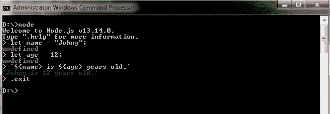

6.  **帮助命令:**REPL 标题中的帮助命令提供了有关节点中可用选项和命令的更多信息。Js REPL。

    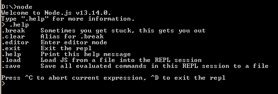

**下划线变量:**下划线变量(_)将给出最后执行的命令或代码的结果。它可以是变量值、函数返回值或任何可以返回某种值的东西，如果评估中没有任何内容，REPL 会将其默认为未定义。

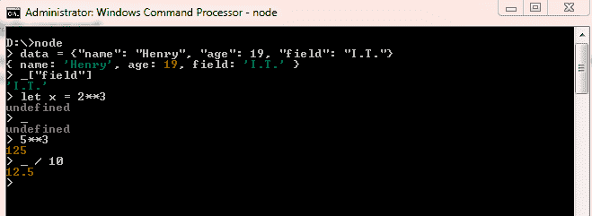

正如我们在示例中看到的，变量获取 shell 中最后执行的命令的结果。如果只有一个变量的声明，它可以是未定义的，否则它存储执行命令的结果或返回值。

**使用模块:**我们甚至可以在 Node 中使用 Js 模块。Js REPL。节点中有几个模块。默认情况下是 Js REPL。您可以通过按两次 TAB 键来获取列表。

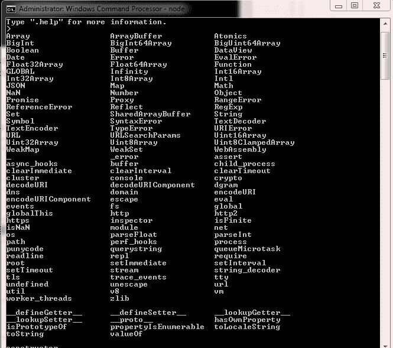

如果要导入其他模块，需要遵循以下步骤:首先需要通过 Node.Js 的 npm 包管理器安装包

```
npm install pacakge_name
```

将模块安装在同一个目录下后，我们可以使用“ **require** ”命令获取模块的核心功能。

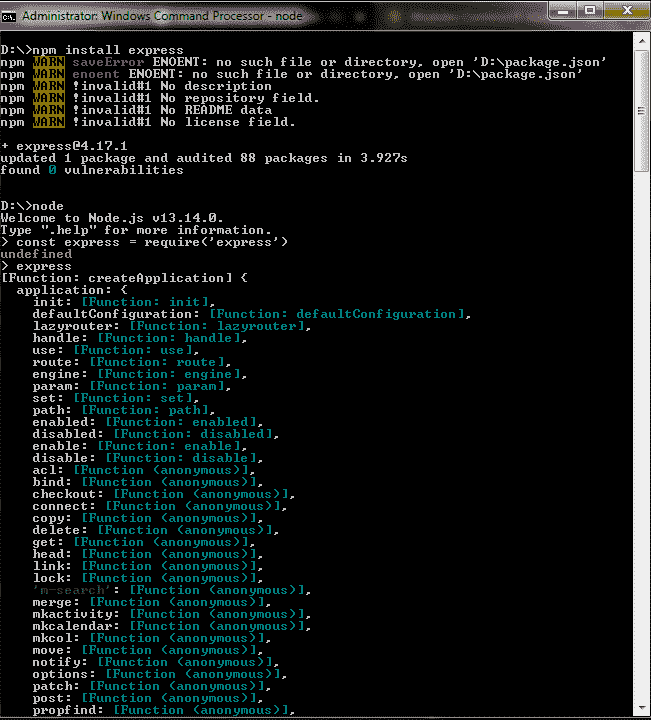

**我们可以看到命令:**

```
const express = require('express')
```

这里，express 也可以是其他模块。在为 REPL 的包编写样板代码之后，我们甚至使用模块中的函数。甚至我们可以使用模板作为文件，并将其加载到 REPL。这使得测试一些经常使用的模块变得非常容易和快速。