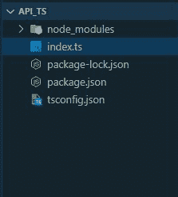
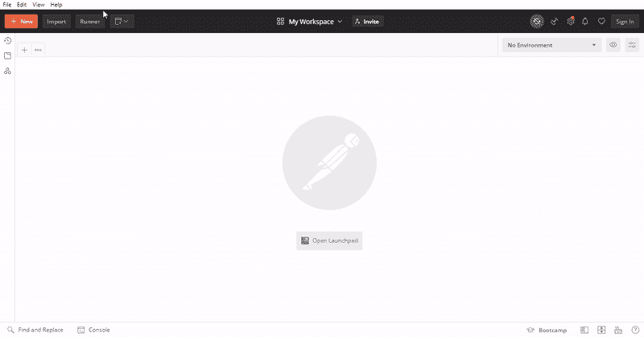
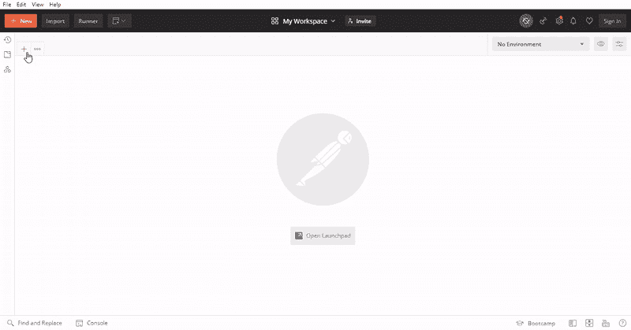
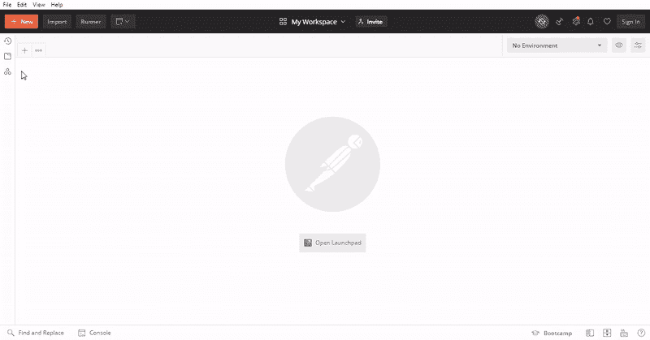

# 如何用 TypeScript 用 Express 构建 Node.js API？

> 原文:[https://www . geesforgeks . org/如何使用-typescript-to-build-node-js-API-with-express/](https://www.geeksforgeeks.org/how-to-use-typescript-to-build-node-js-api-with-express/)

在本文中，我们将讨论如何在 TypeScript 中创建一个快速路由和应用编程接口，并帮助我们使用默认的类型检查机制。我们将在带有 ExpressJS 配置的 TypeScript 的帮助下创建一些 Fake API 端点，并了解如何在我们的 ExpressJS 项目中使用 TypeScript。

TypeScript 是 JavaScript 的超集，具有一些 JavaScript 没有的附加功能，例如类型符号和静态类型更改或在旧的代码库中使用 es6 的代码。Typescript 提供了所有功能。如果您想使用带有 NodeJS 的 express 在 typescript 中创建一个 API 服务，您必须首先使用 typescript 设置您的项目。如果您不知道如何在 typescript 中设置 express，请参考本文[。](https://www.geeksforgeeks.org/how-to-use-express-in-typescript/)

我希望您已经使用上面的文章用 typescript 设置了您的快速项目，现在我们将开始在 Typescript 中创建我们的第一个应用编程接口。

### 先决条件:

*   关于 node.js 的基本知识
*   关于快递 Js 及其路线管理技术的基本知识。
*   关于 TypeScript 及其使用的基本知识。

**方法:**根据上述文章设置目录结构。用类型脚本启动 ExpressJs。将创建两个假的 API 来创建一个用户，并用 ExpressJs TypeScript 配置获取用户数据。查看最终的代码库文件。将在波兹曼应用编程接口测试工具的帮助下测试我们的应用编程接口端点，并查看我们的应用编程接口输出。

**第 1 步:**如果你在使用上面的文章设置了项目你的目录看起来是这样的。



**第二步:**打开 index.ts 文件，写下下面的代码。首先，在 TypeScript 中创建一个 ExpressJs 代码，并传递好的实践。

**index.js**

## java 描述语言

```
// Import the express with express name
import express from 'express';

// Initialize the express module with app variable
const app: express.Application = express();

// Define the port for the application is run
const port: number = 3000;

// Handle the coming data.
app.use(express.json());

// Handle '/', path of the api.
app.get('/', (_req, _res): void => {
    _res.json({
        'name': 'typescitp_api',
        'path': '/',
        'work': 'search_other_apis'
    });
});

// Server the api endpoints.
app.listen(port, (): void => {
    console.log(`Typescript API server http://localhost:${port}/`);
});
```

**第三步:**在这一步中，我们创建了两个 API 端点，用于创建用户和获取用户的数据。首先创建一个全局数组作为假数据库。

**语法:**

```
let fake_db: any = [];
```

然后创建第一个 API 端点来创建用户，并将用户数据存储在假数据库中。我们正在使用 API 端点，因此数据通过 post 方法或 JSON 数据格式传递。在下面的代码中，我们首先处理一个 post 请求，并创建一个“/create”路由管理或创建用户 API 端点，然后将即将到来的主体数据分配给我们的假数据库并返回适当的输出。

**index.js**

## java 描述语言

```
// Handle '/create', path for create user
app.post('/create', (_req, _res): void => {

    // Fatched the user using body data
    const user: object = _req.body;

    // Asigen the user in fake_db with id as a index
    fake_db.push(user);

    _res.json({
        "success": true,
        "data": user
    });
});
```

写完所有代码后，让我们进入测试阶段，看看我们的应用编程接口产生了什么输出。

**步骤 5:** 现在最后一步是使用 Postman 测试所有创建的路由。如果你不了解邮递员，请参考[这篇文章。](https://www.geeksforgeeks.org/introduction-postman-api-development/)

**1。使用邮递员测试“/”根路径。**



根路径工作正常，所以我们正在转移到另一个 API 端点。

**2。使用 postman 在 post 请求中测试“/create”路径。**



我们直接传递原始的 JSON 数据。

**3。使用邮递员测试“/用户”路径。**

