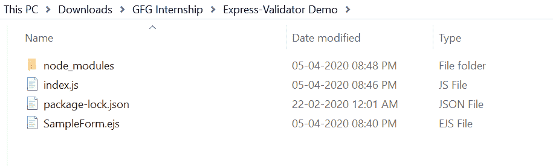
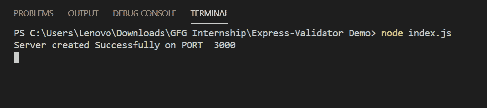
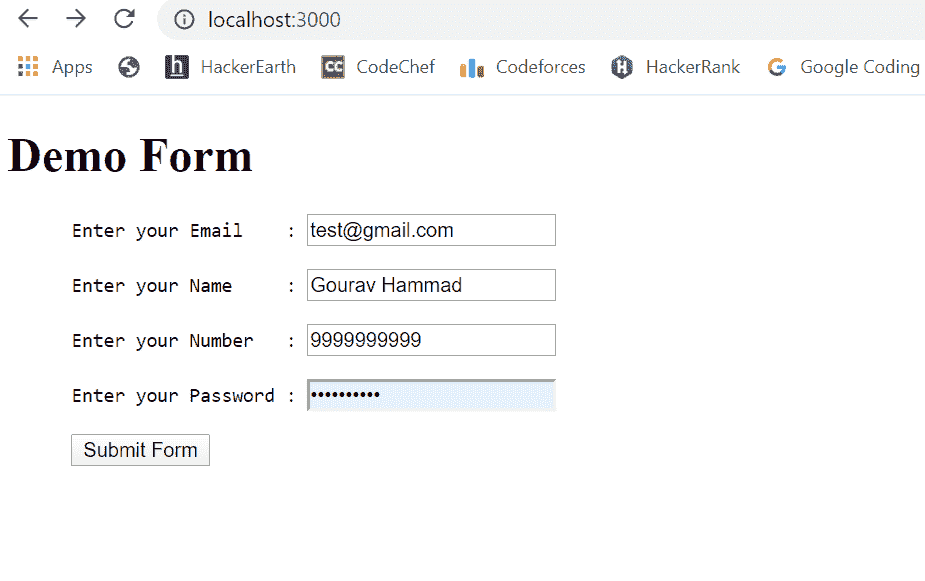
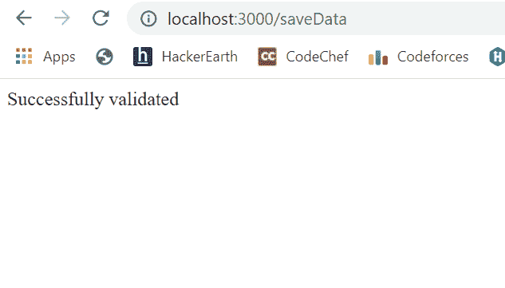
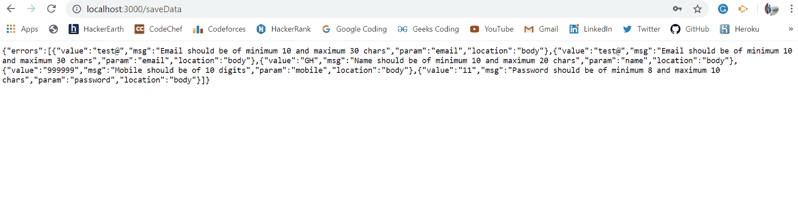

# 如何使用 Node.js 中的快速验证器模块验证数据？

> 原文:[https://www . geesforgeks . org/如何使用快速验证器验证数据-节点中的模块-js/](https://www.geeksforgeeks.org/how-to-validate-data-using-express-validator-module-in-node-js/)

node.js 中的验证可以通过使用 express-validator 模块轻松完成。该模块非常适合数据验证。市场上还有其他模块，如 hapi/joi 等，但是 express-validator 在其中被广泛使用和流行。
**安装快递验证器模块的步骤:**

1.  您可以使用此命令安装此软件包。

```js
npm install express-validator
```

1.  安装后，您可以使用命令在命令提示符下检查您的快速验证器模块版本。

```js
npm version express-validator
```

1.  之后，您可以创建一个简单的数据，如下所示，将数据发送到服务器。
    **文件名:SampleForm.ejs**

## 超文本标记语言

```js
<!DOCTYPE html>
<html>
    <head>
        <title>Validation using Express-Validator</title>
    </head>
<body>
<h1>Demo Form</h1>

<form action="saveData" method="POST">
  <pre>
      Enter your Email    : <input type="text" name="email"> <br>
      Enter your Name     : <input type="text" name="name"> <br>
      Enter your Number   : <input type="number" name="mobile"> <br>
      Enter your Password : <input type="password" name="password"> <br>
      <input type="submit" value="Submit Form">
  </pre>
</form>

</body>
</html>
```

1.  之后，就可以创建一个文件了，例如 index.js 如下所示:
    **文件名:index.js**

## java 描述语言

```js
const { check, validationResult }
    = require('express-validator');

const bodyparser = require('body-parser')
const express = require("express")
const path = require('path')
const app = express()

var PORT = process.env.port || 3000

// View Engine Setup
app.set("views", path.join(__dirname))
app.set("view engine", "ejs")

// Body-parser middleware
app.use(bodyparser.urlencoded({ extended: false }))
app.use(bodyparser.json())

app.get("/", function (req, res) {
    res.render("SampleForm");
})

// check() is a middleware used to validate
// the incoming data as per the fields
app.post('/saveData', [
    check('email', 'Email length should be 10 to 30 characters')
                    .isEmail().isLength({ min: 10, max: 30 }),
    check('name', 'Name length should be 10 to 20 characters')
                    .isLength({ min: 10, max: 20 }),
    check('mobile', 'Mobile number should contains 10 digits')
                    .isLength({ min: 10, max: 10 }),
    check('password', 'Password length should be 8 to 10 characters')
                    .isLength({ min: 8, max: 10 })
], (req, res) => {

    // validationResult function checks whether
    // any occurs or not and return an object
    const errors = validationResult(req);

    // If some error occurs, then this
    // block of code will run
    if (!errors.isEmpty()) {
        res.json(errors)
    }

    // If no error occurs, then this
    // block of code will run
    else {
        res.send("Successfully validated")
    }
});

app.listen(PORT, function (error) {
    if (error) throw error
    console.log("Server created Successfully on PORT ", PORT)
})
```

**运行程序的步骤:**

1.  项目结构如下图所示:



1.  确保你有一个“视图引擎”。我们使用了“ejs”，还使用以下命令安装了 express 和 express-validator、body-parser:

```js
npm install ejs
```

```js
npm install express
```

```js
npm install body-parser
```

```js
npm install express-validator
```

1.  使用以下命令运行 index.js 文件:

```js
node index.js
```



1.  打开浏览器，输入网址*<u>http://localhost:8080/</u>*，填写正确的数据，如下所示:



1.  然后提交表单，如果没有出现错误，那么您将看到以下输出:



1.  如果您试图提交数据不正确的表单，您将看到如下所示的错误消息:

