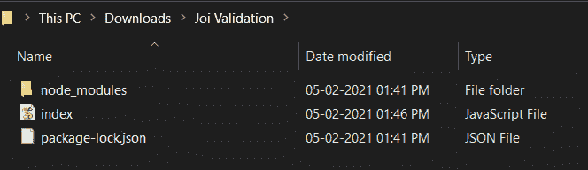
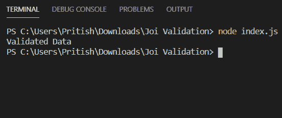
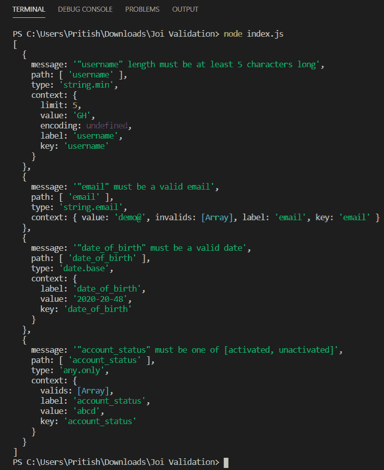
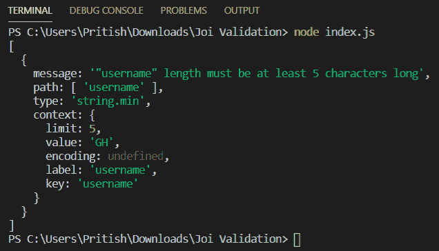

# 如何在 Node.js 中使用 joi 模块验证数据？

> 原文:[https://www . geeksforgeeks . org/如何使用-hapi-joi-module in-node-js/](https://www.geeksforgeeks.org/how-to-validate-data-using-hapi-joi-module-in-node-js/)验证数据

Joi 模块是一个流行的数据验证模块。该模块基于模式验证数据。有各种各样的功能，如可选的()，必需的()，最小的()，最大的()，等等，使其易于使用，并有一个用户友好的模块来验证数据。
**简介:**

1.  上手简单，使用方便。
2.  它是广泛使用和流行的数据验证模块。
3.  它支持基于模式的验证。

**joi 模块安装:**

1.  可以访问**安装 joi 模块链接**。您可以使用此命令安装此软件包。

    ```
    npm install joi
    ```

2.  安装 multer 后，您可以使用命令在命令提示符下检查您的 joi 版本。

    ```
    npm ls joi
    ```

3.  之后，您可以创建一个文件夹并添加一个文件，例如 index.js。

    ```
    node index.js
    ```

4.  **要求模块:**您需要使用这些行在您的文件中包含 joi 模块。

    ```
    const Joi = require('joi');
    ```

**文件名:index.js**

## java 描述语言

```
const Joi = require('joi')

//User-defined function to validate the user
function validateUser(user)
{
    const JoiSchema = Joi.object({

        username: Joi.string()
                  .min(5)
                  .max(30)
                  .required(),

        email: Joi.string()
               .email()
               .min(5)
               .max(50)
               .optional(), 

        date_of_birth: Joi.date()
                       .optional(),

        account_status: Joi.string()
                        .valid('activated')
                        .valid('unactivated')
                        .optional(),
    }).options({ abortEarly: false });

    return JoiSchema.validate(user)
}

const user = {
    username: 'Pritish',
    email: 'pritish@gmail.com',
    date_of_birth: '2020-8-11',
    account_status: 'activated'
}

response = validateUser(user)

if(response.error)
{  
    console.log(response.error.details)
}
else
{
    console.log("Validated Data")
}
```

**注意:**在上面的程序中，abortEarly 被设置为 false，这确保了如果有多个错误，那么所有错误都会显示在终端中。如果设置为真，那么一旦遇到第一个错误，程序的执行将停止，并且只有该错误将显示在终端中。

**运行程序的步骤:**

1.  The project structure will look like this:

    

2.  使用以下命令确保您已经安装了 joi 模块:

    ```
    npm install joi
    ```

3.  使用以下命令运行 index.js 文件:

    ```
    node index.js
    ```

4.  Now, if no error occurs i.e. user data is validate, then following output will be produced:

    

5.  现在，如果我们根据如下所示的无效数据验证用户，那么将产生以下输出:

## java 描述语言

```
var user = {
    username: 'GH',
    email: 'demo@',
    date_of_birth: '2020-20-48',
    account_status: 'abcd'
};
```



```
If abortEarly is set to true the following output will be produced :
```



这就是使用 joi 模块验证数据的方法。市场上还有其他用于验证的模块，如 express-validator 等。