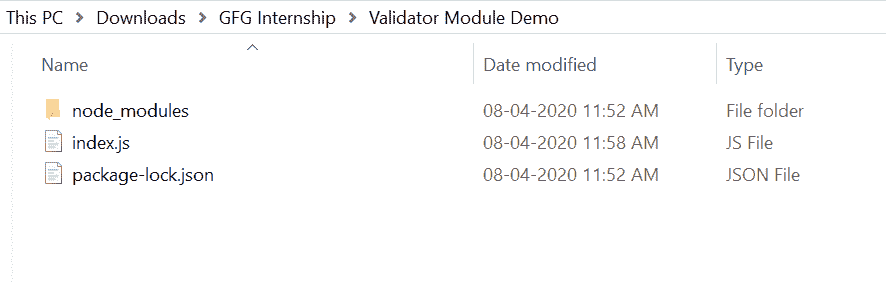
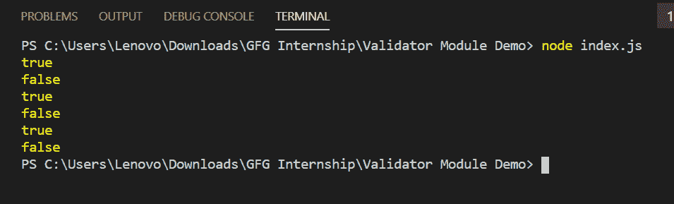

# 如何在 Node.js 中使用验证器模块验证数据？

> 原文:[https://www . geesforgeks . org/如何使用验证器验证数据-节点中的模块-js/](https://www.geeksforgeeks.org/how-to-validate-data-using-validator-module-in-node-js/)

验证器模块在验证中很受欢迎。验证是检查数据是否正确所必需的，因此该模块易于使用，并且可以快速轻松地验证数据。

**验证器模块的特性:**

1.  它很容易上手，也很容易使用。
2.  它是广泛使用和流行的验证模块。
3.  用于验证的简单函数，如 isEmail()、isEmpty()等。

**验证器模块的安装:**

1.  您可以访问链接[安装验证器模块](https://www.npmjs.com/package/validator)。您可以使用此命令安装此软件包。

    ```js
    npm install validator
    ```

2.  安装验证器模块后，您可以使用命令在命令提示符下检查您的验证器版本。

    ```js
    npm version validator
    ```

3.  之后，您可以创建一个文件夹并添加一个文件，例如 index.js。

    ```js
    node index.js
    ```

**文件名:index.js**

```js
const validator = require('validator')

// Check whether given email is valid or not
var email = 'test@gmail.com'
console.log(validator.isEmail(email))  // true
email = 'test@'
console.log(validator.isEmail(email))  // false

// Check whether string is in lowercase or not
var name = 'geeksforgeeks'
console.log(validator.isLowercase(name))  // true
name = 'GEEKSFORGEEKS'
console.log(validator.isLowercase(name))  // false

// Check whether string is empty or not
var name = ''
console.log(validator.isEmpty(name))  // true
name = 'geeksforgeeks'
console.log(validator.isEmpty(name))  // false

// Other functions also available in 
// this module like isBoolean()
// isCurrency(), isDecimal(), isJSON(),
// isJWT(), isFloat(), isCreditCard(), etc.
```

**运行程序的步骤:**

1.  项目结构会是这样的:
    
2.  确保您已经使用以下命令安装了 express 和 validator 模块:

    ```js
    npm install validator
    npm install express
    ```

3.  Run index.js file using below command:

    ```js
    node index.js
    ```

    

这就是如何使用验证器模块进行验证。市场上还有其他可供验证的模块，如 hapi-joi、express-validator 等。