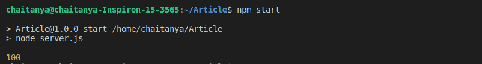
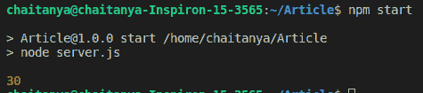

# 如何为 Node.js 编写异步函数？

> 原文:[https://www . geesforgeks . org/如何编写节点异步函数-js/](https://www.geeksforgeeks.org/how-to-write-asynchronous-function-for-node-js/)

异步函数可以在 Node.js 中使用函数名前面的“async”来编写。异步函数返回隐式承诺作为结果。async 函数有助于通过事件循环异步编写基于承诺的代码。异步函数将总是返回值。可以在异步函数中使用 wait 函数来等待承诺。这迫使代码等待，直到承诺返回结果。

使用以下命令从 Node.js 中的 npm 安装异步:

```js
npm i async
```

使用 require()方法在 Node.js 项目中使用异步。

**示例 1:** 创建异步函数来计算 Node.js 中一个数字的平方。

*   创建项目文件夹。
*   使用以下命令初始化项目文件夹中的 package.json 文件。

    ```js
    npm init -y
    ```

*   使用以下命令安装异步:

    ```js
    npm i async
    ```

*   创建一个 server.js 文件，并在其中编写以下代码。
*   使用`npm start`运行代码

```js
var async = require("async");

function square(x) {
    return new Promise((resolve) => {
        setTimeout(() => {
            resolve(Math.pow(x, 2));
        }, 2000);
    });
}

async function output(x) {
    const ans = square(x);
    console.log(ans);
}

output(10);
var async = require("async");

function square(x) {
    return new Promise((resolve) => {
        setTimeout(() => {
            resolve(Math.pow(x, 2));
        }, 2000);
    });
}

async function output(x) {
    const ans = await square(x);
    console.log(ans);
}

output(10);
```

**输出:**


**示例 2:** 创建一个异步函数，使用 await 计算 Node.js 中两个数的和。执行上面的过程来创建一个 Node.js 项目。

```js
var async = require("async");

function square(a, b) {
    return new Promise(resolve => {
        setTimeout(() => {
            resolve(a + b);
        }, 2000);
    });
}

async function output(a, b) {
    const ans = await square(a, b);
    console.log(ans);
}

output(10, 20);
```

**输出:**
