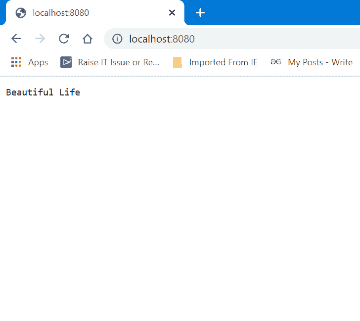

# 如何在 Node.js 中写《美丽人生》？

> 原文:[https://www . geesforgeks . org/如何编写美丽的节点生活-js/](https://www.geeksforgeeks.org/how-to-write-beautiful-life-in-node-js/)

Node.js 是一个开源的跨平台运行时环境，用于在浏览器之外执行 JavaScript 代码。你需要记住 NodeJS 不是一个框架，也不是一种编程语言。大多数人都很困惑，明白这是一个框架或者一种编程语言。我们经常使用 Node.js 来构建后端服务，比如像 Web App 或者移动 App 这样的 API。贝宝、优步、网飞、沃尔玛等大公司都在生产中使用它。

**示例:**在本文中，我们将学习如何在 Node.js 中编写“美丽人生”，创建一个. js 文件，就像我们创建了 *geeksforgeeks.js* 文件一样，并在其中写下以下代码。

**文件名:geeksforgeeks.js**

## java 描述语言

```js
var http = require('http');

// Create a server object:
http.createServer(function (request, response) {

    // Write a response to the client
    response.write('Beautiful Life');

    // End the response
    response.end();

// The server object listens on port 8080
}).listen(8080);
```

**运行文件的步骤:**打开 CMD，转到保存上述文件的文件夹目录，然后运行以下命令。

```js
node geeksforgeeks.js
```

**输出:**打开任意浏览器，转到***http://localhost:8080/***，会看到如下输出。

