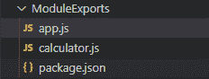
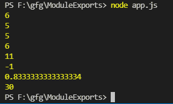

# 如何在 Node.js 中使用 module.exports 编写代码？

> 原文:[https://www . geesforgeks . org/如何编写代码-使用模块-节点中导出-js/](https://www.geeksforgeeks.org/how-to-write-code-using-module-exports-in-node-js/)

**模块**是一个离散的程序，包含在 Node.js 中的一个单独的文件中，它们被绑定到文件中，每个文件有一个模块。 ***module.exports*** 是当前模块在另一程序或模块中为“ ***【必选】*** ”时返回的对象。

我们将看到一个像计算器这样的简单代码，学习如何在 Node.js 中使用*模块. exports* ，我将一步一步地为您讲解。

**第一步:**在项目文件夹中创建两个文件“ *app.js* ”和“ *calculator.js* ”。并通过终端中的 npm 初始化项目。

> npm 初始化



在步骤 1 之后

**第二步:**现在我们有了一个基于 nodeJS 的项目，以“ *app.js* 为切入点。现在我们先来编码一下“*计算器. js* ”。我们将在其中创建一个名为*计算器*的类。它将有几个成员职能，即:

*   *预增量*:对于前缀增量操作
*   *位置增量*:对于后缀增量操作
*   *预定义*:前缀减量操作
*   *后置减量*:对于后置减量操作
*   *加*:两个数相加
*   *减法*:两个数相减
*   *相乘*:两个数相乘
*   *除法*:两个数的除法

最后，我们通过*模块导出*计算器*类*

## 计算器. js

```
// ***** calculator.js file *****
class Calculator {

    // Constructor to create object of the class
    Calculator() {

    }

    // Prefix increment operation
    preIncrement(a) {
        return ++a;
    }

    // Postfix increment operation
    postIncrement(a) {
        return a++;
    }

    // Prefix decrement operation
    preDecrement(a) {
        return --a;
    }

    // Postfix decrement operation
    postDecrement(a) {
        return a--;
    }

    // Addition of two numbers
    add(a, b) {
        return a + b;
    }

    // Subtraction of two numbers
    subtract(a, b) {
        return a - b;
    }

    // Division of two numbers
    divide(a, b) {
        return a / b;
    }

    // Multiplication of two numbers
    multiply(a, b){
        return a * b;
    }
}

// Exporting Calculator as attaching
// it to the module object
module.exports= Calculator;
```

**第三步:**现在让我们对“ *app.js* 文件进行编码。

首先，我们将从“*计算器. js* 文件中导入*计算器* r 类。然后我们创建一个计算器类的对象“ *calc* ”来使用它的成员方法。

## app.js

```
// ***** app.js file  ******
// Importing Calculator class
const Calculator = require('./calculator.js');

// Creating object of calculator class
const calc = new Calculator();

/* Using all the member methods 
defined in Calculator */

console.log(calc.preIncrement(5))

console.log(calc.postIncrement(5))

console.log(calc.preDecrement(6))

console.log(calc.postDecrement(6))

console.log(calc.add(5, 6))

console.log(calc.subtract(5, 6))

console.log(calc.divide(5, 6))

console.log(calc.multiply(5, 6))
```

**运行应用程序的步骤:**打开终端，键入以下命令。

```
node app.js
```



输出

这样，您可以在 node.js 中使用 *module.exports* ，在这里您可以传递任何变量、文字、函数或对象来代替类。然后使用 *require()* 导入