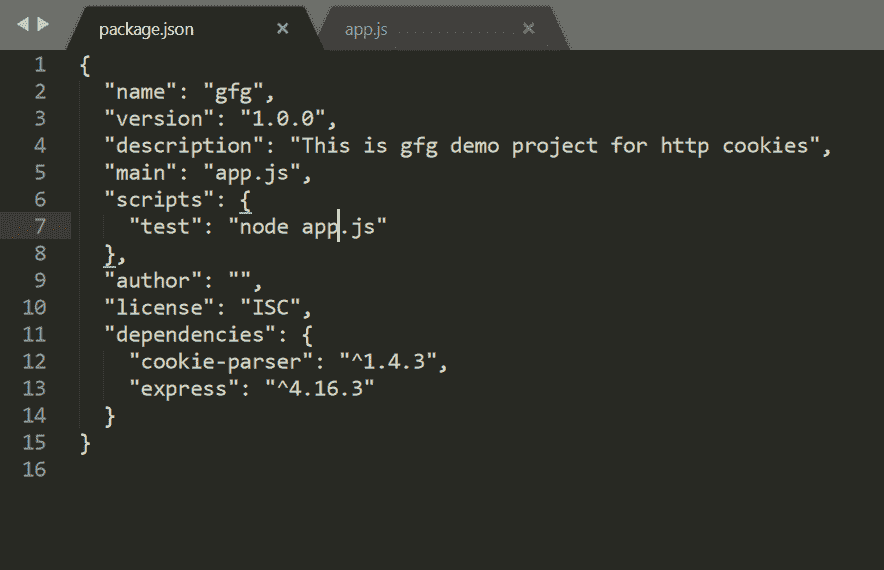
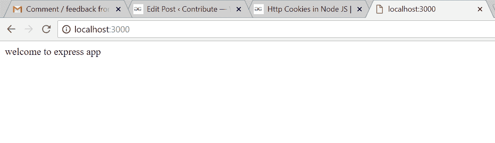
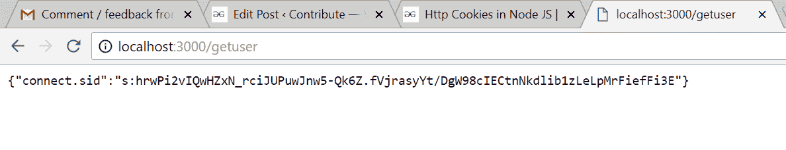
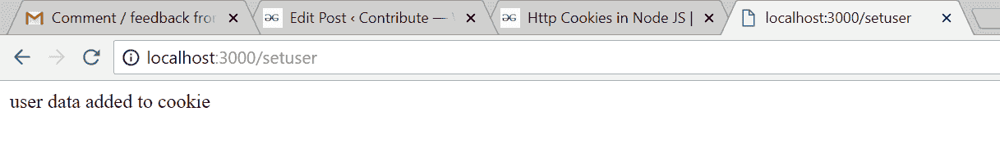
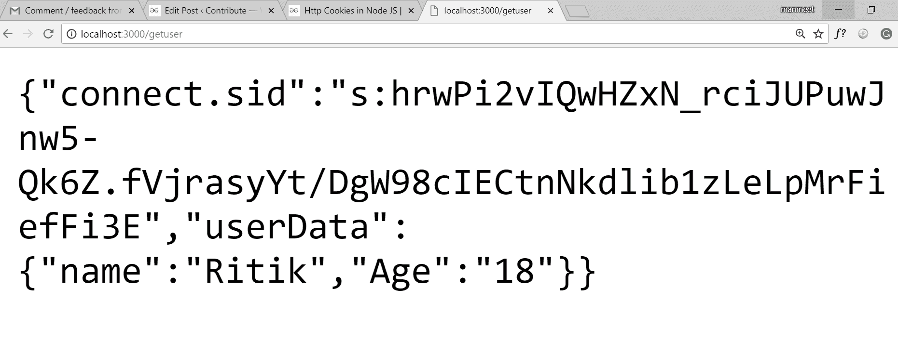
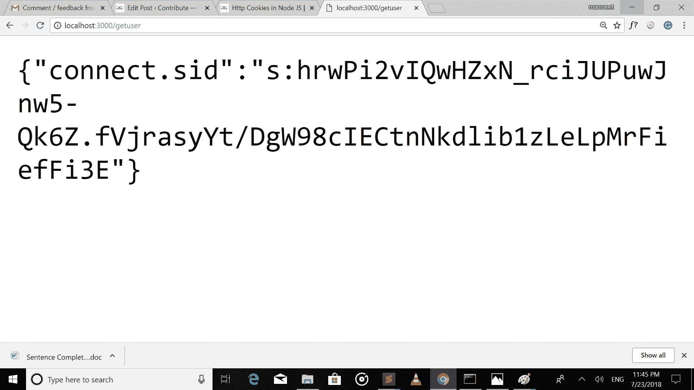

# node . js 中的 HTTP Cookies】

> 原文:[https://www.geeksforgeeks.org/http-cookies-in-node-js/](https://www.geeksforgeeks.org/http-cookies-in-node-js/)

Cookies 是存储在客户端的小数据，与服务器请求一起发送给客户端。Cookies 有各种各样的功能，它们可以用于维护会话和在你的 web 应用程序中添加用户特定的功能。为此，我们将使用 npm 的 **cookie 解析器**模块，该模块为 cookie 解析提供中间件。
首先将命令提示符下的目录设置为项目的根文件夹，并运行以下命令:

```
npm init

```

这会询问你关于你的应用的细节，最后会创建一个 **package.json** 文件。
之后运行以下命令，它将安装所需的模块，并将它们添加到您的 package.json 文件中

```
npm install express cookie-parser --save

```

package.json 文件看起来是这样的:


之后，我们将通过在根目录下的 app.js 文件中编写以下代码来设置基本的 express app。

```
let express = require('express');
//setup express app
let app = express()

//basic route for homepage
app.get('/', (req, res)=>{
res.send('welcome to express app');
});

//server listens to port 3000
app.listen(3000, (err)=>{
if(err)
throw err;
console.log('listening on port 3000');
});
```

之后如果我们运行命令

```
node app.js

```

它将在端口 3000 启动我们的服务器，如果转到 url: localhost:3000，我们将获得一个显示消息的页面:

```
welcome to express app

```

这里是启动服务器后 localhost:3000 页面截图:


所以到目前为止，我们已经成功地设置了我们的快速应用程序，现在让我们从 cookies 开始。

首先对于 cookies，我们需要导入 app.js 文件中的模块，并像其他中间件一样使用它。

```

var cookieParser = require('cookie-parser');
app.use(cookieParser());

```

假设我们有一个用户，我们想要将该用户数据添加到 cookie 中，那么我们必须使用以下代码将该 cookie 添加到响应中:

```
res.cookie(name_of_cookie, value_of_cookie);

```

这可以通过下面的例子来解释:

```
let express = require('express');
let cookieParser = require('cookie-parser');
//setup express app
let app = express()

app.use(cookieParser());

//basic route for homepage
app.get('/', (req, res)=>{
res.send('welcome to express app');
});

//JSON object to be added to cookie
let users = {
name : "Ritik",
Age : "18"
}

//Route for adding cookie
app.get('/setuser', (req, res)=>{
res.cookie("userData", users);
res.send('user data added to cookie');
});

//Iterate users data from cookie
app.get('/getuser', (req, res)=>{
//shows all the cookies
res.send(req.cookies);
});

//server listens to port 3000
app.listen(3000, (err)=>{
if(err)
throw err;
console.log('listening on port 3000');
});
```

因此，如果我们重启服务器，在设置 cookies 之前向路由:localhost:3000/getuser 发出 get 请求，如下所示:


向 localhost:3000/setuser 发出请求后，它会将用户数据添加到 cookie 中，并给出如下输出:


现在，如果我们再次向 localhost:3000/getuser 发出请求，因为该路由正在使用 **req.cookies** 迭代来自 cookies 的用户数据，因此输出将如下所示:

如果我们有多个对象被推入 cookies，那么我们可以使用 **req.cookie.cookie_name** 访问特定的 cookie。

**添加有过期时间的饼干**
我们可以添加一个有一定过期时间的饼干，也就是说过了这个时间饼干就会自动销毁。为此，我们需要在设置 cookie 时向 res.cookie 对象传递一个额外的属性。
可以使用以下两种方式中的任何一种:

```

//Expires after 400000 ms from the time it is set.
res.cookie(cookie_name, 'value', {expire: 400000 + Date.now()});

```

```

//It also expires after 400000 ms from the time it is set.
res.cookie(cookie_name, 'value', {maxAge: 360000});

```

**销毁饼干:**
我们可以使用以下代码销毁饼干:

```
res.clearCookie(cookieName);

```

现在让我们创建一个注销路由，它将破坏 cookie 中的用户数据。现在我们的 app.js 看起来像:

```
let express = require('express');
let cookieParser = require('cookie-parser');
//setup express app
let app = express()

app.use(cookieParser());

//basic route for homepage
app.get('/', (req, res)=>{
res.send('welcome to express app');
});

//JSON object to be added to cookie
let users = {
name : "Ritik",
Age : "18"
}

//Route for adding cookie
app.get('/setuser', (req, res)=>{
res.cookie("userData", users);
res.send('user data added to cookie');
});

//Iterate users data from cookie
app.get('/getuser', (req, res)=>{
//shows all the cookies
res.send(req.cookies);
});

//Route for destroying cookie
app.get('/logout', (req, res)=>{
//it will clear the userData cookie
res.clearCookie('userData');
res.send('user logout successfully');
});

//server listens to port 3000
app.listen(3000, (err)=>{
if(err)
throw err;
console.log('listening on port 3000');
});
```

要销毁 cookie，请向以下链接发出获取请求:<3000 logout="" id="attachment_510034" align="aligncenter" src="https://media.geeksforgeeks.org/wp-content/uploads/Screenshot-39-4.png" alt="" class="size-medium wp-image-510034">用户已注销[/caption]

要检查 cookie 是否被销毁，请向 localhost:3000/getuser 发出 get 请求，您将获得一个空的用户 cookie 对象。


这是关于使用 cookie 解析器中间件的 HTTP cookies 的基本使用。Cookies 可以用于许多方面，例如维护会话，并根据每个用户以前在网站上的交易为他们提供不同的网站视图。

3000>