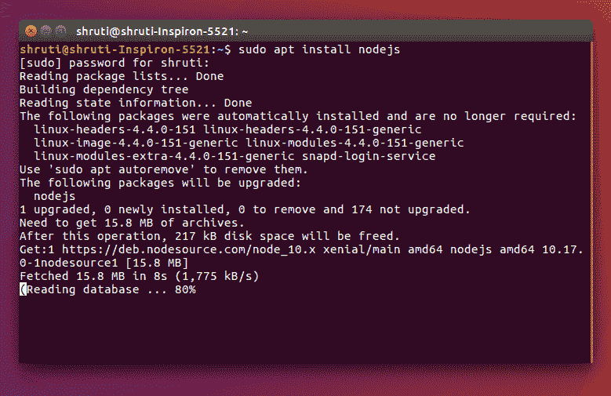
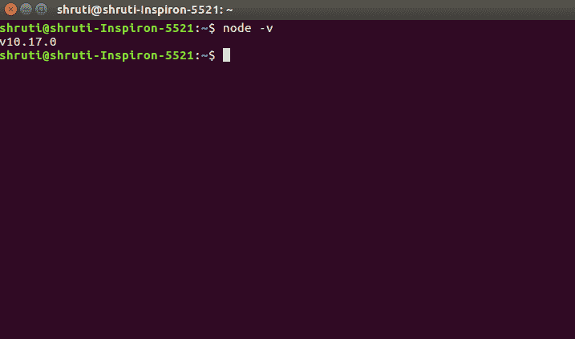
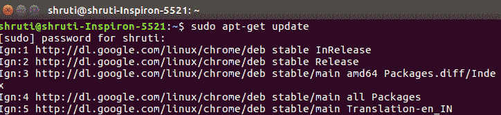
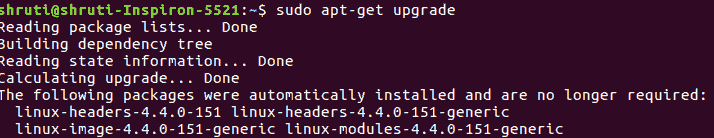
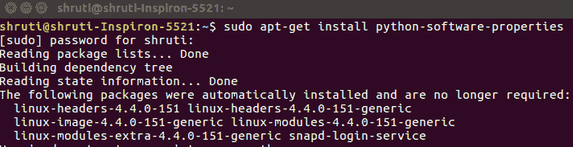
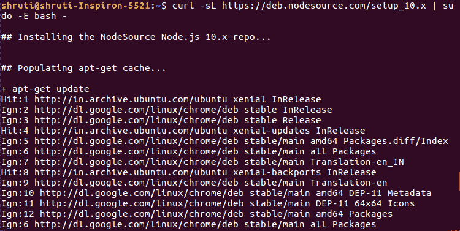
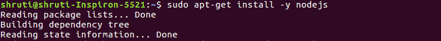
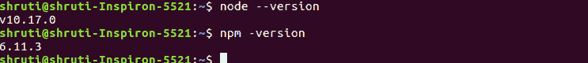

# 在 Linux 上安装 node . js

> 原文:[https://www . geesforgeks . org/installation-of-node-js-on-Linux/](https://www.geeksforgeeks.org/installation-of-node-js-on-linux/)

**Node.js** 是一个建立在 Chrome 的 V8 JavaScript 引擎上的 JavaScript 运行时。Node.js 可以通过多种方式安装在你的 Ubuntu Linux 机器上。你可以使用 **Ubuntu 的官方库**来安装 Node.js 或者用另外一种方式来使用 **NodeSource 库**。通过节点源存储库安装将允许您选择最新版本的节点

**在 Ubuntu 18.04 和 16.04 上安装 Node:**在 Ubuntu 上安装 Node.js 有 Ubuntu 官方资源库和 NodeSouce 资源库两种方法。

**使用 Ubuntu 官方资源库安装 node . js:**node . js 可以在 Ubuntu 的资源库中获得，只需使用几个命令就可以轻松安装。按照以下步骤在 Ubuntu 操作系统上安装 Node.js。

*   **第一步:**打开你的终端或者按 Ctrl+Alt+t .
    T3】
*   **Step 2:** To install node.js use the following command:

    > **sudo apt 安装 nodejs**

    

*   **Step 3:** Once installed, verify it by checking the installed version using the following command:

    > **节点-v** 或**节点-版本**

    

**注意:**建议用 Node.js 安装 Node Package Manager(NPM)，NPM 是 Node.js 包的开源库。
要安装 NPM，请使用以下命令:

> **sudo apt 安装 npm**
> **npm -v** 或**NPM–版本**

节点和 NPM 将成功安装在你的 Ubuntu 机器上。

**使用 NodeSource 库安装 Node.js:**最新版本的 node . js 可以从 [NodeSource 库](https://github.com/nodesource/distributions)安装。按照下面的步骤在你的 Ubuntu 上安装 Node.js。

*   **Step 1:** Open your terminal or press Ctrl + Alt + T and use the following commands to update and upgrade the package manager:

    > **sudo apt-get 更新**T2**sudo apt-get 升级**

    
    

*   **Step 2:** Install Python software libraries using the following command:

    > **sudo apt-get 安装 python-软件-属性**

    

*   **Step 3:** Add Node.js PPA to the system.

    > **curl-sl https://deb . nodesource . com/setup _ 10 . x | sudo-e bash–**

    **注意:**这里我们安装的是 node.js 版本 10，如果要安装版本 11，可以用 setup_11.x 替换 setup _ 10 . x .
    

*   **Step 4:** To Install Node.js and NPM to your Ubuntu machine, use the command given below:

    > **sudo apt-get install nodejs**

    

*   **Step 5:** Once installed, verify it by checking the installed version using the following command:

    > **节点-v** 或**节点-版本**
    > **npm -v** 或**NPM-版本**

    

最后，您已经成功地在您的 Ubuntu 机器上安装了 Node.js 和 NPM。