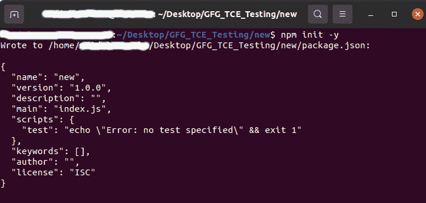
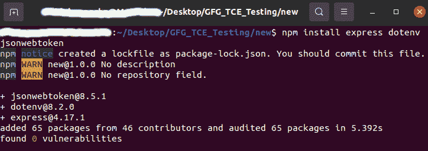

# 节点 JWT 认证

> 原文:[https://www . geesforgeks . org/jwt-带节点身份验证-js/](https://www.geeksforgeeks.org/jwt-authentication-with-node-js/)

[JSON 网络令牌](https://www.geeksforgeeks.org/json-web-token-jwt/)是一个开放标准，用于使用 JSON 对象在各方之间安全地传输数据。JWT 用于用户和提供者的无状态身份验证机制，这意味着在客户端维护会话，而不是在服务器上存储会话。这里，我们将在 NodeJs 中实现 JWT 认证系统。

**所需模块:**

*   NodeJs： [NodeJs](https://www.geeksforgeeks.org/introduction-to-nodejs/) 用于后端
*   dotenv:用于处理配置数据

```
npm install dotenv
```

*   处理路线的快速路:[快速路](https://www.geeksforgeeks.org/introduction-to-express/)。
*   jsonwebtoken 模块:

```
npm install jsonwebtoken
```

**所有步骤:**

2.  创建我们的项目:

    要创建节点项目，npm init -y 用在用户想要创建项目的文件夹中。npm 命令行将询问许多问题，如名称、许可证、脚本、描述、作者、关键字、版本、主文件等。npm 创建完项目后，在项目文件夹中将会看到一个 package.json 文件，作为项目已经初始化的证明。

    ```
    npm init -y
    ```

    

3.  安装模块

    创建项目后，下一步是合并要在节点项目中使用的包和模块。要在项目中安装包和模块，请使用以下语法:

    ```
    npm install express dotenv jsonwebtoken
    ```

    

4.  创建我们的服务器

    导入所有依赖项并使用 express.js 创建一个服务器

    ## java 描述语言

    ```
    const express = require('express');
    const dotenv = require('dotenv');
    const jwt = require('jsonwebtoken');

    const app = express();

    // Set up Global configuration access
    dotenv.config();

    let PORT = process.env.PORT || 5000;
    app.listen(PORT, () => {
      console.log(`Server is up and running on ${PORT} ...`);
    });
    ```

5.  创建配置文件(。环境)

    这些文件包含我们需要传递给应用程序环境的变量。

    ## java 描述语言

    ```
    PORT = 5000

    JWT_SECRET_KEY = gfg_jwt_secret_key

    TOKEN_HEADER_KEY = gfg_token_header_key
    ```