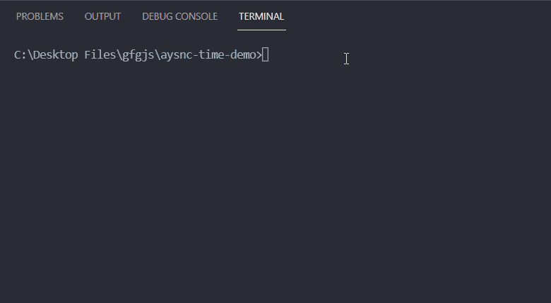

# 测量 Node.js

中异步操作的持续时间

> 原文:[https://www . geesforgeks . org/measure-node-js 中异步操作的持续时间/](https://www.geeksforgeeks.org/measure-the-duration-of-async-operations-in-node-js/)

Node.js 中的异步操作是非阻塞操作，这意味着如果我们在代码中的某个点执行异步操作，那么之后的代码就会被执行，而不会等待这个异步操作完成。

如果我们想计算异步操作的持续时间，那么我们可以使用下面提到的语法，在异步函数中轻松完成。

**语法:**

```
const calcTime = async () => {
  const start = Date.now();
  await someAsyncOperation();
  const end = Date.now()
  const duration = end - start;
}
```

**项目设置:**

**第一步:** [如果你还没有安装 Node.js](https://www.geeksforgeeks.org/installation-of-node-js-on-windows/) 。

**第二步:**为你的项目创建一个文件夹，并将 [**cd**](https://www.geeksforgeeks.org/cd-command-in-linux-with-examples/) (更改目录)放入其中。在该文件夹中创建一个名为 app.js 的新文件。

**项目结构:**按照步骤操作后，您的项目结构将如下所示。


在下面提到的代码示例中，我们使用 [setTimeout()](geeksforgeeks.org/java-script-settimeout-setinterval-method/) 方法模拟了一个异步操作。我们在返回承诺的异步函数中执行加法操作。这个承诺在 2 秒钟后通过加法的结果被解决。最后，我们计算并显示在我们的[生命](https://www.geeksforgeeks.org/javascript-immediately-invoked-function-expressions-iife/)(立即调用的函数表达式)中执行加法操作所花费的时间。

## app.js

```
const asyncAdd = async (a, b) => {
  return new Promise((resolve, reject) => {
    setTimeout(() => {
      resolve(a + b);
    }, 2000);
  });
};

(async() => {
  const startTime = Date.now();
  const res = await asyncAdd(5, 2);
  const endTime = Date.now();

  const timeTaken = endTime - startTime;

  console.log(`Result of addition = ${res}`);
  console.log(`Time taken to perform addition =
          ${timeTaken} milliseconds`);
})();
```

**运行应用程序的步骤:**我们可以在命令行上使用以下命令执行我们的 app.js 文件。

```
node app.js
```

**输出:**

