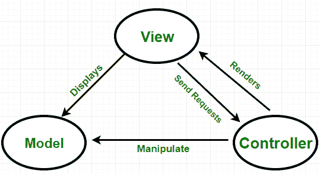
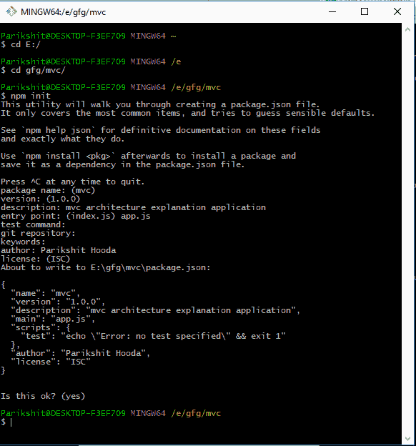
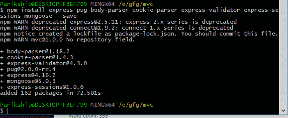
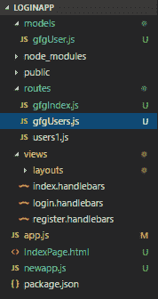
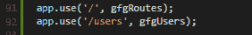
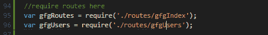
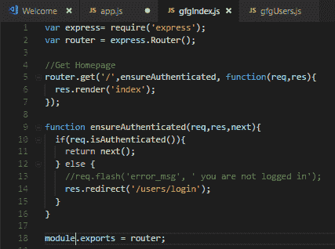
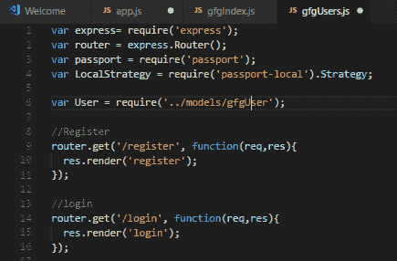
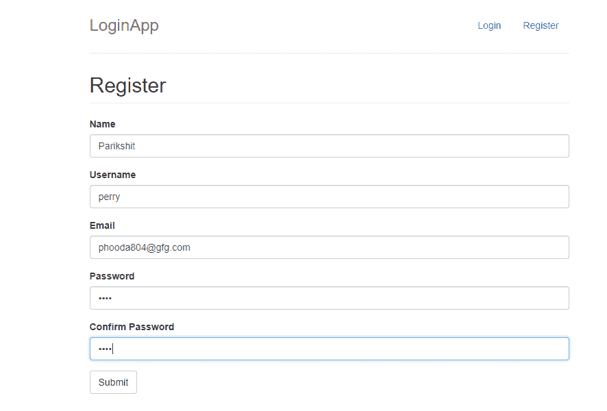
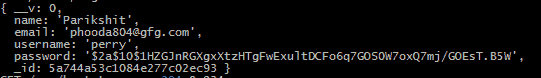

# 节点应用的模型-视图-控制器架构

> 原文:[https://www . geesforgeks . org/model-view-controller VC-architecture-for-node-applications/](https://www.geeksforgeeks.org/model-view-controllermvc-architecture-for-node-applications/)

MVC 是模型-视图-控制器的缩写。
是软件项目的设计模式。它主要由 Node 开发人员使用，也由 C#、Ruby、PHP 框架用户使用。
在 MVC 模式中，应用及其开发分为三个相互关联的部分。这样做的好处是，它有助于关注应用程序名称的特定部分，即信息呈现给用户和用户接受信息的方式。它有助于实现高效的代码重用和应用程序的并行开发。即使项目结构看起来与理想的 MVC 结构有些不同，但是应用程序中的基本程序流保持不变。

在这篇文章中，将通过创建一个演示应用程序来展示应用程序的这些组件之间的程序流。

**首先**，让我们了解一下应用程序的这些部分意味着什么，它们执行什么功能。

### 说明

**模型**:模型表示数据的结构、格式以及存储数据的约束条件。它维护应用程序的数据。本质上，它是应用程序的数据库部分。

**视图**:视图就是呈现给用户的东西。视图利用模型并以用户想要的形式呈现数据。还可以允许用户对呈现给用户的数据进行更改。它们由静态和动态页面组成，当用户请求时，这些页面被呈现或发送给用户。

**控制器**:控制器**控制**用户的请求，然后产生适当的响应，反馈给观众。通常，用户与视图交互，视图又生成适当的请求，该请求将由控制器处理。控制器以模型数据作为响应呈现适当的视图。
所以，总结一下:

*   模型是数据的一部分。
*   视图是用户界面的一部分。
*   控制器是请求-响应处理程序。

MVC 架构

现在，让我们开始应用程序。
**npm init** 在这里用来生成 **package.json** 和 **app.js** 文件。

npm 初始化

顾名思义，有三个文件夹，称为模型、视图、控制器，它们将有助于 mvc 架构的实现。
npm 是用来安装基本的 npm 包来入门的。

NPM-包-安装-snip

项目结构如下。

MVC-项目-结构截图

### 项目结构说明

*   可以看到，有一个**路由**文件夹，将作为**控制器**。
*   然后是**模型**文件夹，里面有一个用户**模型**。
*   一个**视图**文件夹，里面有我们的视图，扩展了**。车把**。请注意，handlebars 是一个模板引擎，这意味着它能够通过填充我们创建的模板来生成页面。

现在，让我们开始展示 MVC 模式是如何在这个演示的登录和注册过程中实现的。

1.  编写**节点 app.js** 启动应用。如果一切正常，应用程序将启动，否则尝试使用 stackoverflow 等工具调试应用程序。
2.  Open the app in your browser. If you have forked and using my github repo, then navigate to **localhost:3000** in your browser and you will see the app running.When you open the app in your browser, your app.js file will say to itself something like :”Oh! The browser has requested **localhost:3000/**, so lets look for the file to serve if this route is hit. It looks for this code:

    App 使用路由 appjs

    .

    它告诉应用程序，如果请求**/**，使用可变路线。然后它会查找 routes 变量。它可以在 app.js 文件中找到:

    

    路线需要

    .

    现在，它在我们的节点应用程序的 routes 文件夹中的 gfgIndex.js 文件中查找当“/”路由被命中时要执行的代码。
    它找到以下代码。

    

    gfgindexjs 路由文件

    This code basically says that render the **index.hanblebars** if the user is logged in. To check if the user is logged in, it runs the function **ensureAuthenticated**.
    This function basically says that if the user is logged in, render the **index.handlebars** file **else** redirect the user to the **/users/login** route.

    GfgUsersjs 登录路径 snip

    This code tells the app to render the index.handlebars file when the GET ‘/’ is called. So, now it goes to the views folder and look for the **index.handlebars** and renders it to the user.
    This is how the views-controller part of the architecture works in the app. I believe the above program flow is clear to the reader.

    现在让我们继续注册测试用户的过程，看看模型是如何工作的。

3.  Lets navigate to **http://localhost:3000/users/register**. So, the app breaks the route into two pieces:/users and /register and asks itself something like “Oh okay! The users wants to see **/users** route and then **/register** . The app looks for the **‘/users’** in its app.js file and finds it here.

    App 使用路由 appjs

    .

    然后，它查找在/users 路径被命中时使用的“users”变量，该变量可以在 app.js 文件中找到:

    

    路线需要

    .

    因此，它转到 routes 文件夹中的 gfgUsers.js 文件，并查找路由/注册。注意**/用户/注册**发现自己在 **gfgUsers.js** 文件中为**/注册**。它要求浏览器渲染**“register . handlers”**文件。这是视图控制器拱门。正在实施。
    **注册第二部分**现在，让我们注册一个新用户。

    

    注册新的用户快照。图片:https://media . geesforgeks . org/WP-content/uploads/register-a-new-user-snap . png

    After clicking on submit, the data is taken, **POST**ed to the **‘/register’** route for processing. This controller validates the incoming data for errors, then creates a new variable called newUser with the User modelled **modelled** with all the data and the calls **save()** on it to actually save the data to the user.
    

    登录到终端的新用户控制台

    创建用户后，**/【注册】**控制器要求浏览器将用户重定向至**/【登录】**页面。这是模型-视图-控制器架构实现。

你可以在这里找到本文[使用的全部代码。分叉，克隆并运行。](https://github.com/Parikshit-Hooda/loginapp-gfg)