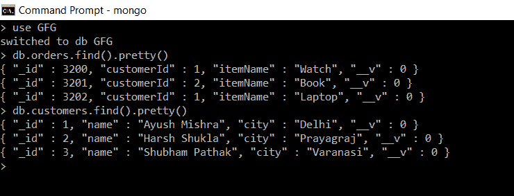
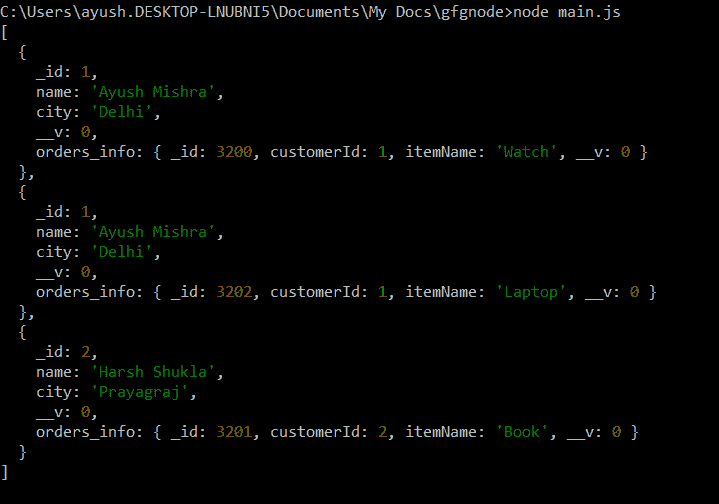
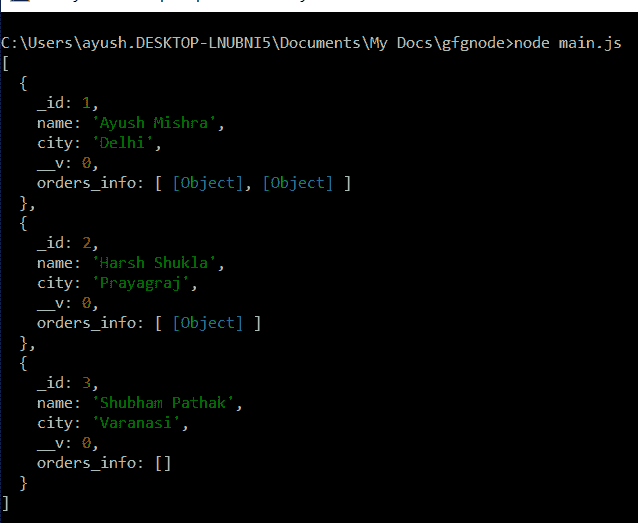
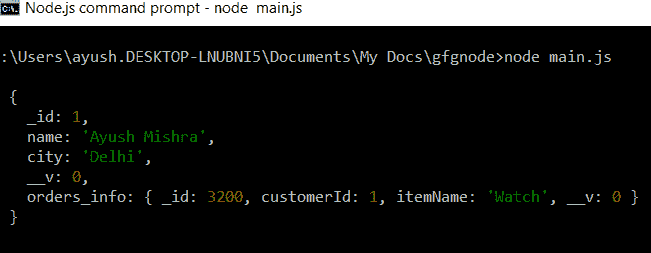
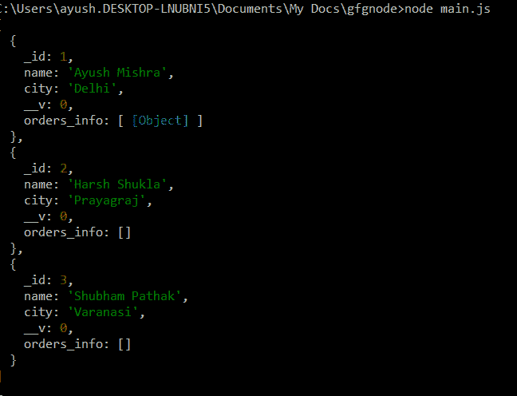

# 使用 Node.js 进行 MongoDB 查找

> 原文:[https://www.geeksforgeeks.org/mongodb-lookup-using-node-js/](https://www.geeksforgeeks.org/mongodb-lookup-using-node-js/)

**$lookup** 运算符是一个聚合运算符或聚合阶段，用于基于某些查询将一个集合中的文档连接到同一数据库的另一个集合中的文档。这两个集合应该属于同一个数据库。

**MongoDB 中的聚合**是将多个文档中的值组合在一起的操作，可以对组合后的数据进行多种操作，返回单个结果。而 **$lookup** 是聚合执行的操作之一。

#### $lookup 是如何工作的？

我们有两个集合，**输入集合**(对其执行$lookup 的集合)和**来自集合**(我们从其获取文档以将其加入到输入集合的文档的集合)。

**$lookup** 根据一些查询从集合的“*中提取选定的文档，然后将它们附加到单独数组字段中的*“输入集合”*的文档中。它就像一个 SQL 的左外连接。*

#### 使用相等匹配执行$查找:

在相等匹配中，对于每个文档，*输入集合*文档的任何特定字段的值与集合文档中每个*的任何特定字段的值进行比较，如果它们匹配，则集合*文档中的特定*被附加到单独数组字段中的*输入集合*文档。*

**语法:$查找运算符**

```
{
    $lookup:
    {
        from: < "from collection" >,
        localField: < any field from "input collection" >,
        foreignField: < any field from "from collection" >,
        as: < attached array field >
    }
}
```

*   **from:** 是包含“ *from collection* 名称的字段，从该字段中获取文档以将其加入到输入集合的文档中。
*   **本地字段:**是*输入集合*的任意字段，其值将与外国字段值进行比较。
*   **foreignField:** 是集合中*的任意字段，其值将与 localField 值进行比较。*
*   **as:** 是集合中的*匹配单据要存放的数组字段。*

#### 安装猫鼬:

**第一步:**可以访问[安装猫鼬](https://www.npmjs.com/package/mongoose)链接安装猫鼬模块。您可以使用此命令安装此软件包。

```
npm install mongoose
```

**步骤 2:** 现在，您可以使用以下命令导入文件中的猫鼬模块:

```
const mongoose = require('mongoose');
```

**数据库:**我们已经在我们的数据库 GFG 中创建了名为*订单*和*客户*的系列，如下图所示:



GFG 数据库中的收款单和客户

#### 创建节点应用程序:

**步骤 1:** 使用以下命令创建**包。**

```
npm init
```

**步骤 2:** 创建文件 **model.js** ，其中包含*订单*和*客户*集合的模式和模型。

## model.js

```
const mongoose = require('mongoose');

const orderSchema = new mongoose.Schema({
    _id: Number,
    customerId: Number,
    itemName: String
})

const customerSchema = new mongoose.Schema({
    _id: Number,
    name: String,
    city: String
})

const Order = new mongoose.model('order', orderSchema);
const Customer = new mongoose.model('customer', customerSchema);

module.exports = { Order, Customer };
```

**第三步:**用下面的代码创建文件 main.js。

## main.js

```
// Requiring module
const mongoose = require("mongoose");

// Importing Models Order and Customer from model.js
const { Customer, Order } = require("./model");

// Connecting to database
mongoose.connect("mongodb://localhost:27017/GFG", {
  useNewUrlParser: true,
  useUnifiedTopology: true,
  useFindAndModify: false,
});

// Implementing $lookup for customers collection
Customer.aggregate([
  {
    $lookup: {
      from: "orders",
      localField: "_id",
      foreignField: "customerId",
      as: "orders_info",
    },
  },
  // Deconstructs the array field from the
  // input document to output a document
  // for each element
  {
    $unwind: "$orders_info",
  },
])
  .then((result) => {
    console.log(result);
  })
  .catch((error) => {
    console.log(error);
  });
```

使用以下命令运行 **main.js** :

```
node main.js
```

**说明**:这里每个*客户*收款单 *_id* 字段值与每个*订单*收款单的 customerId 字段进行比较，如果匹配，则*订单*收款单附加到*订单 _ 信息*数组字段中的*客户*收款单。

***注意:*** 这里**$ explode**用于从输入文档中解构“orders_info”数组字段，为每个元素输出一个文档。有了这个，我们将能够看到每个附加的文件。

**输出**:在控制台中，我们使用$lookup 从集合文档中加入*后，得到*输入集合*文档。*



执行 main.js 后的输出

当我们将从代码中消除 ***$unwind*** 运算符时，我们将获得如下所示的输出:



不使用$ unwiind 运算符的输出

#### 使用多个联接条件执行$查找:

**语法:$查找运算符**

> {
> $ lookup:
> {
> from:<“from collection”>，
> let:{<var _ 1>:<field _ 1>，<var _ 2>:<field _ 2>，……，
> pipeline: <不同管道阶段待执行的“from”collection>，
> as: <附着数组字段>

*   **from:** 是包含*“from collection”*名称的字段，从该字段中获取文档以将其加入输入集合的文档。
*   **let:** 为可选字段。管道无法直接访问*“输入”*文档字段，因此在 let 变量中，我们定义了要在管道中用于执行查询的输入文档字段的名称。
*   **管道:**是从集合对*的文档运行管道不同阶段，然后在数组字段中返回结果文档的字段。*
*   **为:**为数组字段，集合中匹配的单据将存储在该数组字段中。

**注:**

*   为了使用$let 字段中定义的变量，我们像$ <variable>一样引用它。</variable>
*   在$match 中使用$expr 运算符，访问变量$let 字段。

如下所示更改 **main.js** 文件，运行得到结果:

## main.js

```
const mongoose = require("mongoose");

// Model for Order and Customer
const { Customer, Order } = require("./model");

// Connecting to database
mongoose.connect("mongodb://localhost:27017/GFG", {
  useNewUrlParser: true,
  useUnifiedTopology: true,
  useFindAndModify: false,
});

// Performing multiple query with the help of pipeline
Customer.aggregate([
  {
    $lookup: {
      from: "orders",
      let: { custId: "$_id" },
      pipeline: [
        {
          $match: {
            $expr: {
              $and: [
                { $eq: ["$customerId", "$custId"] },
                { $eq: ["$itemName", "Watch"] },
              ],
            },
          },
        },
      ],
      as: "orders_info",
    },
  },
  {
    $unwind: "$orders_info",
  },
])
  .then((result) => {
    console.log(result);
  })
  .catch((error) => {
    console.log(error);
  });
```

使用命令运行 **main.js** :

```
node main.js
```

**说明:**在上面的代码中，我们加入了来自*订单*集合的文档，其 *customerId* 的值与*客户*集合的 *_id* 的值相匹配，其*项目名称*的值为*“手表”*。为了在管道中使用客户收集的 *_id* 字段，我们在 let 字段中将其定义为 *custId* 。

**注意:**此处 **$unwind** 用于从输入文档中解构*“orders _ info”*数组字段，为每个元素输出一个文档。有了这个，我们将能够看到每个附加的文件。

**输出**:在控制台中，我们正在获取匹配的文档，如下所示:



执行 main.js 后的输出

当我们从代码中删除 **$unwind** 运算符时，我们将得到如下所示的输出:



消除$unwind 运算符后的输出