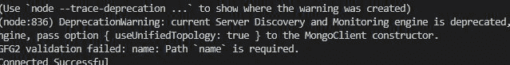

# 使用 Node.js 的 MongoDB 必需约束

> 原文:[https://www . geesforgeks . org/MongoDB-required-constraint-use-node-js/](https://www.geeksforgeeks.org/mongodb-required-constraint-using-node-js/)

Mongoose 模块是 node.js . mongose 最强大的外部模块之一，是一个 MongoDB ODM(即 Object database Modelling)，用于将代码及其表示从 MongoDB 翻译到 node . js 服务器。Mongoose 模块提供了几个功能来操作 MongoDB 数据库集合中的文档(参见[这个](https://www.geeksforgeeks.org/tag/mongoose/)链接)

**必需约束:**该约束不允许跳过 MongoDB 集合的文档中特定键的值。这个约束与 MySQL 中的非空约束相同。

**安装模块:**使用以下命令安装所需的模块。

```js
npm install mongoose
```

**项目结构:**我们的项目结构会是这样的。


**在本地 IP 上运行服务器:**数据是 MongoDB 服务器所在的目录。

```js
mongod --dbpath=data --bind_ip 127.0.0.1
```


## index.js

```js
// Importing mongoose module
const mongoose = require("mongoose")

// Database Address
const url = "mongodb://localhost:27017/GFG"

// Connecting to database
mongoose.connect(url).then((ans) => {
  console.log("Connected Successful")
}).catch((err) => {
  console.log("Error in the Connection")
})

// Calling Schema class
const Schema = mongoose.Schema;

// Creating Structure of the collection
const collection_structure = new Schema({
  name: {
    type: String,
    required: true
  },
  marks: {
    type: Number
  }
})

// Creating collection
const collections = mongoose.model("GFG2", collection_structure)

// Inserting one document
collections.create({
  // Inserting value of only one key
  marks: 3
}).then((ans) => {
  console.log(ans);
}).catch((err) => {
  console.log(err.message);
})
```

使用以下命令运行 **index.js** 文件:

```js
node index.js
```

**控制台输出:**

