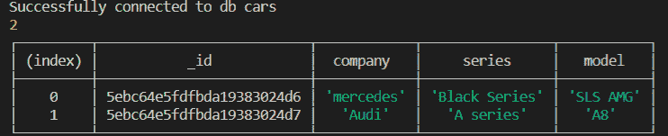
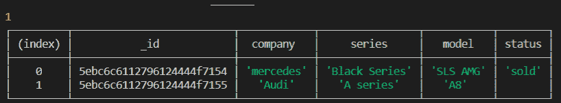
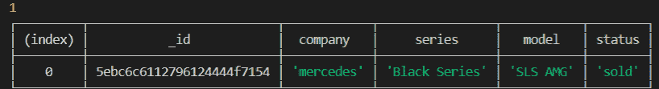

# node . js 的原生 MongoDB 驱动程序

> 原文:[https://www . geesforgeks . org/native-MongoDB-driver-for-node-js/](https://www.geeksforgeeks.org/native-mongodb-driver-for-node-js/)

节点的本机 MongoDB 驱动程序。JS 是一个依赖项，它允许我们的 JavaScript 应用程序与 NoSQL 数据库交互，无论是本地交互还是通过 MongoDB Atlas 在云上交互。我们可以使用承诺和回调，这给了我们使用 ES6 特性的更大灵活性。

为了开始使用 MongoDB 驱动程序，我们将首先创建一个新文件夹并初始化我们的项目:

```
npm init -y

```

这里，-y 是一个标志，它将用默认值初始化我们的项目。

我们将安装 MongoDB 驱动程序，并使用以下命令将其保存为依赖项:

```
npm install mongodb --save

```

在我们的 JavaScript 入口点文件中，为了方便起见，我们将*命名为 app.js* ，我们将编写以下代码来连接到服务器:

## Java Script 语言

```
// Importing MongoClient from mongodb driver
const { MongoClient } = require('mongodb');

// Conencting to a local port
const uri = 'mongodb://127.0.0.1:27017';

const client = new MongoClient(uri, {
    useUnifiedTopology: true,
    useNewUrlParser: true
});

connect();

// ESNext syntax using async-await
async function connect() {
    try {
        await client.connect();
        const db = client.db('cars');
        console.log(
    `Successfully connected to db ${db.databaseName}`);
    }
    catch (err) {
        console.error(`we encountered ${err}`);
    }
    finally {
        client.close();
    }
}
```

**输出:**

```
Successfully connected to db cars
```

现在我们已经建立了连接，让我们在我们的数据库上看到一些基本的插入、读取、更新和删除操作:

**插入和读取:**在下面的代码片段中，我们将处理插入和读取操作。

## Java Script 语言

```
const { MongoClient } = require('mongodb');
const uri = 'mongodb://127.0.0.1:27017';

const client = new MongoClient(uri, { 
    useUnifiedTopology: true, 
    useNewUrlParser: true 
});

connect();

async function connect() {
    try {
        await client.connect();
        const db = client.db('cars');
        console.log(
    `Successfully connected to db ${db.databaseName}`);

        const sportsCars = db.collection('SportsCars');

        // Insertion
        const cursorInsertion = await sportsCars.insertMany([
            {
                'company': 'mercedes',
                'series': 'Black Series',
                'model': 'SLS AMG'
            },
            {
                'company': 'Audi',
                'series': 'A series',
                'model': 'A8'
            }]);
        console.log(cursorInsertion.insertedCount);

        // Display
        const cursorFind = sportsCars.find();
        const data = await cursorFind.toArray();
        console.table(data);
    }
    catch (err) {
        console.error(`we encountered ${err}`);
    }
    finally {
        client.close();
    }
}
```

**说明:**使用 collections()方法创建了一个名为跑车的集合。对于插入，我们使用以下两种方法:

1.  ***【insert multi】()方法:*** 该方法用于借助游标向数据库中插入多个条目。在这种情况下，它将对象数组作为参数。该方法返回一个承诺，因此我们使用了 wait 关键字。或者，方法 insertOne()用于将单个文档插入到表中。
2.  ***InsertedCount:*** 该函数用于计算插入的次数。

对于显示，我们使用了以下方法:

1.  ***find():*** 这个方法是借助游标来查找数据库中的所有文档。
2.  ***toArray():*** 该方法使用从 find()方法接收的 cursor 元素将数据库存储在对象数组中。这个方法返回一个承诺，因此我们使用了关键字 wait。

代码片段的输出如下:



**更新:**下面的代码片段将帮助我们更新一个数据库元素，然后我们将显示更新后的数据库:

## Java Script 语言

```
const { MongoClient } = require('mongodb');
const uri = 'mongodb://127.0.0.1:27017';

const client = new MongoClient(uri, {
    useUnifiedTopology: true, 
    useNewUrlParser: true 
});

connect();

async function connect() {
    try {
        await client.connect();
        const db = client.db('cars');

        const sportsCars = db.collection('SportsCars');
        //update
        const cursorUpdate = await sportsCars.updateOne(
            { "company": "mercedes" },
            { "$set": { "status": "sold" } }
        );

        console.log(cursorUpdate.modifiedCount);

        // Display
        const cursorFind = sportsCars.find();
        const data = await cursorFind.toArray();
        console.table(data);
    }
    catch (err) {
        console.error(`we encountered ${err}`);
    }
    finally {
        client.close();
    }
}
```

**说明:**我们使用以下方法更新数据库:

1.  ***updateOne()方法:*** 这个方法允许我们更新一个条目。它采用的第一个参数是一个键值对，对应于我们想要更新的数据库条目。它可以是元素拥有的任何属性。第二个参数是 update command $set，它与一个对象成对出现。该对象还是现有属性或新属性的键值对。如果属性已经存在，则使用传递的值更新属性。如果它不存在，则添加它。这个方法返回一个承诺，因此我们使用关键字 wait。或者，updateMany()方法可用于更新多个文档。
2.  ***【modified count:***这个方法是在从上一个方法接收到的 cursor 元素上调用的，它给出了更新条目数的计数。

输出:



**删除条目:**在下面的片段中，我们将删除基于系列的条目:

## Java Script 语言

```
const { MongoClient } = require('mongodb');
const uri = 'mongodb://127.0.0.1:27017';

const client = new MongoClient(uri, { 
    useUnifiedTopology: true,
    useNewUrlParser: true 
});

connect();

async function connect() {
    try {
        await client.connect();
        const db = client.db('cars');

        const sportsCars = db.collection('SportsCars');
        //Delete
        const cursorDelete = await sportsCars
                .deleteOne({ "series": "A series" });

        console.log(cursorDelete.deletedCount);

        // Display
        const cursorFind = sportsCars.find();
        const data = await cursorFind.toArray();
        console.table(data);
    }
    catch (err) {
        console.error(`we encountered ${err}`);
    }
    finally {
        client.close();
    }
}
```

**说明:**我们使用以下方法从数据库中删除条目“公司”:“奥迪”:

1.  ***删除一个:*** 此方法用于从数据库中删除一个条目。它接收与我们要删除的条目相对应的键值对。这个方法返回一个承诺。因此，我们使用关键字 wait。或者，可以使用 deleteMany()方法一次删除多个文档。
2.  ***deletedCount:*** 这个方法是在从上一个方法接收到的游标元素上调用的，它返回所做的删除次数。

**输出:**



因此，Node 和 MongoDB 可以很容易地用来制作高效的后端 CRUD apis。