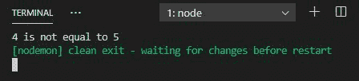
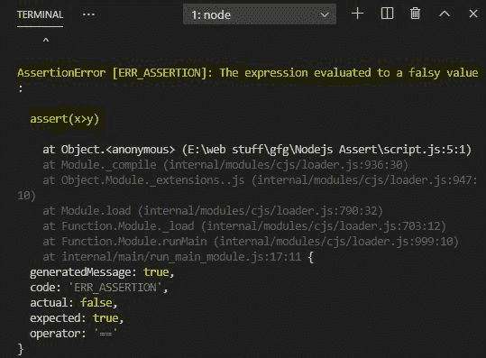

# Node.js 断言模块

> 原文:[https://www.geeksforgeeks.org/node-js-assert-module/](https://www.geeksforgeeks.org/node-js-assert-module/)

Node.js 中的 **Assert** 模块提供了一堆对函数断言有用的工具。assert 模块提供了一组用于验证不变量的断言函数。如果条件为真，它将不会输出其他任何东西，控制台会给出一个断言错误。

**使用以下命令安装 assert 模块:**

```js
npm install assert
```

**注意:**安装是可选步骤，因为它内置了 Node.js 模块。

**导入模块:**

```js
const assert = require("assert");
```

**例 1:**

```js
console.clear()
const assert = require('assert');

let x = 4;
let y = 5;

try {

    // Checking condition
    assert(x == y);
}
catch {

    // Error output
    console.log(
        `${x} is not equal to ${y}`);
}
```

**输出:**



**例 2:**

```js
console.clear()
const assert = require('assert');

let x = 4;
let y = 5;

assert(x > y);
```

**注意:**在本例中，没有给出尝试捕获，因此下面给出的那种**断言错误**将是输出。

**输出:**



**注意:**突出显示的文本是断言错误。