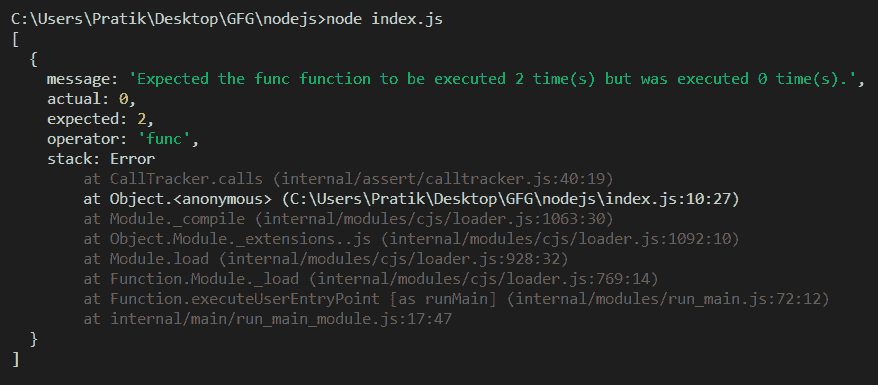
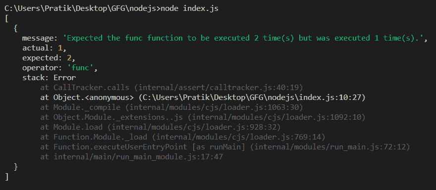

# Node.js 断言 tracker.report()函数

> 原文:[https://www . geesforgeks . org/node-js-assert-tracker-report-function/](https://www.geeksforgeeks.org/node-js-assert-tracker-report-function/)

**tracker.report()** 方法用于获取尚未被调用的函数的预期调用次数和实际调用次数的信息。

该函数返回一个 JavaScript 对象，该对象包含带有堆栈跟踪的预期和实际调用次数的完整细节。

**语法**:

```js
tracker.report()
```

**参数:**该函数不取参数

**返回值:**它返回一个对象，该对象包含带有堆栈跟踪的预期和实际调用次数的完整细节。

**例 1:**

## java 描述语言

```js
const assert = require('assert');

// Creates call tracker.
const tracker = new assert.CallTracker();

function func() {}

// Returns a function that wraps func() that must be called exact times
// before tracker.verify().
const callsfunc = tracker.calls(func, 2);

console.log(tracker.report());
```

**输出:**



**例 2:**

## java 描述语言

```js
const assert = require('assert');

// Creates call tracker.
const tracker = new assert.CallTracker();

function func() {}

// Returns a function that wraps func() that must be called exact times
// before tracker.verify().
const callsfunc = tracker.calls(func, 2);

// called func through callsfunc
callsfunc();

console.log(tracker.report());
```

**输出:**


**参考:**[https://nodejs.org/api/assert.html#assert_tracker_report](https://nodejs.org/api/assert.html#assert_tracker_report)