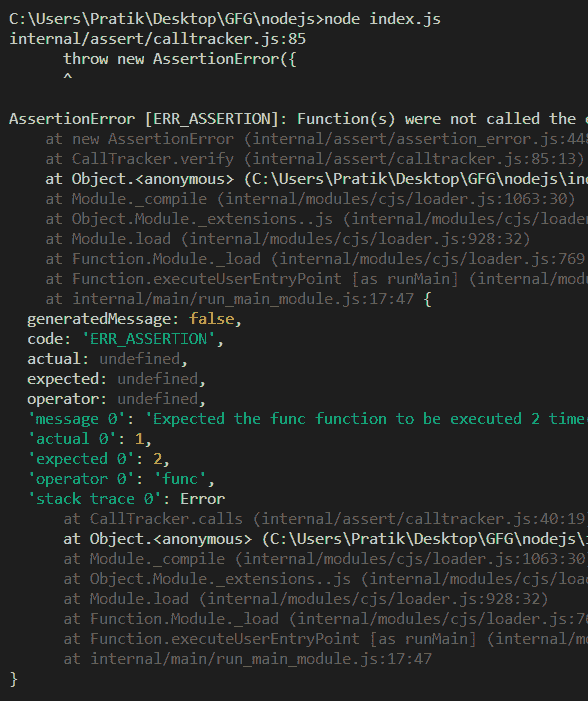
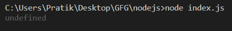

# Node.js 断言 tracker.verify()函数

> 原文:[https://www . geesforgeks . org/node-js-assert-tracker-verify-function/](https://www.geeksforgeeks.org/node-js-assert-tracker-verify-function/)

**tracker.verify()** 方法用于验证与预期调用次数相比，函数实际被调用的次数。如果实际调用次数和预期调用次数不一样，这个函数会抛出一个错误。

**语法:**

```js
tracker.verify()
```

**参数**:本功能不接受任何参数。

**返回值:**返回 void。

以下示例说明 nodejs 中的 assert tracker.verify()函数。

**例 1:**

## java 描述语言

```js
const assert = require('assert');

// Creates call tracker.
const tracker = new assert.CallTracker();

function func() {}

// Returns a function that wraps func() that must be called exact times
// before tracker.verify().
const callsfunc = tracker.calls(func, 2);

// called func through callsfunc only 1 time
callsfunc();

console.log(tracker.verify());
```

**输出:**



**例 2:**

## java 描述语言

```js
const assert = require('assert');

// Creates call tracker.
const tracker = new assert.CallTracker();

function func() {}

// Returns a function that wraps func() that must be called exact times
// before tracker.verify().
const callsfunc = tracker.calls(func, 2);

// called func through callsfunc only 2 times
callsfunc();
callsfunc();

console.log(tracker.verify());
```

**输出:**



**参考:**T2】https://nodejs.org/api/assert.html#assert_tracker_verify