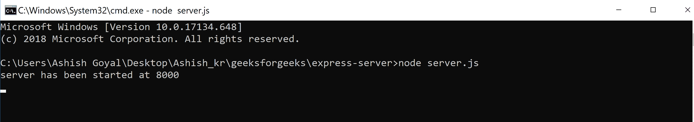
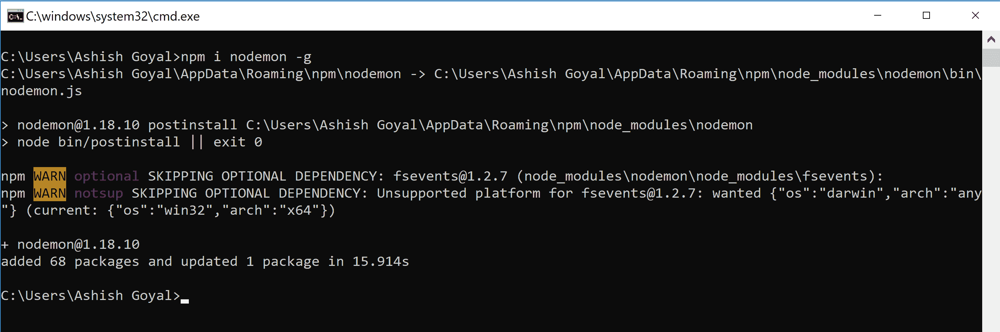
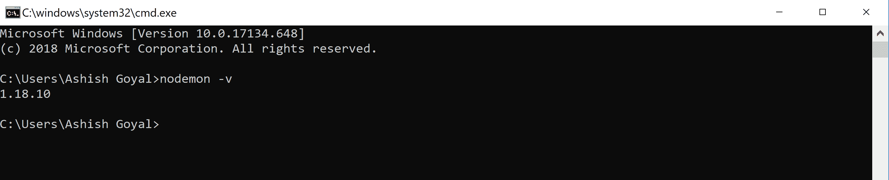
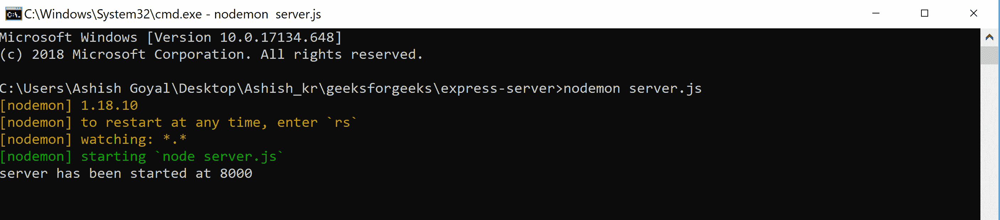
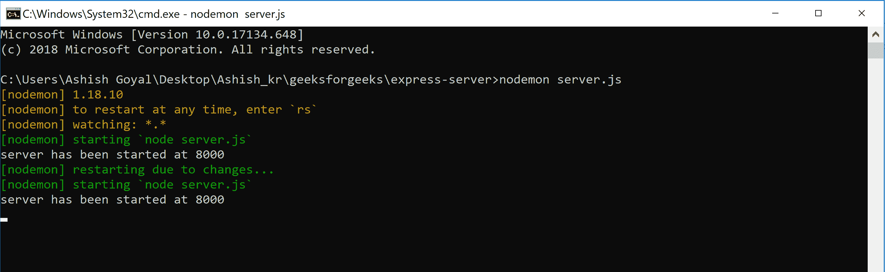

# Node.js 自动重启 Node.js 服务器带 nodemon

> 原文:[https://www . geesforgeks . org/node-js-automatic-restart-node-js-server-with-node mon/](https://www.geeksforgeeks.org/node-js-automatic-restart-node-js-server-with-nodemon/)

我们通常键入以下命令来启动 NodeJs 服务器:

```
node server.js
```



在这种情况下，如果我们对项目进行任何更改，那么我们将不得不通过使用 CTRL+C 杀死它，然后再次键入相同的命令来重新启动服务器。

```
node server.js
```

对于开发过程来说，这是一项非常繁忙的任务。

**Nodemon 是一个包，用于在项目文件发生变化时自动处理这个重启过程。**

**安装 nodemon:** nodemon 应该在我们的系统中全局安装:

```
Windows system: npm i nodemon -g
Linux system: sudo npm i nodemon -g 

```



**现在，让我们通过在终端或命令提示符下键入以下命令来检查 nodemon 是否已正确安装到系统中:**

```
nodemon -v
```

它将显示 nodemon 的版本，如下图所示。



**用 nodemon 启动节点服务器:**

```
nodemon [Your node application]
```



**现在，当我们对我们的 nodejs 应用程序进行更改时，服务器会通过 nodemon 自动重启，如下图截图所示。** 



用这种方式用 nodemon 服务器自动重启。