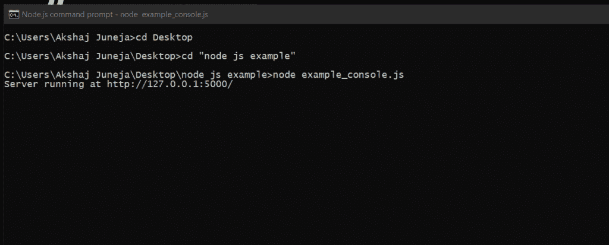
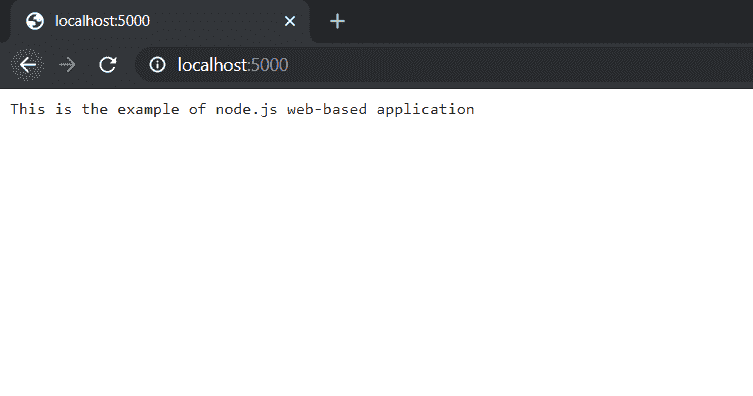

# Node.js 基础

> 原文:[https://www.geeksforgeeks.org/node-js-basics/](https://www.geeksforgeeks.org/node-js-basics/)

Node.js 是一个跨平台的 JavaScript 运行时环境。它允许创建可扩展的网络服务器，而无需使用 JavaScript 的线程和网络工具以及处理各种核心功能的“模块”集合。它可以制作基于控制台和基于 web 的 node.js 应用程序。

**数据类型:** Node.js 包含各种类型的数据类型，类似于 JavaScript。

*   布尔代数学体系的
*   不明确的
*   空
*   线
*   数字

**松散类型化:** Node.js 支持松散类型化，意味着不需要提前指定变量中会存储什么类型的信息。我们在 Node.js 中使用 *var* 关键字来声明任何类型的变量。例子如下:

**示例:**

```js
// Variable store number data type
var a = 35;
console.log(typeof a);

// Variable store string data type
a = "GeeksforGeeks";
console.log(typeof a);

// Variable store Boolean data type
a = true;
console.log(typeof a);

// Variable store undefined (no value) data type
a = undefined;
console.log(typeof a);
```

**输出:**

```js
number
string
boolean
undefined
```

**对象&函数:** Node.js 对象与 JavaScript 对象相同，即对象类似于变量，它包含许多值，这些值被写成**名称:值**对。名称和值用冒号分隔，每对用逗号分隔。

**示例:**

```js
var company = {
    Name: "GeeksforGeeks", 
    Address: "Noida", 
    Contact: "+919876543210",
    Email: "abc@geeksforgeeks.org"
};

// Display the object information
console.log("Information of variable company:", company);

// Display the type of variable
console.log("Type of variable company:", typeof company);
```

**输出:**

```js
Information of variable company: {
  Name: 'GeeksforGeeks',
  Address: 'Noida',
  Contact: '+919876543210',
  Email: 'abc@geeksforgeeks.org'
}
Type of variable company: object
```

**函数:** Node.js 函数是使用**函数**关键字定义的，然后是函数的名称和在函数中传递的参数。在 Node.js 中，我们不必为参数指定数据类型，也不必检查收到的参数数量。Node.js 函数遵循编写 JavaScript 函数时的所有规则。

**示例:**

```js
function multiply(num1, num2) {

    // It returns the multiplication
    // of num1 and num2
    return num1 * num2;
}

// Declare variable
var x = 2;
var y = 3;

// Display the answer returned by
// multiply function
console.log("Multiplication of", x, 
    "and", y, "is", multiply(x, y));
```

**输出:**

```js
Multiplication of 2 and 3 is 6
```

如果您在上面的例子中观察到，我们已经创建了一个名为“乘法”的函数，其参数与 JavaScript 相同。

**字符串和字符串函数:**在 Node.js 中，我们可以通过使用单引号(")或双引号("")来赋值，从而使变量成为字符串，并且它包含许多函数来操作字符串。
下面是在 node.js 中定义字符串变量和函数的例子

**示例:**

```js
var x = "Welcome to GeeksforGeeks ";

var y = 'Node.js Tutorials';

var z = ['Geeks', 'for', 'Geeks'];

console.log(x);

console.log(y);

console.log("Concat Using (+) :", (x + y));

console.log("Concat Using Function :", (x.concat(y)));

console.log("Split string: ", x.split(' '));

console.log("Join string: ", z.join(', '));

console.log("Char At Index 5: ", x.charAt(5) );
```

**输出:**

```js
Welcome to GeeksforGeeks
Node.js Tutorials
Concat Using (+) : Welcome to GeeksforGeeks Node.js Tutorials
Concat Using Function : Welcome to GeeksforGeeks Node.js Tutorials
Split string:  [ 'Welcome', 'to', 'GeeksforGeeks', '' ]
Join string:  Geeks, for, Geeks
Char At Index 5:  m
```

**Buffer:** 在 node.js 中，我们有一个名为“Buffer”的数据类型来存储二进制数据，当我们从文件中读取数据或通过网络接收数据包时，它非常有用。

**Node.js 基于控制台的应用:**用下面的代码制作一个名为 console.js 的文件。

```js
console.log('Hello this is the console-based application');

console.log('This all will be printed in console');

// The above two lines will be printed in the console.
```

要运行这个文件，打开 node.js 命令提示符，转到 *console.js* 文件所在的文件夹，写下以下命令。它将在控制台上显示内容。
T3】

console 类的 console.log()方法在控制台中打印在方法中传递的消息。

**Node.js 基于 web 的应用程序:** Node.js web 应用程序包含不同类型的模块，这些模块是使用 **require()** 指令导入的，我们必须创建一个服务器并为读取请求和返回响应编写代码。
用下面的代码制作一个文件 web.js。

```js
// Require http module
var http = require("http");  

// Create server
http.createServer(function (req, res) {  

    // Send the HTTP header   
    // HTTP Status: 200 : OK  
    // Content Type: text/plain  
    res.writeHead(200, {'Content-Type': 'text/plain'});  

    // Send the response body as "This is the example
    // of node.js web based application"  
   res.end('This is the example of node.js web-based application \n');  

// Console will display the message  
}).listen(5000, 
    ()=>console.log('Server running at http://127.0.0.1:5000/'));
```

要运行此文件，请按照下面给出的步骤操作:

*   在搜索栏中搜索 node.js 命令提示符，打开 node.js 命令提示符。
*   在命令提示符下使用 **cd** 命令进入文件夹，并编写以下命令**节点**
    
*   现在服务器已经启动，进入浏览器打开这个 URL**localhost:5000**
    

您将在浏览器中看到从 web.js 发回的响应。如果在 web.js 文件中进行了任何更改，则再次运行命令**节点 web.js** 并刷新浏览器中的选项卡。