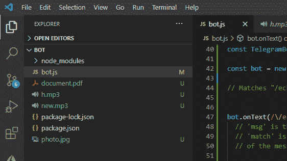
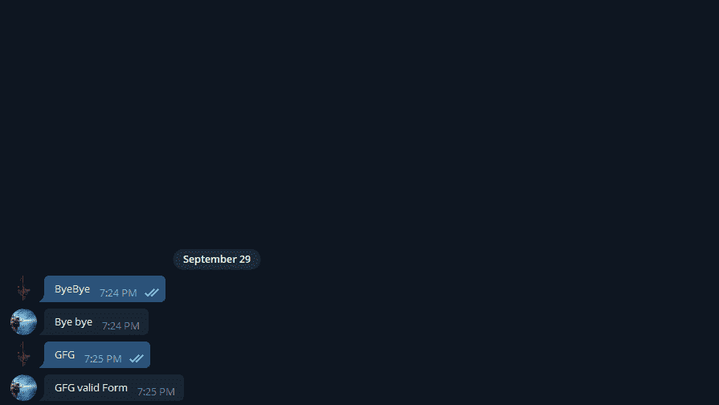

# Node.js Bot .闻讯()方法

> 原文:[https://www.geeksforgeeks.org/node-js-bot-hears-method/](https://www.geeksforgeeks.org/node-js-bot-hears-method/)

节点 js **电信**模块使用**机器人听到()**方法。该模块提供各种功能与官方电报机器人应用编程接口进行交互。当给定的捕获消息与给定的关键字匹配时，此方法执行。
**语法:**

```
TelegrafBot.hears(keyword, callback)
```

**参数:**该方法接受两个参数，如上所述，如下所述:

*   **关键字:**可以是数组、字符串，也可以是需要匹配的混合。
*   **回调:**该函数封装电报更新信息，当关键字匹配时执行。

**返回类型:**函数的返回类型为空。
**安装模块:**使用以下命令安装模块:

```
npm install telegraf
```

**获取钥匙的步骤:**

**第一步:**首先，从电报中的 BOTFATHER 处获取 **GET BOT_TOKEN** 。只需在电报中搜索**机器人父亲**，并选择如下所示的验证过的:


**第二步:**输入*/启动*，然后点击*/新手*，如下图:


**步骤 3:** 现在输入机器人的名称，并且必须是唯一的。


**第 4 步:**现在只需从机器人父亲那里复制令牌。要删除令牌，只需在 BotFather 中搜索/删除令牌。

**项目结构:**



**文件名:bot.js**

## java 描述语言

```
// Requiring module
const telegraf = require("telegraf");

// Your Token
var token = 'Enter your token';

// Creating object of Telegraf
const bot = new telegraf(token); 

bot.hears("GFG", ctrx => {

  // ctx object holds the Update object
  // from Telegram API So you can use
  // everything you see there

  // Exexutes when 'GFG' keyword match
  ctrx.reply("GFG valid Form");  
})

bot.hears("ByeBye", ctrx => { 

  // Executes when 'ByeBye' keyword match
  ctrx.reply("Bye bye");  
})

// Launch the program
bot.launch()
```

使用以下命令运行 **bot.js** 文件:

```
node bot.js
```

**输出:**

