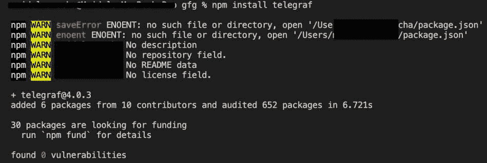
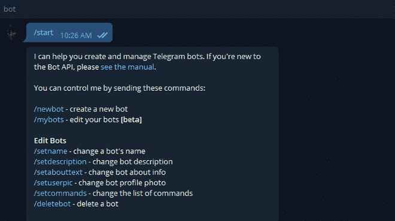
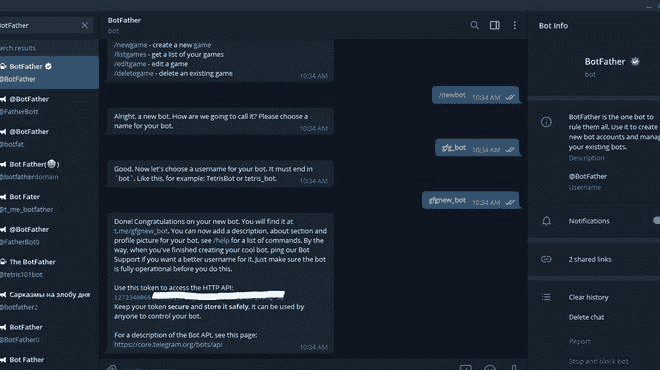

# Node.js Bot.help()方法

> 原文:[https://www.geeksforgeeks.org/node-js-bot-help-method/](https://www.geeksforgeeks.org/node-js-bot-help-method/)

Node.js **电信**机器人模块使用**机器人帮助()**方法。该模块提供各种功能与官方电报机器人应用编程接口进行交互。当我们键入保留关键字*/帮助*时，此方法执行。当我们有任何与机器人功能相关的查询并返回与您的查询相关的输出时，通常使用这种方法。

**语法:**

```js
TelegrafBot.help(callback)
```

**参数:**该方法接受一个参数，如上所述，如下所述:

*   **回调函数**:这个方法只接受一个保存来自 Telegram API 的 Update 对象的参数。

**返回类型**:功能的返回类型为空。

**安装模块**:使用以下命令安装模块:

```js
npm install telegraf
```



**获取钥匙的步骤:**

*   首先，在电报中从僵尸父亲那里获得 GET BOT_TOKEN。只需在 Telegram 中搜索 botdeard，并选择如下所示的已验证选项:


*   键入**/启动**，然后点击**/新机**，如下图:



*   现在输入机器人的名称，并且必须是唯一的。



*   现在只需从机器人父亲那里复制令牌。要删除令牌，只需在 BotFather 中搜索/删除令牌。

**项目结构:**


**文件名:bot.js**

## java 描述语言

```js
// Requiring module
const telegraf = require("telegraf");

// Set your token 
var token = 'YOUR_TOKEN';

// Creating a new object of Telegraf
const bot = new telegraf(token);

bot.help(ctx => {

    // The ctx object holds the Update
    // object from Telegram API
    ctx.reply("Yes what can i help");

    bot.hears("What is your name", ctx => {

        // Reply with your custom message
        ctx.reply("Hi This bot Created by Zack_aayush")
    })
})

// Calling the launch function
bot.launch()
```

使用以下命令运行 **bot.js** 文件:

```js
node bot.js
```

**输出:**

