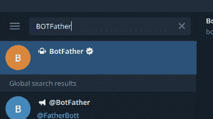
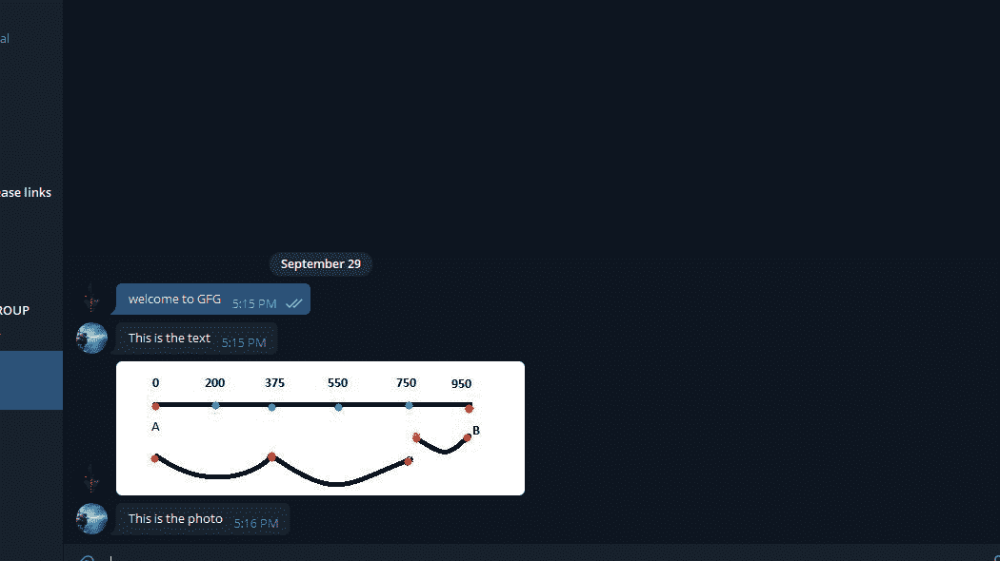

# Node.js Bot.on()方法

> 原文:[https://www.geeksforgeeks.org/node-js-bot-on-method/](https://www.geeksforgeeks.org/node-js-bot-on-method/)

在 Node.js 现代远程移植机器人框架中使用了 **Bot.on()** 方法。该框架提供了各种功能来与官方电报机器人应用编程接口进行交互。这个方法是在与机器人对话过程中发生特定事件时执行的，例如:发送文本、发送照片等事件。这些操作由上下文功能处理。
**语法:**

```
TelegrafBot.on(event, Context function)
```

**参数:**本方法接受两个参数，如上所述，如下所述:
**1** 。**事件**:与机器人对话过程中特定活动的发生。
**2。上下文功能:**该功能封装电报更新信息。

**返回类型:**函数的返回类型为空。

**安装模块:**使用以下命令安装模块:

```
npm install telegraf
```

**获取钥匙的步骤:**
1。首先，通过电报从机器人父亲那里获得**获取机器人令牌**。只需在 Telegram 中搜索**botdear**，选择验证过的，如下所示:



2.键入*/启动*，然后点击*/新手*，如下图:


3.现在输入机器人的名称，并且必须是唯一的。


4.现在只需从机器人父亲那里复制令牌。要删除令牌，只需在 BotFather 中搜索/删除令牌。

**项目结构:**


**文件名:bot.js**

## java 描述语言

```
var token = 'Enter the token';

const telegraf =require("telegraf");
var token='Token';
const bot=new telegraf(token); //Creating object of Telegraf

bot.on("text",ctx=>{
//"Event of the text"

  ctx.reply("This is the text")  //context function reply the message

})
bot.on("photo",ctx=>{

  ctx.reply("This is the photo"); //context function reply the message

})

});
```

使用以下命令运行 **bot.js** 文件:

```
node bot.js
```

**输出:**

