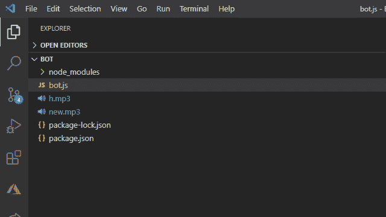
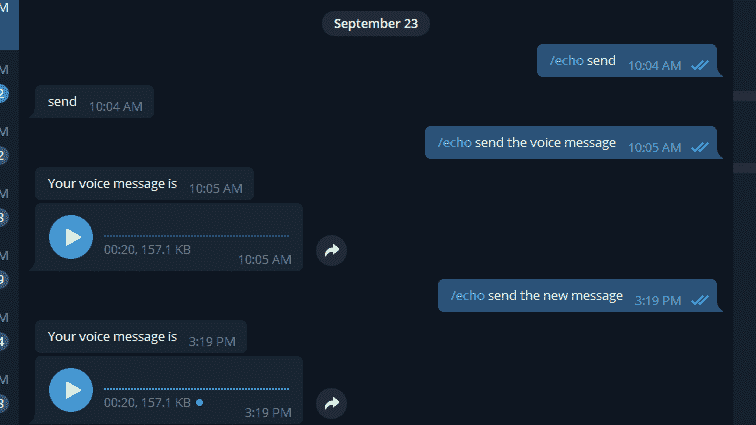

# Node.js Bot.sendVoice()方法

> 原文:[https://www.geeksforgeeks.org/node-js-bot-sendvoice-method/](https://www.geeksforgeeks.org/node-js-bot-sendvoice-method/)

Node.js 电报机器人应用编程接口中使用了**机器人发送语音()**方法。这个 Node.js 模块与官方的电报机器人应用编程接口进行交互。当用户与电报机器人交互时，这种方法用于用语音消息回复。

**语法:**

```
TelegramBot.sendVoice(chatId, Location)

```

**参数:**该方法接受两个参数，如上所述，如下所述:

*   **chatId:**chatId 是聊天的唯一标识符，可以是私人的、群组的、超级群组的或频道的，而 userId 只是用户或机器人的唯一标识符。每个客户的信息都包含聊天标识。
*   **位置:**第二个参数是你的语音信息的位置。

**返回类型:**函数的返回类型为空。

**安装模块:**使用以下命令安装模块:

```
npm i telegram-bot-api

```

**获取钥匙的步骤:**

1.  首先通过电报从机器人父亲那里获得 **GET BOT_TOKEN** 。只需在电报中搜索**机器人父亲**，并选择如下所示的验证过的:
    
2.  键入*/启动*，然后点击*/新机*，如下图:
    
3.  现在输入机器人的名称，并且必须是唯一的。
    
4.  现在只需从机器人父亲那里复制令牌。要删除令牌，只需在 BotFather 中搜索/删除令牌。

**项目结构:**


**文件名:bot.js**

```
var token = 'Enter the token';

const TelegramBot = require('node-telegram-bot-api');

const bot = new TelegramBot(token, {polling: true});

// Matches "/echo [whatever]"
bot.onText(/\/echo(.+)/, (msg, match) => {

 // The 'msg' is the received Message from Telegram
 // and 'match' is the result of executing the regexp 
 // above on the text content of the message

 const chatId = msg.chat.id;

 // The captured "whatever"
 const resp = match[1]; 

 // Send back the matched "whatever" to the chat
  bot.sendMessage(chatId, "Your Voice message is")

  bot.sendVoice(chatId, "new.mp3"); //Voice Message
});
```

使用以下命令运行 bot.js 文件:

```
node bot.js

```

**输出:**
