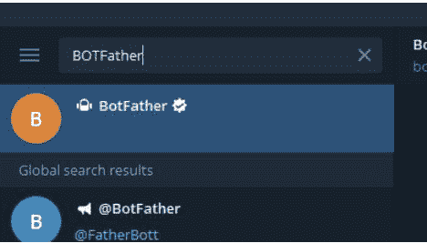
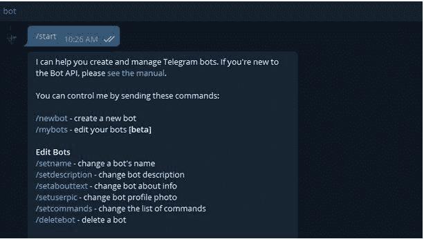
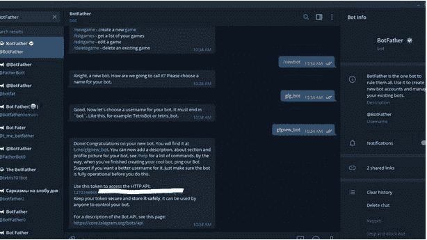
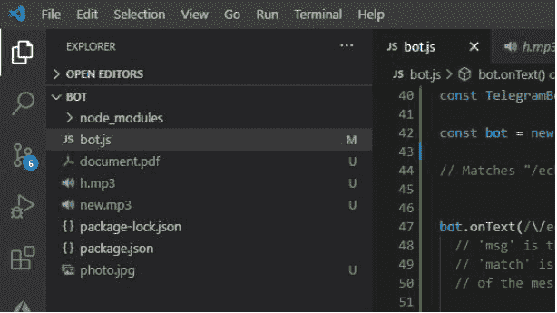
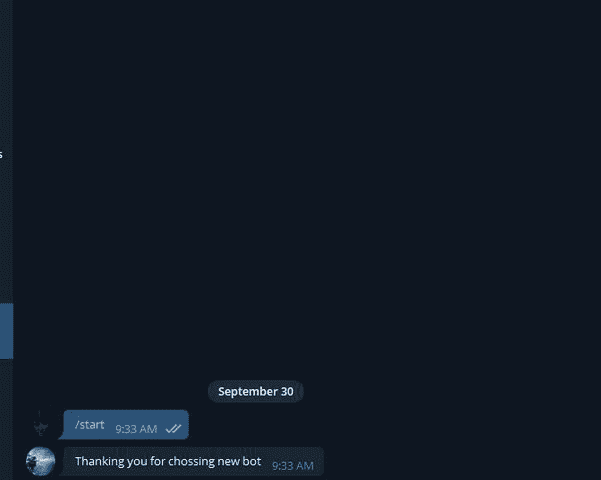

# Node.js Bot.start()方法

> 原文:[https://www.geeksforgeeks.org/node-js-bot-start-method/](https://www.geeksforgeeks.org/node-js-bot-start-method/)

节点 js *电信*机器人模块采用**机器人启动()**方法。该模块提供各种功能与官方电报机器人应用编程接口进行交互。当新用户第一次启动 bot 或键入预留模块关键字 */start* 时，该方法执行。

**语法:**

```js
TelegrafBot.start(callback function(Context function))
```

**参数:**该方法接受一个参数，如上所述，如下所述:

*   **回调函数:**它只接受一个保存来自 Telegram API 的 Update 对象的参数。

**返回类型:**函数的返回类型为空。

**安装模块:**使用以下命令安装该模块:

```js
npm install telegraf
```

**获取钥匙的步骤:**

**1。**首先，从电报中的 BOTFATHER 处获取 GET BOT_TOKEN。只需在 Telegram 中搜索 botdeard，然后选择如下所示的已验证的那个:



2.键入*/启动*，然后点击*/新机*，如下图:



3.现在输入机器人的名称，并且必须是唯一的。



4.现在只需从机器人父亲那里复制令牌。要删除令牌，只需在 BotFather 中搜索*/删除*令牌。

**项目结构:**



**文件名:bot.js**

## java 描述语言

```js
// Requiring module
const telegraf = require("telegraf");

// Set your token
var token = 'YOUR_TOKEN';

// Creating a new object of Telegraf
const bot = new telegraf(token);

// The ctx object holds the update
// object from Telegram API
bot.start( ctx => {

  // Sending the message
  ctx.reply("Thanking you for choosing new bot");
});

// Calling the launch function
bot.launch()
```

使用以下命令运行 **bot.js** 文件:

```js
node bot.js
```

**输出:**

