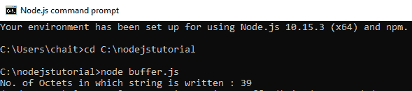
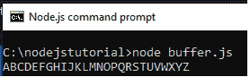
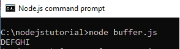

# Node.js 缓冲区

> 原文:[https://www.geeksforgeeks.org/node-js-buffers/](https://www.geeksforgeeks.org/node-js-buffers/)

**缓冲区**是 Node.js 中 Buffer 类的实例，缓冲区是为处理二进制原始数据而设计的。缓冲区在 V8 堆之外分配原始内存。缓冲区类是一个全局类，因此可以在应用程序中不导入缓冲区模块的情况下使用它。

**创建缓冲区:**以下是在 Node.js 中创建缓冲区的不同方法:

*   **Create an uninitiated buffer:** It creates the uninitiated buffer of given size.

    **语法:**

    ```
    var ubuf = new Buffer(5);
    ```

    上面的语法用于创建一个 5 个八位字节的未初始化缓冲区。

*   **Create a buffer from array:** It creates the buffer from given array.

    **语法:**

    ```
    var abuf = new Buffer([16, 32, 48, 64]);
    ```

    上面的语法用于从给定的数组创建缓冲区。

*   **Create a buffer from string:** It creates buffer from given string with optional encoding.

    **语法:**

    ```
    var sbuf = new Buffer("GeeksforGeeks", "ascii");
    ```

    上述语法用于从字符串创建缓冲区，也可以选择指定编码类型。

**写入 Node.js 中的缓冲区:**使用 **buf.write()方法**将数据写入节点缓冲区。

**语法:**

```
buf.write( string, offset, length, encoding )
```

**buf.write()方法**用于返回写入字符串的八位字节数。如果缓冲区没有足够的空间来容纳整个字符串，它将写入字符串的一部分。
buf . write()方法接受以下参数:

*   **字符串:**指定要写入缓冲区的字符串数据。
*   **偏移量:**指定缓冲区开始写入的索引。其默认值为 0。
*   **长度:**指定写入的字节数。它的默认值是 buffer.length。
*   **编码:**指定编码机制。它的默认值是“utf-8”。

**示例:**创建一个包含以下代码的 biffer.js 文件。

```
// Write JavaScript code here
cbuf = new Buffer(256);
bufferlen = cbuf.write("Learn Programming with GeeksforGeeks!!!");
console.log("No. of Octets in which string is written : "+  bufferlen);
```

**输出:**


**从缓冲区读取:**使用**方法**从节点缓冲区读取数据。
**语法:**

```
buf.toString( encoding, start, end )
```

buf.toString()方法接受以下参数:

*   **编码:**指定编码机制。它的默认值是“utf-8”。
*   **开始:**指定开始读取的索引。其默认值为 0。
*   **end:** 指定结束读取的索引。它的默认值是完全缓冲。

**示例 1:** 创建一个包含以下代码的 buffer.js 文件。

```
// Write JavaScript code here
rbuf = new Buffer(26); 
var j; 

for (var i = 65, j = 0; i < 90, j < 26; i++, j++) {  
    rbuf[j] = i ;  
}  

console.log( rbuf.toString('ascii'));  
```

**输出:**


**例 2:** 从 Node.js 缓冲区读取数据，指定读取的起点和终点。创建一个包含以下代码的 buffer.js 文件。

```
// Write JavaScript code here
rbuf = new Buffer(26);  
var j;

for (var i = 65, j = 0; i < 90, j < 26; i++, j++) {  
    rbuf[j] = i ;  
}

console.log( rbuf.toString('utf-8', 3, 9));  
```

**输出:**
