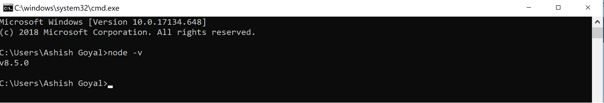
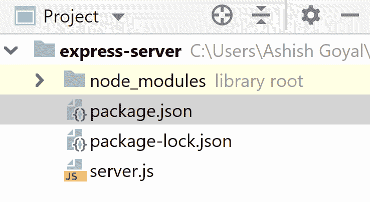
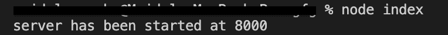
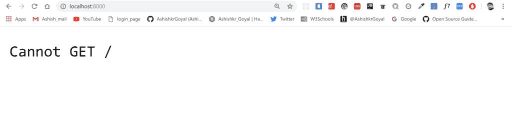

# Node.js 用 express 构建简单的 REST API

> 原文:[https://www . geesforgeks . org/node-js-building-simple-rest-API-in-express/](https://www.geeksforgeeks.org/node-js-building-simple-rest-api-in-express/)

在开始代码部分之前，我们先简单介绍一下 Express 框架:
**Express:** 这是一个开源的 NodeJs web 应用程序框架，旨在以一种非常简单的方式开发网站、web 应用程序和 API。
Express 帮助我们在特定的路由上处理不同的 HTTP 请求。
因为它是 NodeJs web 框架，所以请确保 NodeJs 已经安装在我们的系统上。

**验证类型**终端中的**以下命令:**

```js
node -v
```

它将向我们的系统显示 NodeJs 的安装版本，如下图所示。



*   **STEP-1:**
    创建一个单独的文件夹，并在终端或命令提示符的帮助下导航到该文件夹:

*   **STEP-2:**
    在终端中键入以下命令创建 package . JSON:

```js
npm init -y
```

欲了解更多关于 package.json [的信息，请点击此处](https://www.geeksforgeeks.org/node-js-package-json/)。

*   **STEP-3:**
    在项目的根目录下创建一个名为 **server.js** 的文件。
    现在，我们的文件夹结构将如下截图所示:



## java 描述语言

```js
// server.js File
const express = require('express'); // Importing express module

const app = express(); // Creating an express object

const port = 8000;  // Setting an port for this application

// Starting server using listen function
app.listen(port, function (err) {
   if(err){
       console.log("Error while starting server");
   }
   else{
       console.log("Server has been started at "+port);
   }
})
```

*   **STEP-4:**
    在终端输入以下命令启动服务器:

```js
node server.js
```



*   **STEP-5:**
    打开浏览器，输入 **http://localhost:8000** ，我们会得到如下回应。
    我们正在获取**无法获取/** 响应，因为我们正在尝试访问/路由到服务器，并且该特定路由上没有安装任何东西。

*   **STEP-6:将路由交给****服务器**
    处理服务器的根路由，方法是向服务器发回一些东西，并向服务器添加以下代码

```js
app.get('/', function (req, res) {
  res.send('we are at the root route of our server');
})
```

现在，通过键入以下命令重新启动服务器:

```js
node server.js
```