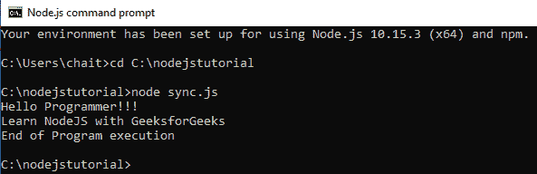
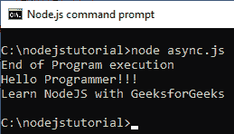

# Node.js 回调概念

> 原文:[https://www.geeksforgeeks.org/node-js-callback-concept/](https://www.geeksforgeeks.org/node-js-callback-concept/)

**回调**是一个在任务完成时调用的函数，因此有助于防止任何类型的阻塞，同时回调函数允许其他代码运行。回调在任务完成时调用，对于函数来说是异步等价的。使用回调概念，Node.js 可以处理大量的请求，而无需等待任何函数返回结果，这使得 Node.js 具有很高的可伸缩性。例如:在 Node.js 中，当一个函数开始读取文件时，它会立即将控制返回到执行环境，以便执行下一条指令。一旦文件输入输出完成，回调函数将被调用，以避免阻塞或等待文件输入输出

**例 1:**node . js 中同步读取文件的代码(阻塞代码)创建一个文本文件 **inputfile1.txt** ，内容如下:

```
Hello Programmer!!!
Learn NodeJS with GeeksforGeeks
```

使用以下代码创建一个 sync.js 文件:

```
// Write JavaScript code
var fs = require("fs");
var filedata = fs.readFileSync('inputfile1.txt');
console.log(filedata.toString());
console.log("End of Program execution");
```

**说明:** *fs* 库被加载来处理文件系统相关的操作。readFileSync()函数是同步的，并阻止执行，直到完成。该功能会阻止程序，直到它读取文件，然后才继续结束程序
**输出:**


**例 2:**node . js 中异步读取文件的代码(非阻塞代码)创建一个文本文件 **inputfile1.txt** ，内容如下。

```
Hello Programmer!!!
Learn NodeJS with GeeksforGeeks
```

使用以下代码创建一个 async.js 文件:

```
// Write a JavaScript code
var fs = require("fs");  

fs.readFile('inputfile1.txt', function (ferr, filedata) {  
    if (ferr) return console.error(ferr);  
    console.log(filedata.toString());  
}); 
console.log("End of Program execution");  
```

**说明:** *fs* 库被加载来处理文件系统相关的操作。readFile()函数是异步的，当函数在后台继续运行时，控制立即返回到程序中的下一条指令。传递一个回调函数，当后台运行的任务完成时调用该函数。
**输出:**
