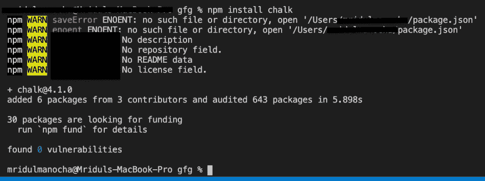
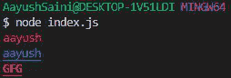
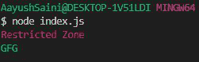

# Node.js 粉笔模块

> 原文:[https://www.geeksforgeeks.org/node-js-chalk-module/](https://www.geeksforgeeks.org/node-js-chalk-module/)

**Node.js 中的粉笔模块**是第三方模块，用于设置文本格式的样式，允许我们在 node . js 项目中创建自己的主题。

**粉笔模组优势:**

1.  它有助于自定义命令行输出的颜色
2.  它通过提供多种颜色选项来帮助提高输出质量，例如警告信息的红色等

**粉笔模块:**https://www.npmjs.com/package/chalk

**安装模块:**

```
npm install chalk
```



**项目结构:**


**例 1:**

## index.js

```
// Importing module
const chalk=require("chalk");

// Printing the text
console.log(chalk.red("aayush"))
console.log(chalk.red.underline("aayush"))
console.log(chalk.red.underline.bold("GFG"))
```

使用以下命令运行 **index.js** 文件:

```
node index.js
```

**输出:**这将是控制台输出。



**例 2:** 定义自己的主题。

## index.js

```
// Importing chalk module
const chalk=require("chalk");

// Creating theme
const warning=chalk.red;

// Printing theme text
console.log(warning("Restricted Zone"));
const welcome=chalk.green
console.log(welcome("GFG"))
```

使用以下命令运行 **index.js** 文件:

```
node index.js
```

**输出:**这将是控制台输出。

