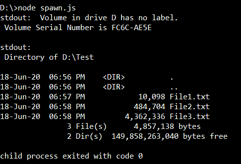
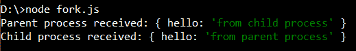
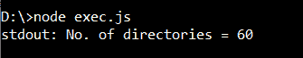
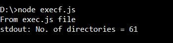

# Node.js 子进程

> 原文:[https://www.geeksforgeeks.org/node-js-child-process/](https://www.geeksforgeeks.org/node-js-child-process/)

Node.js 是一个 web 开发框架，它提供了各种各样的模块。通常，Node.js 允许单线程、无阻塞的性能，但是在 CPU 中运行单线程无法处理不断增加的工作负载，因此 child_process 模块可以用来产生子进程。子进程使用内置的消息传递系统相互通信。

以下是在 Node.js 中创建子进程的四种不同方法:

*   产卵()方法
*   fork()方法
*   exec()方法
*   execFile()方法

上述方式解释如下:

**产卵()方法:**这个方法使用给定的命令和 args 中的命令行参数来产生一个新的进程。ChildProcess 实例实现了 EventEmitterAPI，它使我们能够直接在子对象上注册事件的处理程序。可以注册用于处理子进程的一些事件是退出、断开、错误、关闭和消息。
**语法:**

```
child_process.spawn(command[, args][, options])
```

**参数:**

*   **命令:**接受一个字符串，该字符串是要运行的命令。
*   **参数:**字符串参数列表。默认值为空数组。
*   **options:**
    *   **shell:** 接受布尔值。如果为真，则在外壳内部运行命令。不同的 shell 可以指定为字符串。默认值为 false，这意味着没有外壳。默认情况下，spawn()不会创建一个 shell 来执行命令，因此在调用子进程时将其作为选项传递是很重要的。

    可根据需要使用其他选项，如 cwd、env、argv0、stdio 等。

**返回值:**返回一个子进程对象。

**示例:**

```
const { spawn } = require('child_process');
const child = spawn('dir', ['D:\Test'], {shell: true});
child.stdout.on('data', (data) => {
  console.log(`stdout: ${data}`);
});

child.stderr.on('data', (data) => {
  console.error(`stderr: ${data}`);
});

child.on('close', (code) => {
  console.log(`child process exited with code ${code}`);
});
```

**输出:**


**fork()方法:**child _ process . fork()是 child_process.spawn()的特例，其中父进程和子进程可以通过 send()相互通信。fork()允许从主事件循环中分离计算密集型任务。子进程独立于父进程，除了它们之间建立的 IPC 通信通道。每个进程都有自己的内存，因此调用大量子进程会影响应用程序的性能。child_process.fork()不支持 shell 选项。

**语法:**

```
child_process.fork(modulePath[, args][, options])
```

**参数:**

*   **模块路径:**接受一个字符串，该字符串指定要在子模块中运行的模块。
*   **参数:**字符串参数列表。
*   **选项:** cwd、disconnected、env、execPath、execArgv 是此方法的一些可用选项。

**返回值:**返回一个子进程实例。

**示例:** **文件名:fork.js**

```
// Write Javascript code here
var cp = require('child_process');

var child = cp.fork(__dirname + '/sub.js');

child.on('message', function(m) {
  console.log('Parent process received:', m);
});

child.send({ hello: 'from parent process' });

child.on('close', (code) => {
  console.log(`child process exited with code ${code}`);
});
```

**文件名:sub js**

```
process.on('message', function(m) {
  console.log('Child process received:', m);
});

process.send({ hello: 'from child process' });
```

**输出:**


**exec()方法:**该方法先创建一个 shell，然后执行命令。

**语法:**

```
child_process.exec(command[, options][, callback])
```

**参数:**

*   **命令:**接受一个字符串，该字符串指定用空格分隔的参数运行的命令。
*   **选项:**可用的选项有 cwd、env、编码、shell、超时等
*   **回调:**进程终止时调用回调函数。这个函数的参数分别是 error、stdout 和 stderr。

**返回值:**返回 ChildProcess 的一个实例。

**示例:**

```
const { exec } = require('child_process');

// Counts the number of directory in 
// current working directory
exec('dir | find /c /v ""', (error, stdout, stderr) => {
  if (error) {
    console.error(`exec error: ${error}`);
    return;
  }
  console.log(`stdout: No. of directories = ${stdout}`);
  if (stderr!= "")
  console.error(`stderr: ${stderr}`);
});
```

**输出:**


**execFile()方法:**child _ process . exec file()函数是默认不产生 shell 的。它比 child_process.exec()稍微高效一些，因为指定的可执行文件是作为一个新进程直接生成的。

**语法:**

```
child_process.execFile(file[, args][, options][, callback])
```

**参数:**

*   **文件:**接受指定要运行的文件的名称或路径的字符串。
*   **参数:**字符串参数列表。
*   **选项:**可用的选项有 cwd、env、编码、shell、超时等
*   **回调:**进程终止时调用回调函数。这个函数的参数分别是 error、stdout 和 stderr。

**返回值:**返回 ChildProcess 的一个实例。

**示例:**

```
const { execFile } = require('child_process');

// Executes the exec.js file
const child = execFile('node', ['exec.js'], 
        (error, stdout, stderr) => {
  if (error) {
    throw error;
  }
  console.log(stdout);
});
```

**输出:**
