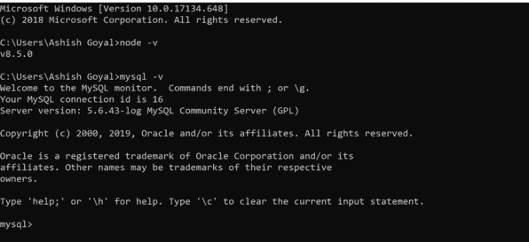
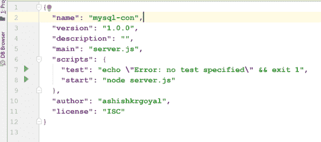
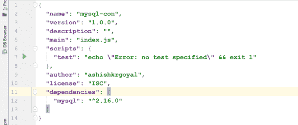
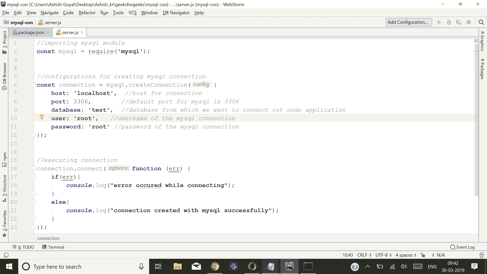
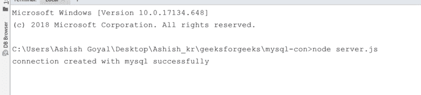

# Node.js 连接 Mysql 与 Node app

> 原文:[https://www . geesforgeks . org/node-js-connect-MySQL-with-node-app/](https://www.geeksforgeeks.org/node-js-connect-mysql-with-node-app/)

在本文中，我们将学习如何将 Mysql 数据库连接到 NodeJs 应用程序。在深入编码部分之前，让我们简单介绍一下这些技术:

*   **NodeJs:** 在服务器端执行 javascript 代码的开源平台。也是一个建立在 Chrome V8 javascript 引擎上的 JavaScript 运行时。可以从[这里](https://nodejs.org/en/)下载
*   **Mysql:** 使用结构化查询语言(sql)的开源关系数据库管理系统(RDBMS)。它是在数据库中添加、访问和管理内容的最流行的语言。这里我们将使用 Mysql 作为节点应用程序的数据库。可以从[这里下载。](https://dev.mysql.com/downloads/mysql/5.6.html)

**After successfully installation let’s verify them by the following commands:**

*   **Node -v: It will show node version in our system.***   ****Mysql -v: It will show Mysql version in our system.

    

    到目前为止，我们已经成功地在系统中安装了 Node 和 Mysql。将节点应用程序连接到 Mysql 需要安装模块/包:

    ```js
    [Mysql](https://www.npmjs.com/package/mysql): NodeJs driver for mysql
    ```

    **Now let’s come to the coding part:**

    *   **STEP-1:
        Create a separate folder for this task and come inside this folder with terminal or command prompt.**
    *   ****STEP-2:
        Now, we will generate a **package.json** file so that all dependencies can be listed there for future reference.
        For knowing more about package.json [click here](https://www.geeksforgeeks.org/node-js-package-json/)

        要生成 package.json，请在项目文件夹的终端中运行以下命令:

        ```js
        npm init -y
        ```

        现在我们的项目文件夹中有了我们的 package.json，如下图所示:
        **** 
    *   ******STEP-3
        使用以下命令在我们的项目中安装 Mysql 模块:******

     ******```js
    npm install mysql
    ```

    成功安装模块后，我们的 package.json 将具有如下结构:
    ********** *   ******STEP-4
    Create a javascript file named server.js in the root of the project folder. Code for creating connection is as given below:
    

    **我们来了解一下项目文件夹中 server.js 文件的代码流程:** 

    **第 2 行:**通过使用这一行代码，我们正在导入 mysql 模块。

    ```js
    const mysql = require(‘mysql’)
    ```

    **第 6 行-第 12 行:**在本节中，我们将创建连接变量，并设置 MySQL 数据库的所有配置，如主机、端口、用户、密码和数据库。
    **注意:** Mysql 数据库在一个系统中有默认端口 3306。

    > const connection = MySQL . createconnection({
    > )T1】host:' ' localhost '，//host for connection
    > /T4】端口:3306，//MySQL 的默认端口是 3306
    > /T7】数据库:“test”， //我们要从中连接出节点应用程序的数据库
    > /T10】用户:“root”，//MySQL 连接的用户名
    > /T13】密码:“root”//MySQL 的密码

    **第 16 行-第 23 行:**现在在本节中，我们将建立应用程序与 Mysql 的连接。
    我们在这里对已经创建的连接变量调用 connect 函数。

    ```js
    connection.connect(function (err) {
       if(err){
           console.log("error occured while connecting");
       }
       else{
           console.log("connection created with Mysql successfully");
       }
    });
    ```

    使用以下命令运行文件服务器. js:

    ```js
    node server.js
    ```

    现在，我们将在终端上看到如下输出，如屏幕截图所示:

    

    通过这种方式，NodeJs 应用程序可以与 Mysql 数据库连接。******