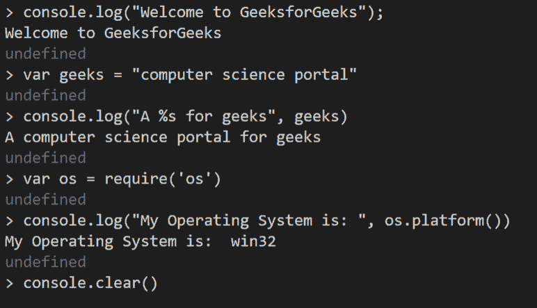
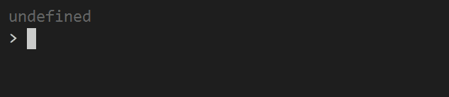
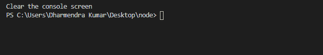

# Node.js console.clear()方法

> 原文:[https://www.geeksforgeeks.org/node-js-console-clear-method/](https://www.geeksforgeeks.org/node-js-console-clear-method/)

**控制台.清除()方法**用于清除标准输出，当标准输出是 TTY(电传)终端时，它将尝试清除 TTY。当 stdout 不是 TTY 时，此方法不执行任何操作。

**console.clear()** 将在不同的操作系统和终端类型上以不同的方式工作。对于 Linux 操作系统，console.clear()的操作类似于终端中的 ***clear*** shell 命令。在 Windows 上，console.clear()将清除 Node.js 二进制文件的当前终端视口。

**语法:**

```
console.clear()
```

**参数:**此方法不接受任何参数。

下面的程序说明了 Node.js 中的 console.clear()方法:

在这个例子中，我们首先在终端写 node.js 命令，启动 node.js，然后写基本命令


在 **console.clear()** 之后，终端将像在终端
中 ***清除*** 命令一样进行清除

要退出 Node.js 终端，请按`Ctrl + C two times`或使用`.exit`命令。

**示例:**

```
// Node.js program to demonstrate the  
// Buffer.clear() Method

// Both two lines will not display
// the result on screen
console.log("GeeksforGeeks");
console.log("A computer science portal");

// Clear the previous screen
console.clear();

// Display the content
console.log("Clear the console screen");
```

**输出:**


**参考:**T2】https://nodejs.org/api/console.html#console_console_clear