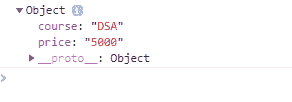
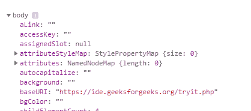

# Node.js console.dir()方法

> 原文:[https://www.geeksforgeeks.org/node-js-console-dir-method/](https://www.geeksforgeeks.org/node-js-console-dir-method/)

console.dir()方法用于获取指定对象的对象属性列表。这些对象属性也有子对象，您可以从中查看更多信息。

**语法:**

```
console.dir( *object* )
```

**参数:**该方法接受保存对象元素的单个参数。

**例 1:**

```
<!DOCTYPE html>
<html>

<head>
    <style>
        h1 {
            color:green;
        }
        body {
            text-align:center;
        }
    </style>
</head>

<body>

    <h1>GeeksforGeeks</h1>

    <h2>console.dir() Method</h2>

    <h3>
        Open console using F12 or Ctrl+Shift+I
    <h3>

    <script>
        var geek = { 
            course : "DSA", 
            price : "5000" 
        };

        console.dir(geek);
    </script>
</body>

</html>
```

**输出:**


**例 2:**

```
<!DOCTYPE html>
<html>
<head>
    <style>
        h1 {
            color:green;
        }
        body {
            text-align:center;
        }
    </style>
</head>

<body>

    <h1>GeeksforGeeks</h1>

    <h2>console.dir() Method</h2>

    <h3>
        Open console using F12 or Ctrl+Shift+I
    <h3>

    <script>
        console.dir(document.body);
        console.log(document.body);
    </script>
</body>

</html>         
```

**输出:**
