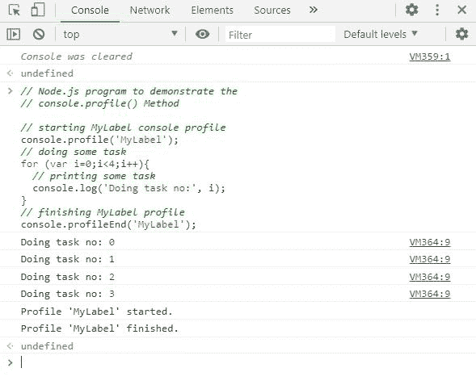
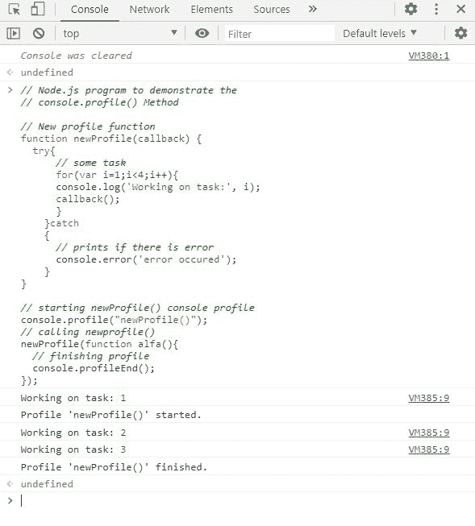

# Node.js console.profileEnd()方法

> 原文:[https://www . geesforgeks . org/node-js-console-profile end-method/](https://www.geeksforgeeks.org/node-js-console-profileend-method/)

控制台模块提供了一个简单的调试控制台，由 web 浏览器提供，它导出两个特定的组件:

*   控制台类可以用来写入任何 Node.js 流。示例: *console.log()、console.error()* 等。
*   无需导入控制台即可使用全局控制台。例如: *process.stdout，process.stderr* 等。

***console . profile end()***(*在 v8.0.0* 中添加)方法是“控制台”模块的内置应用编程接口，除非在检查器中使用，否则不会显示任何内容。如果已经启动了当前的 JavaScript CPU 分析会话，它实际上停止当前的 JavaScript CPU 分析会话，并将报告打印到检查器的“配置文件”面板，如果调用此方法时没有标签，则停止最近启动的配置文件。

**注意:**全局控制台方法既不是一致同步的，也不是一致异步的。

**语法:**

```js
console.profileEnd([label])
```

**参数:**该函数接受如上所述的单个参数，如下所述:

*   **标签** < *字符串* > **:** 它接受进一步在检查器中使用的标签名称。

**返回值:**它不在控制台打印任何东西，而是在检查器中完成/结束一个 JavaScript CPU 配置文件。

下面的例子说明了在 Node.js 中 *console.profileEnd()* 方法的使用

**示例 1:** **文件名:index.js**

```js
// Node.js program to demonstrate the
// console.profileEnd() Method

// Starting MyLabel console profile
console.profile('MyLabel');

// Doing some task
for (var i = 0; i < 4; i++) {
 // Printing some task
 console.log('Doing task no:', i);
}

// Finishing MyLabel profile
console.profileEnd('MyLabel');
```

使用以下命令运行 **index.js** 文件:

```js
node index.js
```

**控制台输出:**

```js
Doing task no: 0
Doing task no: 1
Doing task no: 2
Doing task no: 3

```

**检验员输出:**



检查器中的输出

**示例 2:** **文件名:index.js**

```js
// Node.js program to demonstrate the
// console.profileEnd() Method

// New profile function
function newProfile(callback) {      
 try{
     // Do some task
     for(var i = 1; i < 4; i++) {
     console.log('Working on task:', i);
     callback();      
     }
   } catch {
     // Prints if there is error
     console.error('error occured');
   }
}

// Starting newProfile() console profile
console.profile("newProfile()");

// Calling newprofile()
newProfile(function alfa() {
  // Finishing profile
  console.profileEnd();
});
```

使用以下命令运行 **index.js** 文件:

```js
node index.js
```

**控制台输出:**

```js
Working on task: 1
Working on task: 2
Working on task: 3

```

**检验员输出:**



检查器中的输出

参考:https://nodejs . org/API/console . html # console _ console _ profile end _ label