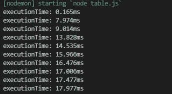
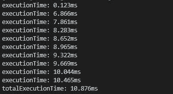

# Node.js console.timeLog()方法

> 原文:[https://www . geesforgeks . org/node-js-console-time log-method/](https://www.geeksforgeeks.org/node-js-console-timelog-method/)

console.timeLog()方法是 Nodejs 中的一个内置函数，用于显示每次执行的时间。该函数在循环中使用时被证明是有效的。

**语法:**

```js
console.log([label][, ...data])
```

**参数:**此功能接受两个或多个参数。

**返回值:**此方法显示执行时间。

下面的例子说明了 Node.js 中的 console.timeLog()方法:

**例 1:**

```js
// Node.js program to demonstrate the   
// console.timeLog() method

// Time started
console.time("executionTime");
for (let i = 0; i < 10; i++) {

    // Printing execution time for each
    console.timeLog("executionTime");
}
```

**输出:**


**例 2:**

```js
// Node.js program to demonstrate the   
// console.timeLog() method

// Time started
console.time("totalExecutionTime");

// Time started
console.time("executionTime");

for (let i = 0; i < 10; i++) {

    // Printing execution time for each
    console.timeLog("executionTime");
}

// Printing total execution time
console.timeLog("totalExecutionTime");
```

**输出:**


**参考:**[https://nodejs . org/API/console . html # console _ console _ time log _ label _ data](https://nodejs.org/api/console.html#console_console_timelog_label_data)