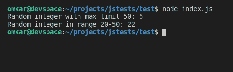

# node . js crypto . random nt()方法

> 原文:[https://www . geesforgeks . org/node-js-crypto-random nt-method/](https://www.geeksforgeeks.org/node-js-crypto-randomint-method/)

Node.js 中的 **Crypto.randomInt** 方法是加密模块的内置应用编程接口，用于根据我们的使用同步或异步创建**随机整数**。

**语法:**

```
crypto.randomInt([min, ] max [, callback])
```

**参数:**该方法接受三个参数，如上所述，如下所述。

*   **min:** 要生成的随机 int 的可选最小值(包括在内)。默认值:0
*   **最大值:**生成随机整数所需的最大值(不包括)。
*   **回调:**生成随机整数后执行的可选回调函数。如果指定了回调，默认情况下，方法异步工作，否则同步工作。

**返回值:****加密随机**方法返回一个随机整数 **n** ，这样 **min < = n < max** 。

**注意:**范围**(最大–最小)**必须小于 **2 <sup>48</sup>** & **最小****最大**必须为 [**安全整数**](https://www.geeksforgeeks.org/javascript-number-issafeinteger/) 。

以下示例说明了**节点. js** 中**加密.随机化**方法的使用。

**例 1:** 同步

## java 描述语言

```
const crypto = require("crypto");

// Only max value provided
console.log("Random integers less than 50:");
console.log(crypto.randomInt(50));
console.log(crypto.randomInt(50));
console.log(crypto.randomInt(50));
console.log();

// Min value also provided
console.log("Random integers in range 30-50:");
console.log(crypto.randomInt(30, 50));
console.log(crypto.randomInt(30, 50));
console.log(crypto.randomInt(30, 50));
```

**输出:**


**例 2:** 异步

## java 描述语言

```
const crypto = require("crypto");

// Asynchronous
crypto.randomInt(50, (err, result) => {
  if (err) console.log("Some error occured while"+
                       " generating random integer !");
  else console.log("Random integer with max limit 50:", result);
});

// Asynchronous with both min & max
crypto.randomInt(20, 50, (err, result) => {
  if (err) console.log("Some error occured while "+
                       "generating random integer !");
  else console.log("Random integer in range 20-50:", result);
});
```

**输出:**


**参考:**[https://nodejs . org/API/crypt . html # crypt _ crypt _ random mint _ min _ max _ callback](https://nodejs.org/api/crypto.html#crypto_crypto_randomint_min_max_callback)